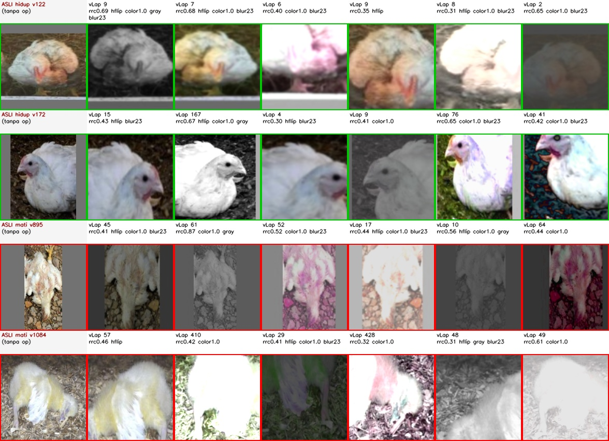
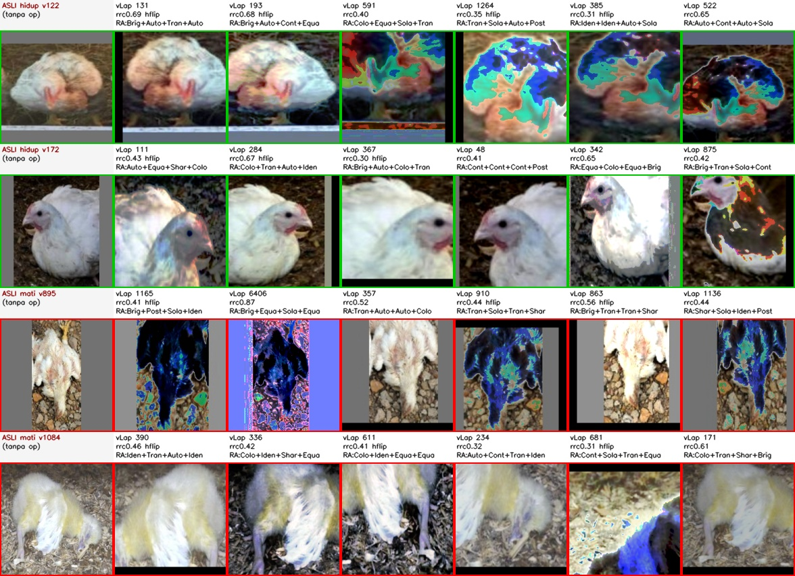
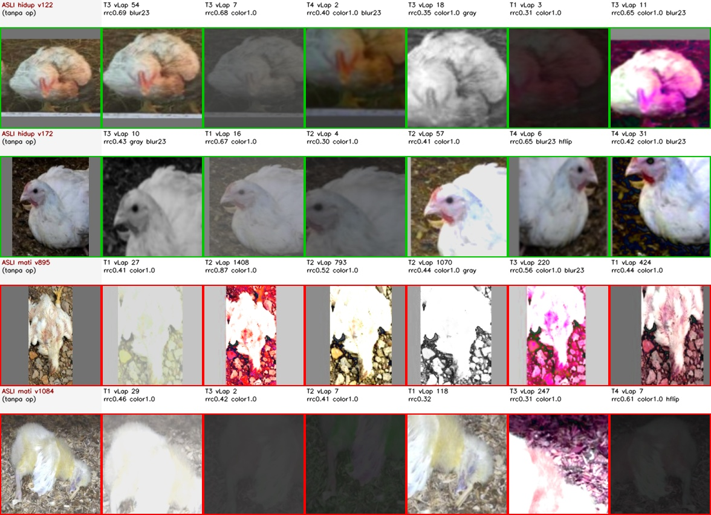
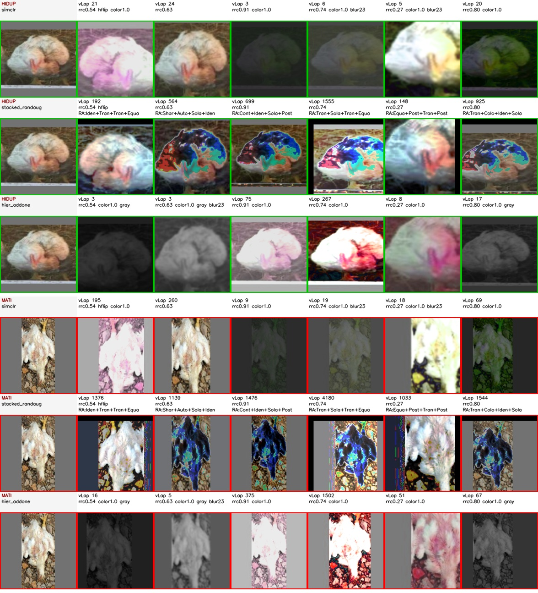

# Augmentasi per Metode Kontrastif

Tiap metode kontrastif diberi **satu kebijakan augmentasi berbeda**, masing-masing diambil dari satu paper yang berbeda:

| metode | loss | kebijakan augmentasi | paper |
|---|---|---|---|
| `selfcon` | NT-Xent (tanpa label) | `simclr` | Chen dkk., ICML 2020 |
| `supcon` | Supervised Contrastive | `stacked_randaug` | Khosla dkk., NeurIPS 2020 |
| `ce` | Cross-Entropy | `hier_addone` | Zhang & Ma, CVPR 2022 |

Arsitektur (`resnet18` + projection head), data, ukuran input (224x224 letterbox), dan jumlah epoch **sama persis** untuk ketiganya.

## PERINGATAN: perbandingannya sekarang 2 faktor

Sebelumnya ketiga metode memakai augmentasi identik, jadi selisih skornya bisa dikaitkan ke **fungsi loss** saja. Sekarang dua hal berubah bersamaan (loss DAN augmentasi), jadi membaca diagonal saja tidak bisa menjawab "ini efek loss atau efek augmentasi?".

Karena itu `src/train.py --grid full` menjalankan **seluruh 3x3 grid**:

- **diagonal** (3 baris bertanda) = yang Anda minta;
- **kolom** (augmentasi ditahan, loss divariasikan) = perbandingan metode yang tetap sah;
- **baris** (loss ditahan, augmentasi divariasikan) = menjawab "ini efek augmentasi atau loss?".

## Jalan pintas ketajaman - kenapa ini penting duluan

Sebelum membahas augmentasi, satu temuan harus disampaikan: **ketajaman gambar saja sudah hampir memisahkan kedua kelas.**

Penyebabnya cara datanya terbentuk, bukan ayamnya:

| | crop hidup | crop mati |
|---|---|---|
| median sisi pendek bbox | 83 px | 212 px |
| yang harus diperbesar ke 224 | 100% | 58% |
| median variance-of-Laplacian | 134 | 747 |

Artinya sebuah "classifier" yang **tidak melihat isi gambar sama sekali**, cuma mengukur ketajaman lalu memotong di satu ambang (ambang dicocokkan di **train**, diuji di **test** - protokol yang sama dengan model sungguhan), sudah mendapat **balanced accuracy 0.9231** di test set (ambang vLap 301, AUC 0.9670). Angka itu dipakai sebagai **lantai** di tabel hasil: metode yang skornya di bawah lantai belum membuktikan apa pun.

Konsekuensinya untuk pekerjaan ini: **kekuatan blur adalah tuas langsung pada skor**, lewat jalan pintas ini, terlepas dari loss-nya. Kebijakan yang paling banyak memblur akan terlihat menang karena alasan yang tidak ada hubungannya dengan kualitas representasi. Tabel berikut mengukur persis itu.

### Berapa banyak jalan pintas yang tersisa setelah augmentasi

AUC ketajaman pada crop **split train** yang sudah diaugmentasi, 8 view per crop (0.5 = jalan pintas hilang, 1.0 = utuh):

| kebijakan | AUC ketajaman | median vLap hidup | median vLap mati |
|---|---|---|---|
| `(tanpa augmentasi)` | **0.9945** | 133.9 | 926.0 |
| `legacy` | **0.8468** ± 0.0108 | 45.2 | 229.5 |
| `simclr` | **0.7181** ± 0.0167 | 10.6 | 49.5 |
| `stacked_randaug` | **0.7513** ± 0.0141 | 175.8 | 529.9 |
| `hier_addone` | **0.7421** ± 0.0178 | 17.0 | 84.5 |

Angkanya mean ± simpangan baku atas 5 ulangan dengan seed berbeda (8 view per crop tiap ulangan).

**Yang boleh disimpulkan:** ketiga kebijakan paper menurunkan jalan pintas secara nyata - dari 0.9945 apa adanya, dan dari 0.8468 milik `legacy`, turun ke kisaran 0.72-0.75. Syarat rencana terpenuhi untuk ketiganya.

**Yang TIDAK boleh disimpulkan:** urutan di antara ketiganya. Jarak terjauh cuma 0.0331 (`simclr` vs `stacked_randaug`) sedangkan simpangan bakunya sendiri sampai 0.0178 - selisihnya di dalam derau. Pada satu seed `stacked_randaug` sempat keluar paling rendah, pada seed lain paling tinggi; itulah sebabnya kolom ini diulang 5 kali, bukan sekali.

Perlu dicatat, dugaan awal rencana **meleset**: `stacked_randaug` sengaja tidak memakai Gaussian blur dan diperkirakan jadi yang paling bocor (~0.82), tapi ternyata setara dengan dua lainnya. Penyebabnya `Solarize`/`Posterize` - keduanya memotong tingkat keabuan sehingga ikut merusak isyarat ketajaman walau bukan blur. Jadi blur **bukan** satu-satunya cara menyerang confound ini.

### Kebocoran kedua: bantalan letterbox

Ketajaman bukan satu-satunya. `build_crops.py` menyimpan crop yang **sudah dipersegi**, jadi bilah bantalan abu-abu (114,114,114) ikut terpanggang ke dalam berkas - augmentasi bekerja di atas gambar yang bilahnya sudah ada, sehingga **tidak satu pun kebijakan di atas bisa menghapusnya.**

Diukur pada **split train** (20 hidup, 55 mati):

| | crop hidup | crop mati |
|---|---|---|
| median bagian piksel bantalan | 0.174 | 0.138 |
| crop tanpa bilah sama sekali | 0 / 20 | 23 / 55 |

AUC bagian bantalan = **0.2959**. Angkanya di bawah 0.5 karena arahnya terbalik (crop hidup justru **lebih** banyak bantalan); sebagai pembeda kekuatannya setara **0.7041**. Sebabnya sama dengan kebocoran ketajaman: crop ayam hidup lebih kecil dan lebih memanjang, jadi lebih banyak ruang yang harus dibantali.

Tapi kekuatan **mengurutkan** tidak sama dengan kekuatan **memutuskan**. Diuji dengan protokol yang sama persis seperti lantai ketajaman (ambang dicocokkan di train, dinilai di test):

| isyarat | bacc train | bacc **test** | AUC test |
|---|---|---|---|
| ketajaman (vLap) | 0.9909 | **0.9231** | 0.9670 |
| bantalan letterbox | 0.7114 | **0.6538** | 0.9038 |

Jadi bantalan **mengurutkan** hampir sebaik ketajaman (AUC 0.9038), tapi ambangnya **tidak berpindah** dari train ke test - bacc-nya jatuh ke 0.6538. Karena itu yang dipakai sebagai lantai resmi tetap ketajaman (0.9231): itu yang benar-benar bisa dicapai tanpa belajar apa pun. Bantalan dicatat sebagai peringatan, bukan sebagai lantai kedua.

Arah bilah (atas-bawah vs kiri-kanan) ikut membocorkan sedikit (AUC 0.2909), jadi yang bocor terutama ketebalannya.

**Ini tidak diperbaiki di pekerjaan ini** - memperbaikinya berarti membangun ulang `data/crops/` dan membatalkan semua angka lama. Stub `crops.equalize_resolution` di config sudah disiapkan (default mati) supaya temuannya tidak hilang. Dicatat di sini karena angka hasil di bawah ikut terpengaruh.

### Efek samping: view yang keluar nyaris polos

Color jitter berkekuatan penuh (`strength 1.0`, sesuai paper) kadang menghasilkan view yang praktis tidak berisi lagi. Diukur sebagai simpangan baku abu-abu < 8:

| kebijakan | % view polos | pada hidup | pada mati |
|---|---|---|---|
| `simclr` | 4.00% | 2.50% | 4.55% |
| `stacked_randaug` | 0.00% | 0.00% | 0.00% |
| `hier_addone` | 4.17% | 5.00% | 3.86% |

Yang penting bukan besarnya, melainkan **keseimbangannya antar kelas**: selisih terbesar cuma 2.05 poin persen (`simclr`). Kalau satu kelas jauh lebih sering rusak, itu bias baru; karena seimbang, ini derau - dan dibiarkan apa adanya supaya tetap setia pada paper.

## Tiga kebijakan augmentasi

### `simclr` - dipakai metode `selfcon`

**Sumber:** Chen dkk., *A Simple Framework for Contrastive Learning of Visual Representations*, ICML 2020 (Appendix A)

**Alasan dipakai di dataset ini:**
Loss NT-Xent tidak memakai label sama sekali, jadi ia paling gampang
"curang": kalau ada satu isyarat gampang yang kebetulan sejalan dengan
kelas, encoder akan memungutnya dan berhenti belajar bentuk ayam. Di
dataset ini isyarat gampang itu ada dan sangat kuat - **ketajaman gambar**
(lihat bagian jalan pintas di bawah).

Dua bagian resep SimCLR yang menjawab persis masalah itu:

1. **Distorsi warna kuat (`strength = 1.0`).** Gambar 5 paper menunjukkan
   crop + distorsi warna adalah pasangan augmentasi terkuat, +23.2 poin di
   atas crop saja. Alasan paper: potongan dari satu gambar berbagi
   histogram warna yang hampir sama, jadi tanpa distorsi warna encoder
   cukup mencocokkan warna dan tidak perlu mengenali objeknya. Di sini
   substratnya beragam (sekam, tanah, beton, kayu, jaring, aspal) dan
   pencahayaannya sangat berbeda-beda, jadi warna memang isyarat yang
   harus dimatikan.
2. **Blur kernel 10% sisi gambar = 23 px** dengan sigma ~ U[0.1, 2.0].
   Ini jauh lebih kuat daripada k=3/5 yang dipakai pipeline lama, dan
   inilah satu-satunya op di seluruh resep yang menyerang langsung jalan
   pintas ketajaman.

**Rangkaian op:**

| urutan | op | peluang | parameter |
|---|---|---|---|
| 1 | `rrc` | 1.00 | `scale=[0.2, 1.0]`, `ratio=[0.75, 1.3333]` |
| 2 | `hflip` | 0.50 | - |
| 3 | `color_jitter` | 0.80 | `strength=1.0` |
| 4 | `gray` | 0.20 | - |
| 5 | `blur` | 0.50 | `kernel_frac=0.1`, `sigma=[0.1, 2.0]` |

**Contoh keluaran** (kolom 0 = asli; `v###` = ketajaman vLap ubin itu; hijau = hidup, merah = mati):

### `stacked_randaug` - dipakai metode `supcon`

**Sumber:** Khosla dkk., *Supervised Contrastive Learning*, NeurIPS 2020 (Sec. 4.3 & lampiran augmentasi)

**Alasan dipakai di dataset ini:**
Paper SupCon **tidak mendefinisikan augmentasinya sendiri**. Ia justru
membandingkan empat pilihan yang sudah ada (AutoAugment, RandAugment,
SimAugment, Stacked RandAugment) dan melaporkan **Stacked RandAugment**
paling baik untuk ResNet yang dalam. Jadi memilih Stacked RandAugment
untuk `supcon` adalah mengikuti temuan papernya, bukan mengarang.

"Stacked" berarti rangkaian 2 op acak dijalankan **dua kali berurutan**,
sehingga satu gambar bisa kena sampai 4 operasi fotometrik bertumpuk.

Dua alasan tambahan yang khusus dataset ini:

1. **Loss SupCon memakai label.** Dengan hanya 2 kelas, tiap anchor punya
   puluhan positif dari kelas yang sama - pasangan augmentasi cuma
   minoritas kecil di antaranya. Jadi tugas augmentasi di sini bukan
   membuat pasangan positif (label sudah menyediakannya), melainkan
   menambah keragaman. Op acak bertumpuk cocok untuk itu.
2. **Sengaja TANPA Gaussian blur** - blur bukan bagian dari kolam
   RandAugment. Ini dipilih sebagai kontrol: dengan satu kebijakan
   berblur kuat (`simclr`), satu berblur sedang (`hier_addone`), dan satu
   tanpa blur sama sekali, tabel kebocoran bisa menguji apakah blur
   memang penggerak angkanya. **Hasilnya: bukan.** Ketiganya turun ke
   kisaran yang sama, karena `Solarize`/`Posterize` memotong tingkat
   keabuan sehingga ikut merusak isyarat ketajaman tanpa memblur apa pun.
   Dugaan awal rencana (kebijakan ini paling bocor, ~0.82) meleset, dan
   dibiarkan tercatat di sini apa adanya.

Paper juga mengklaim (Sec. 4.3) SupCon **lebih tahan terhadap pilihan
augmentasi** daripada cross-entropy. Klaim itu justru bisa diuji di sini
lewat `--grid full`: kalau benar, baris `supcon` harusnya paling rata
sepanjang ketiga kebijakan.

**Rangkaian op:**

| urutan | op | peluang | parameter |
|---|---|---|---|
| 1 | `rrc` | 1.00 | `scale=[0.2, 1.0]`, `ratio=[0.75, 1.3333]` |
| 2 | `hflip` | 0.50 | - |
| 3 | `randaug` | 1.00 | `n=2`, `magnitude=9`, `stacked=True` |

**Contoh keluaran** (kolom 0 = asli; `v###` = ketajaman vLap ubin itu; hijau = hidup, merah = mati):

### `hier_addone` - dipakai metode `ce`

**Sumber:** Zhang & Ma, *Rethinking the Augmentation Module in Contrastive Learning*, CVPR 2022 (modul add-one)

**Alasan dipakai di dataset ini:**
Inti paper Zhang bukan "augmentasi yang lebih kuat", melainkan
**komposisi add-one berjenjang**: T1 = {crop, warna}, T2 = T1 + grayscale,
T3 = T2 + blur, T4 = T3 + flip. Urutan warna -> grayscale -> blur -> flip
inilah yang menang di paper (67.1 vs 64.5 untuk urutan terburuk), dan
urutan itu dipakai persis di sini.

`level_sampling` membuat tiap sampel menarik tingkat i ~ U{1..4} lalu
hanya menjalankan op dengan level <= i. Akibatnya sebagian pasangan view
hanya berbeda crop+warna (invariansi lemah) dan sebagian berbeda penuh -
meniru gagasan "expanded views" paper dalam kerangka 2 view.

Kenapa dipasangkan ke `ce`: data latihnya cuma 75 crop. Memaksa seluruh
sampel ke invariansi maksimum pada data sekecil itu berisiko membuang
sinyal; pencampuran kuat-lemah ini memberi jaring pengaman.

**PERINGATAN Tabel 6 paper**: varian "hierarchical strength" (augmentasi
makin kuat makin dalam) justru varian TERBURUK - di bawah baseline biasa.
Manfaatnya datang dari membagi JENIS augmentasi lewat add-one, bukan dari
menaikkan intensitas menurut kedalaman. Implementasi di sini mengikuti
yang pertama.

**Yang TIDAK diimplementasikan**: loss multi-stage 4-tap, 8 view, dan
augmentation-parameter embedding. Ketiganya mengubah arsitektur jaringan,
sedangkan syarat perbandingan ini adalah arsitektur ketiga metode
identik. Jadi yang dipakai di sini adalah **modul augmentasinya saja**,
bukan metode Zhang secara utuh - menyebutnya sebaliknya tidak benar.

**Rangkaian op:**

| urutan | op | peluang | parameter |
|---|---|---|---|
| 1 (T1) | `rrc` | 1.00 | `scale=[0.2, 1.0]`, `ratio=[0.75, 1.3333]` |
| 2 (T1) | `color_jitter` | 0.80 | `strength=1.0` |
| 3 (T2) | `gray` | 0.20 | - |
| 4 (T3) | `blur` | 0.50 | `kernel_frac=0.1`, `sigma=[0.1, 2.0]` |
| 5 (T4) | `hflip` | 0.50 | - |

`level_sampling: true` - tiap sampel menarik tingkat i ~ U{1..4} lalu hanya menjalankan op dengan level <= i.

**Contoh keluaran** (kolom 0 = asli; `v###` = ketajaman vLap ubin itu; hijau = hidup, merah = mati):

## Deviasi dari paper yang perlu diketahui

Dua parameter sengaja menyimpang dari papernya, dan keduanya perlu diketahui
pembaca:

1. **`scale` batas bawah 0.20, bukan 0.08 seperti SimCLR.** Angka 0.08 di
   paper ditala untuk foto ImageNet yang berisi pemandangan penuh. Crop kita
   sudah ketat di badan ayam; pada skala 0.08, 13% sampel mengambil kurang
   dari 20% luas gambar dan sering tidak ada ayamnya sama sekali. Yang
   dihasilkan bukan invariansi, melainkan derau label. Pada 0.20 tidak ada
   lagi sampel yang tinggal serpihan.
2. **`ratio [0.75, 1.333]` adalah parameter paling berisiko yang dipinjam
   di sini.** Distorsi rasio aspek sedikit menggerus satu-satunya sinyal
   nyata yang kita punya: ayam mati tergeletak memanjang horizontal, ayam
   hidup berdiri tegak. Rasio aspek sendiri TIDAK membocorkan label
   (AUC 0.451), jadi ini bukan jalan pintas yang dibuang melainkan fitur
   asli yang ditipiskan. Nilai paper tetap dipakai supaya setia, tapi kalau
   satu kebijakan anjlok tanpa sebab jelas, ablasi pertama yang harus
   dicoba adalah `ratio: [1.0, 1.0]`.

Selain itu, **rotasi dibuang dari semua kebijakan**, walaupun ketiga paper
memakainya (dan Zhang membahasnya panjang lebar). Untuk `stacked_randaug`
ini berarti op `Rotate`, `ShearX`, `ShearY` dikeluarkan dari kolam
RandAugment, menyisakan 11 op. Alasannya sama dengan poin 2 di atas, tapi
lebih parah: memutar gambar menghapus habis sinyal orientasi.

## Perbandingan ketiga kebijakan pada ayam yang sama

Kotak crop dan flip sengaja dibuat identik di ketiga baris (RNG diturunkan per-op), jadi yang terlihat berbeda benar-benar hanya op yang memang berbeda:

## Hasil

Kelas positif = ayam **MATI**. Metrik utama = **balanced accuracy** (rata-rata recall kedua kelas), karena jumlah kelasnya timpang (98 mati : 32 hidup).

`@0.5` = ambang bawaan. `@tau` = ambang yang dipilih di **validation set**, bukan di test - lihat catatan di bawah.

| augmentasi | metode | bal.acc @0.5 | bal.acc @tau | AUC | n seed |
|---|---|---|---|---|---|
| `hier_addone` | selfcon | 77.86% ± 9.86 | 77.03% ± 10.58 | 93.63% ± 4.62 | 5 |
| `hier_addone` | supcon | 75.11% ± 6.27 | 80.66% ± 6.57 | 91.21% ± 4.88 | 5 |
| `hier_addone` | ce **<-** | 85.99% ± 9.40 | 88.46% ± 7.67 | 96.05% ± 2.83 | 5 |
| `legacy` | selfcon | 78.57% | - | 100.00% | 1 |
| `legacy` | supcon | 85.16% | - | 91.76% | 1 |
| `legacy` | ce | 96.15% | - | 97.25% | 1 |
| `simclr` | selfcon **<-** | 78.63% ± 10.49 | 80.82% ± 12.37 | 91.32% ± 5.65 | 5 |
| `simclr` | supcon | 80.66% ± 15.85 | 84.78% ± 8.12 | 99.45% ± 0.85 | 5 |
| `simclr` | ce | 70.94% ± 10.77 | 73.02% ± 9.31 | 93.30% ± 5.09 | 5 |
| `stacked_randaug` | selfcon | 71.70% ± 9.97 | 76.92% ± 11.63 | 92.86% ± 6.49 | 5 |
| `stacked_randaug` | supcon **<-** | 70.28% ± 8.63 | 81.21% ± 5.39 | 87.03% ± 7.00 | 5 |
| `stacked_randaug` | ce | 74.28% ± 11.60 | 80.00% ± 11.43 | 95.05% ± 5.10 | 5 |
| _(lantai)_ | **KETAJAMAN SAJA** | **92.31%** | - | 96.70% | - |

Baris bertanda **<-** adalah diagonal: pasangan metode-augmentasi yang diminta.

**Vonis untuk diagonal:** dari 3 pasangan yang diminta, **0** berada di atas lantai 92.31% pada bal.acc. Yang tertinggi `hier_addone`+ce (85.99% ± 9.40), masih 6.3 poin **di bawah** lantai. Artinya rancangan "satu paper satu augmentasi" ini belum bisa diklaim mengalahkan tebakan berbasis ketajaman - pada bal.acc.

Sisi satunya lebih menarik: diukur pada **urutan** (AUC), `simclr`+supcon mendapat 99.45% ± 0.85, di atas AUC lantai 96.70% di **kelima** seed. Itu bukan baris diagonal - ia muncul dari kolom grid penuh - tapi ia satu-satunya di seluruh grid yang benar-benar melewati lantai. Rinciannya di [`comparison.md`](comparison.md).

**Kenapa `@tau` sering tidak menggeser apa-apa:** validation set cuma 22 crop, dan **47%** dari 45 run mencapai bacc val 1.0000 - sempurna. Kalau val sudah sempurna, tidak ada yang bisa dipakai untuk memilih ambang yang lebih baik, jadi tau jatuh di tengah dataran yang lebar (tercatat 0.304 - 0.980 di seluruh run). Ini batas datanya, bukan kegagalan kalibrasinya.

**Dan akibat yang lebih serius: validation set tidak bisa dipakai untuk MEMILIH.** Contoh nyata dari grid ini - `ce`+`simclr` di 5 seed mendapat bacc val **1.0000 di semuanya** (identik), sementara bacc test-nya berayun 0.585 sampai 0.857. Val sama sekali tidak melihat perbedaan itu. Jadi memilih seed, epoch, atau konfigurasi terbaik berdasarkan val di sini sama saja dengan memilih acak; yang bisa dilakukan val cuma mengkalibrasi ambang.

## Cara membaca angkanya

1. **Balanced accuracy di sini bergerak dalam langkah yang besar.** Test set berisi 26 crop mati tapi cuma **7 crop hidup**, dan balanced accuracy memberi bobot sama ke kedua kelas. Akibatnya satu crop hidup yang salah menggeser skor **7.14 poin**, sedangkan satu crop mati cuma 1.92 poin. Jadi selisih 7 poin antar metode artinya *satu gambar*, dan selisih 14 poin artinya *dua gambar* - bukan bukti bahwa metodenya lebih baik. Ke-33 crop itu pun berasal dari hanya 7 foto asli, jadi sampelnya bahkan tidak sepenuhnya saling bebas. Karena itu tiap konfigurasi dijalankan 5 seed dan yang dilaporkan rata-rata ± simpangan baku, bukan satu angka.
2. **Metode yang BAL.ACC-nya di bawah lantai 0.9231 belum membuktikan apa-apa** - hasil yang sama bisa didapat tanpa melihat isi gambar. Tapi lantai itu punya dua sisi: bal.acc (keputusan) DAN AUC (urutan). Ada konfigurasi yang gagal di sisi pertama tapi lolos di sisi kedua - yaitu mengurutkan lebih baik daripada ketajaman walau ambangnya meleset. Itu tetap sebuah hasil, dan dirinci di [`comparison.md`](comparison.md) bagian "Yang berhasil melewati lantai".
3. **Augmentasi ini dipakai di tahap KONTRASTIF saja** untuk `selfcon`/`supcon`. Tahap linear probe-nya sengaja dikunci ke `minimal` (flip saja, lihat `lock_probe_policy`), supaya angkanya mengukur kualitas encoder dan bukan campuran dua augmentasi. `ce` tidak bisa ikut dikunci - kepala *adalah* satu-satunya tahap latihnya, jadi di baris `ce` augmentasi itu memang bekerja di tahap yang berbeda. Asimetri ini nyata; tabel per-tahap ada di [`comparison.md`](comparison.md).
4. **Diagonal menjawab pertanyaan Anda, kolom menjawab "metode mana yang terbaik".** Keduanya pertanyaan berbeda.
5. **Ambang `@tau` dipilih di validation set, tidak pernah di test set.** Ini penting: pernah terjadi `selfcon` mendapat AUC 1.0000 (pemisahan sempurna) tapi balanced accuracy cuma 0.7857, semata karena ambang bawaan 0.5 jatuh di tempat yang salah. AUC mengukur urutan, balanced accuracy mengukur keputusan - keduanya perlu dilaporkan.
6. **Batasan implementasi Zhang**: hanya modul augmentasinya yang dipakai, bukan loss multi-stage dan augmentation embedding-nya.

---

Cerita utuh seluruh eksperimen - berurutan, dengan gambar tiap
percobaan dan alasan di balik setiap perubahan - ada di
[`kronologi_lengkap.md`](kronologi_lengkap.md).
