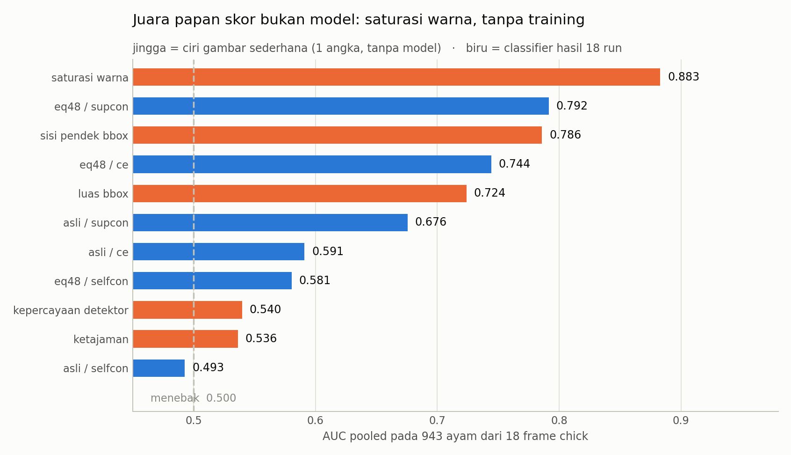
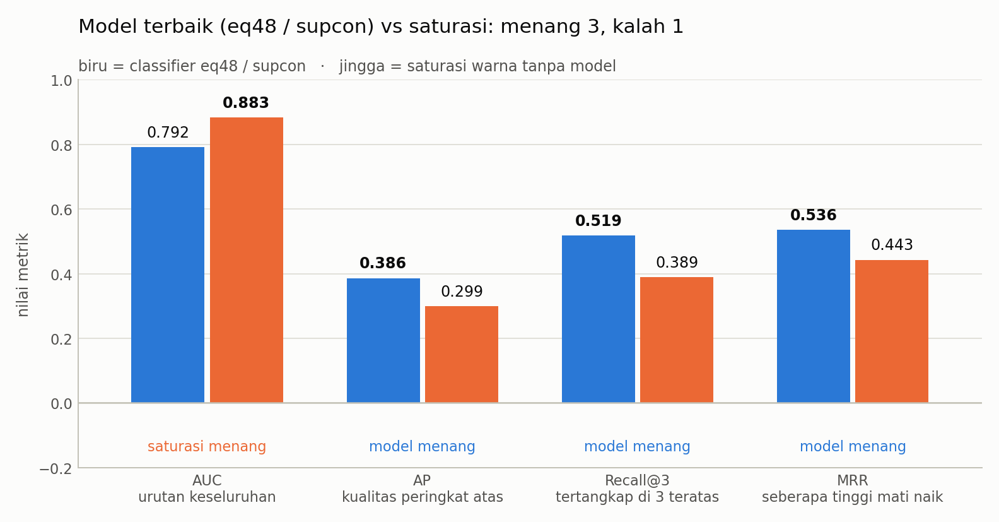
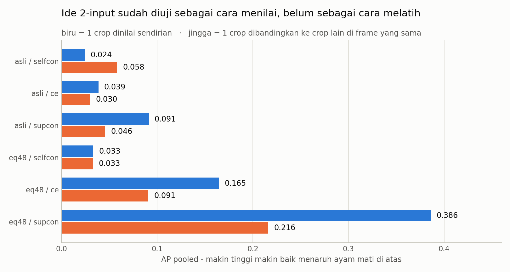
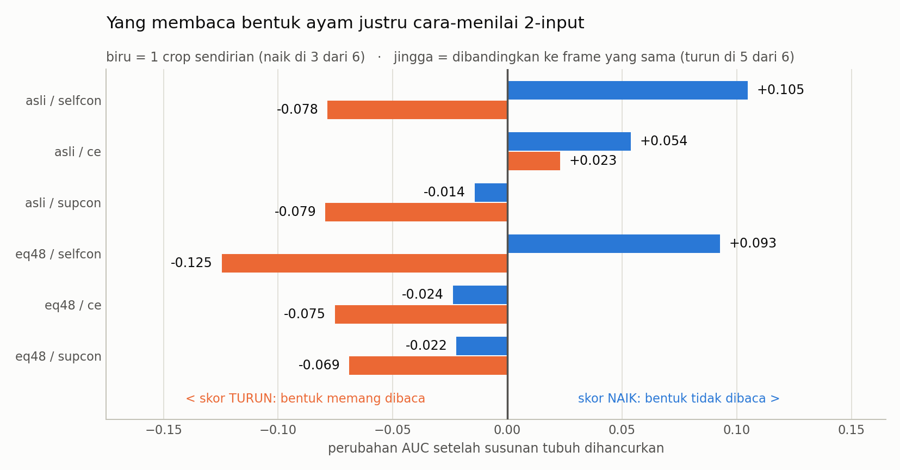

# Kesimpulan Kronologi 2 - Empat Pertanyaan, Empat Jawaban

Dokumen ini menjawab empat pertanyaan langsung atas
[`kronologi lengkap 2.md`](kronologi%20lengkap%202.md):

1. Apakah benar modelnya masih kalah dari saturasi?
2. Trainingnya apa bedanya dengan kronologi awal?
3. Apakah ide 2-input sudah tersinggung?
4. Saturasi itu model apa, dan yang kalah itu model apa?

---

## Daftar isi

| # | Pertanyaan | Jawaban singkat |
|---|---|---|
| [1](#1-saturasi-itu-bukan-model) | Saturasi itu model apa? | **Bukan model** - 1 baris kode, 0 parameter |
| [2](#2-yang-kalah-itu-model-apa) | Yang kalah itu model apa? | ResNet-18, 11.7 juta parameter, 65 menit GPU |
| [3](#3-benar-kalah---tapi-cuma-di-satu-metrik-dari-empat) | Benar kalah? | **Benar, tapi hanya di AUC.** Menang di 3 metrik lain |
| [4](#4-bedanya-training-dengan-kronologi-awal) | Beda training vs kronologi 1 | Resepnya **hampir sama** - yang berubah protokolnya |
| [5](#5-ide-2-input-sudah-tersinggung---separuh) | Ide 2-input | **Sudah, separuh**: dipakai menilai, belum dipakai melatih |
| [6](#6-kesimpulan-satu-halaman) | Kesimpulan | 4 kalimat + langkah berikutnya |

---

## 1. Saturasi itu bukan model

Ini bagian yang paling sering disalahpahami, jadi ditaruh paling depan.

**Saturasi bukan model.** Bukan jaringan saraf, bukan hasil training, tidak
punya parameter, tidak pernah melihat data latih. Ia adalah **satu baris kode**
di `src/eval_fixed_chick.py:152`:

```python
"saturation": float(hsv[:, :, 1].mean()),
```

Artinya: ubah crop ke ruang warna HSV, ambil kanal S (seberapa pekat warnanya),
lalu **rata-ratakan seluruh piksel**. Hasilnya satu angka antara 0 dan 255.
Makin besar angkanya, makin diduga mati. Selesai. Tidak ada yang lain.

| | saturasi | classifier |
|---|---|---|
| parameter | **0** | 11.689.512 |
| data latih | **tidak ada** | 392 crop |
| waktu training | **0 detik** | 3.914 detik (65 menit) |
| GPU | **tidak perlu** | perlu |
| baris kode inti | **1** | ~2.000 |
| AUC di test | **0.883** | 0.792 |

Kenapa ini bisa jalan? Karena kebetulan: 22 ayam mati di dataset `chick`
hampir semuanya terekam di bagian lantai kandang yang warnanya lebih pekat.
Jadi "warna crop ini pekat" ternyata pertanda "ini ayam mati" - **bukan karena
ayam matinya berwarna pekat, tapi karena tempatnya kebetulan begitu.**


*22 ayam mati (jingga) duduk di saturasi 39-67; 921 ayam hidup (biru) menumpuk
di 10-35. Satu garis vertikal di sekitar 38 sudah memisahkan sebagian besarnya.*

Saturasi bukan satu-satunya. Ada delapan ciri gambar sederhana lain yang diukur
dengan cara yang sama, dan dua di antaranya juga mengalahkan sebagian besar
checkpoint:



*Semua peserta di satu sumbu. Jingga = ciri gambar sederhana tanpa model.
Biru = classifier hasil 18 run. Juara papan skor bukan model.*

| ciri (tanpa model) | apa yang diukur | AUC |
|---|---|---:|
| **saturasi warna** | rata-rata kanal S dari HSV | **0.883** |
| sisi pendek bbox | `min(lebar, tinggi)` kotak deteksi | 0.786 |
| luas bbox | `lebar x tinggi` | 0.724 |
| kepercayaan detektor | skor confidence dari YOLO | 0.540 |
| ketajaman | varians Laplacian | 0.536 |

> **Catatan kejujuran.** Arah ciri **tidak pernah dibalik** setelah melihat hasil
> test. Karena itu `hue` tercatat 0.188 dan `brightness` 0.173 - keduanya di
> bawah 0.5. Kalau arahnya boleh dibalik setelah melihat jawabannya,
> `brightness` sebenarnya bernilai 0.827. Itu tidak dilakukan, karena membalik
> arah setelah melihat test persis jenis kecurangan yang protokol babak 13
> dirancang untuk mencegah.

> **Perumpamaan.** Lomba menebak harga rumah. Seorang penilai profesional datang
> dengan alat lengkap, mengukur luas, memeriksa fondasi, menghitung tiga hari.
> Seorang anak kecil cuma melihat warna catnya dan berkata "yang catnya
> mengelupas pasti murah" - dan dia lebih sering benar.
>
> Anak itu tidak bisa menilai rumah. Dia menebak cat. Masalahnya bukan anak itu
> pintar - masalahnya **lombanya yang disusun sehingga cat dan harga kebetulan
> berjalan seiring.**

---

## 2. Yang kalah itu model apa

Yang kalah adalah **classifier tahap kedua** dari pipeline - bukan detektornya.
Detektor YOLO tetap sangat baik: 22 dari 22 ayam mati tertangkap, 100%.

Arsitektur dan resepnya, sama persis untuk keenam pipeline:

| bagian | nilai |
|---|---|
| backbone | **ResNet-18**, pretrained ImageNet (`pretrained: true`) |
| parameter backbone | 11.176.512 |
| ukuran input | 224 x 224, letterbox (rasio aspek dijaga) |
| batch size | 32 |
| epoch contrastive | 60 |
| epoch linear probe | 40 |
| epoch CE | 60 |
| seed | 42, 43, 44 |

Yang dibandingkan ada **6 pipeline**, yaitu 3 metode x 2 cara menyiapkan crop:

| nama | loss | augmentasi | asal paper |
|---|---|---|---|
| `selfcon` | NT-Xent (tanpa label) | `simclr` | SimCLR |
| `supcon` | SupCon (pakai label) | `stacked_randaug` | Supervised Contrastive |
| `ce` | weighted cross-entropy | `hier_addone` | baseline biasa |

| varian crop | maksudnya |
|---|---|
| `asli` | crop apa adanya |
| `eq48` | crop disamakan dulu ke 48 px lalu dibesarkan - memotong jalan pintas ketajaman |

6 pipeline x 3 seed = **18 run**, semuanya selesai exit code 0.

**Yang kalah di AUC adalah ke-18-18nya.** Tidak satu pun menyentuh 0.883.
Yang terbaik - dan yang dimaksud "model terbaik" di seluruh dokumen - adalah:

> **`eq48 / supcon`** = crop disamakan 48 px + SupCon loss + Stacked RandAugment
> -> **AP 0.386, AUC 0.792, Recall@3 0.519, MRR 0.536**



*Model terbaik lawan saturasi pada empat metrik. Kalah di AUC, menang di tiga
sisanya.*

---

## 3. Benar kalah - tapi cuma di satu metrik dari empat

Yang ditangkap benar: **modelnya kalah dari saturasi.** Tapi perlu satu koreksi
supaya tidak terlalu pesimis - **kalahnya hanya di AUC.**

| metrik | artinya dalam bahasa biasa | model | saturasi | siapa menang |
|---|---|---:|---:|---|
| **AUC** | mengurutkan *seluruh* 943 ayam dengan benar | 0.792 | **0.883** | **saturasi** |
| **AP** | kualitas ujung atas daftar | **0.386** | 0.299 | **model** |
| **Recall@3** | dari 3 teratas per frame, berapa mati tertangkap | **0.519** | 0.389 | **model** |
| **MRR** | seberapa tinggi ayam mati pertama naik | **0.536** | 0.443 | **model** |

Bedanya ada di apa yang diukur:

- **AUC** menilai urutan **seluruh daftar**, termasuk ujung bawah yang tidak
  akan pernah dilihat orang.
- **AP / Recall@3 / MRR** menilai **ujung atas daftar** - persis yang dilihat
  operator kalau dia cuma sempat memeriksa 3 kandidat teratas per frame.

Jadi kalimat yang tepat bukan "modelnya kalah", melainkan:

> **Untuk mengurutkan semua ayam, satu angka warna lebih baik. Untuk menaruh
> ayam mati di 3 besar, modelnya lebih baik.**

Tetap saja ini **bukan** bukti modelnya mengenali ayam mati. Alasannya ada di
gerbang kausal, bagian 5.

> **Perumpamaan.** Dua juri lomba masak. Juri A mengurutkan seluruh 943 peserta
> dengan cukup masuk akal tapi salah menaruh juaranya. Juri B urutan
> keseluruhannya berantakan, tapi tiga besarnya hampir selalu tepat. Untuk
> menentukan pemenang, juri B lebih berguna - walaupun rapornya secara
> keseluruhan lebih jelek.

---

## 4. Bedanya training dengan kronologi awal

Jawaban jujurnya mungkin mengejutkan: **resep trainingnya hampir tidak berubah.**
Yang berubah besar adalah **datanya** (sejak babak 8) dan **protokolnya** (babak
13-14).

### Yang TIDAK berubah sama sekali

ResNet-18 pretrained, input 224 letterbox, batch 32, 60 epoch contrastive, 40
epoch probe, 60 epoch CE, tiga metode yang sama, tiga augmentasi yang sama, seed
42/43/44. **Identik.** Kalau yang dicari "arsitektur barunya apa" - jawabannya:
tidak ada arsitektur baru di babak 14.

### Yang berubah: datanya (sudah sejak babak 8)

| | kronologi 1 babak 1-7 | kronologi 1 babak 8 | **kronologi 2 (babak 13-14)** |
|---|---|---|---|
| ayam hidup | 32 crop, **close-up** | 294 crop, **CCTV** (PIO) | 294 crop, CCTV (PIO) |
| ayam mati | 98 crop, close-up | 98 crop, close-up | 98 crop, close-up |
| total | 130 | 392 | 392 |
| train | 20 hidup / 55 mati | 179 / 58 | **179 / 58** |
| validation | 5 / 17 | 58 / 19 | **115 / 40** |
| test | 7 / 26 (split internal) | 57 / 21 (split internal) | **943 crop chick, 18 frame** |

Dua perubahan pokoknya:

1. **Split internal lama dihapus sebagai test.** Barisnya digabung ke
   validation - itu sebabnya validation naik dari 58/19 jadi 115/40.
2. **Test sekarang satu-satunya: dataset `chick`.** 18 frame CCTV asli, 943 crop
   valid, 22 mati dan 921 hidup, ditambah 272 crop `bukan ayam`.

### Yang berubah paling besar: protokolnya

| aspek | kronologi 1 | **kronologi 2** |
|---|---|---|
| loss per epoch | tidak dicatat | **dicatat train + val tiap epoch** |
| checkpoint di-hash | tidak | **SHA-256 checkpoint + config + split + 10 berkas sumber** |
| kapan test dibuka | kapan saja, berkali-kali | **sekali, setelah registry dibekukan** |
| test dipakai memilih model | ya (tanpa disadari) | **tidak** (`selection_from_test: false`) |
| baseline tanpa model | ketajaman saja | **9 ciri sekaligus** |
| gerbang kausal | ada (babak 10) | **ada, di bawah registry beku** |
| crop `bukan ayam` | tidak diaudit | **diaudit: berapa naik ke top-1/3/5** |

> **Perumpamaan.** Bayangkan ujian yang sama, murid yang sama, buku yang sama.
> Yang berubah cuma: soalnya sekarang disegel sebelum murid masuk, pengawasnya
> orang luar, dan nilainya diumumkan berbarengan dengan nilai orang yang tidak
> pernah belajar sama sekali.
>
> Muridnya tidak jadi lebih pintar hari itu. Tapi untuk pertama kalinya, kita
> tahu nilainya berapa **sesungguhnya**.

Jadi kalau ditanya "apa kemajuannya kalau trainingnya sama saja?" - kemajuannya
adalah **angka 0.792 itu bisa dipercaya**, sementara `bacc 1.0000` di babak 8
ternyata palsu dan butuh dua babak penuh untuk ketahuan.

---

## 5. Ide 2-input sudah tersinggung - separuh

Ya, sudah. Tapi baru **separuh**, dan separuh mana yang sudah dan mana yang
belum itu penting.

### Ide aslinya

> "Jangan menilai satu crop secara absolut, tapi **bandingkan satu bounding box
> dengan bounding box lain dari frame CCTV yang sama.**"

Alasannya kuat: dua crop dari frame yang sama otomatis punya kamera,
pencahayaan, jarak, kompresi, dan ketajaman yang **identik**. Jadi jalan pintas
domain mati **karena konstruksi datanya**, bukan karena augmentasi atau loss.

### Yang sudah dikerjakan: dipakai untuk MENILAI

Siamese murni "sama/beda" punya masalah: saat inferensi ia butuh crop acuan
**berlabel mati** dari frame itu sendiri - penalarannya melingkar. Jalan
keluarnya: **skor anomali relatif per frame.**

Dalam satu frame mayoritas ayam hidup (tiap frame 26-88 hidup, cuma 1-2 mati).
Jadi pusat robust - median koordinat-wise fitur backbone 512-d seluruh crop di
frame itu, dihitung **leave-one-out** supaya crop yang dinilai tidak ikut
menentukan pusatnya - sudah mewakili "ayam hidup normal" **tanpa perlu label apa
pun**. Skor tiap ayam = jaraknya dari pusat itu.

Ini tetap sesuai ide aslinya (satu bbox selalu dicocokkan ke bbox lain dari CCTV
yang sama), tapi tidak butuh jangkar berlabel. Sudah dijalankan pada 27
checkpoint di babak 12, dan ikut diuji di benchmark beku babak 14 sebagai dua
scorer: `relative_clean` (943 ayam) dan `relative_operational` (943 + 272
`bukan`).

### Yang BELUM dikerjakan: dipakai untuk MELATIH

Tahap 3 di `tujuan.md` - melatih dengan **ranking loss** di dalam frame:

```
jarak(mati, pusat frame) > jarak(hidup, pusat frame) + margin
```

**Belum dijalankan.** Sampai hari ini, perbandingan satu-frame baru dipakai
sebagai **cara menilai** di atas model yang dilatih dengan cara lama (crop
sendirian, PIO + Roboflow). Belum ada satu pun bobot yang dilatih dengan
membandingkan dua crop.

### Hasilnya sejauh ini: kalah angka, tapi menang alasan



*AP pooled. Biru = 1 crop dinilai sendirian. Jingga = 1 crop dibandingkan ke
crop lain di frame yang sama. Relatif kalah di 5 dari 6.*

| varian / metode | AP absolut | AP relatif | selisih |
|---|---:|---:|---:|
| asli / selfcon | 0.024 | **0.058** | +0.034 |
| asli / ce | 0.039 | 0.030 | -0.009 |
| asli / supcon | 0.091 | 0.046 | -0.045 |
| eq48 / selfcon | 0.033 | 0.033 | 0.000 |
| eq48 / ce | 0.165 | 0.091 | -0.074 |
| eq48 / supcon | **0.386** | 0.216 | -0.170 |

Dari angka saja, ide 2-input **kalah**. Tapi angka bukan satu-satunya yang
diukur - ada gerbang kausal, dan di situ hasilnya terbalik:



*Perubahan AUC setelah petak 4x4 crop diacak. Biru (1 crop sendirian) malah
NAIK di 3 dari 6 - tanda bentuk tidak dibaca. Jingga (dibandingkan ke frame yang
sama) TURUN di 5 dari 6 - tanda bentuk memang dibaca.*

| | naik saat bentuk dirusak | turun saat bentuk dirusak |
|---|---:|---:|
| skor absolut (1 crop sendirian) | **3 dari 6** | 3 dari 6 |
| skor relatif (2-input, satu frame) | 1 dari 6 | **5 dari 6** |

Dan pada AP, skor relatif turun di **6 dari 6**. Yang paling mencolok:
`eq48 / supcon` AP relatif jatuh dari **0.216 ke 0.046** saat susunan tubuh
dihancurkan - jatuh 78%. Skor absolutnya pada kombinasi yang sama hanya turun
dari 0.386 ke 0.223.

**Inilah temuan terpenting tentang ide 2-input:** ia satu-satunya bagian dari
sistem ini yang **terbukti membaca susunan tubuh ayam**, bukan warna lantai.
Nilainya memang lebih rendah - tapi nilainya lebih rendah **karena alasan yang
benar**, sementara nilai yang lebih tinggi didapat **karena alasan yang salah**.

> **Perumpamaan.** Dua siswa ujian sejarah. Siswa A dapat 80 karena hafal bahwa
> jawaban nomor ganjil selalu "B". Siswa B dapat 65 karena benar-benar membaca
> bukunya. Nilai A lebih tinggi - tapi kalau soalnya diganti, A jatuh ke nol dan
> B tetap 65.
>
> Gerbang `acak16` adalah "mengganti soalnya". Skor absolut malah **naik** - itu
> siswa A. Skor relatif **turun** - itu siswa B, dan turunnya justru bukti dia
> memang membaca.

### Jadi apa statusnya

| bagian ide 2-input | status |
|---|---|
| bandingkan bbox ke bbox lain di frame yang sama | **sudah** - sebagai scorer |
| tidak butuh jangkar berlabel saat inferensi | **sudah** - pusat robust leave-one-out |
| diuji di benchmark test yang beku | **sudah** - babak 14 |
| terbukti membaca bentuk, bukan warna | **sudah** - turun 5/6 AUC, 6/6 AP di `acak16` |
| **dipakai sebagai loss saat training** | **BELUM** - ini Tahap 3 |
| leave-one-frame-out 18 fold | **BELUM** |
| hard negative mining dalam frame | **BELUM** |

---

## 6. Kesimpulan satu halaman

**Empat kalimat:**

1. **Saturasi bukan model** - ia satu baris kode tanpa parameter, dan ia menang
   di AUC (0.883 vs 0.792) karena ayam mati di dataset ini kebetulan terekam di
   lantai yang warnanya lebih pekat.
2. **Yang kalah adalah classifier ResNet-18** hasil 18 run - tapi kalahnya hanya
   di AUC; di AP, Recall@3, dan MRR ia menang, artinya ia lebih baik menaruh
   ayam mati di 3 besar walau urutan keseluruhannya lebih buruk.
3. **Trainingnya hampir tidak berubah** dari kronologi 1 - arsitektur, epoch,
   batch, seed, ketiga metode semuanya identik; yang berubah adalah split
   internal dihapus sebagai test, dan seluruh protokol pengukurannya dikunci.
4. **Ide 2-input sudah tersinggung separuh** - sudah dipakai sebagai cara
   menilai dan terbukti satu-satunya yang membaca bentuk tubuh ayam, tapi
   **belum pernah dipakai sebagai cara melatih.**

**Urutan langkah berikutnya, dari yang paling berdampak:**

1. **Latih dengan ranking loss satu-frame (Tahap 3).** Ini menyambung langsung
   ke ide 2-input dan menyerang akar masalahnya: selama model dilatih pada crop
   sendirian dari dua domain berbeda, `label = domain` tidak bisa dipatahkan.
   Perbandingan dalam satu frame mematahkannya **secara konstruksi**.
2. **Kejar AUC 0.883 sebagai syarat lulus.** Model apa pun yang tidak
   melewatinya belum boleh disebut lebih baik daripada tidak punya model.
3. **Periksa kurva SupCon yang datar** - 4.09 ke 3.54 dalam 60 epoch penuh.
   Kalau tahap contrastive-nya praktis tidak belajar, keunggulan SupCon di test
   sebenarnya milik probe liniernya, dan itu mengubah kesimpulan soal metode.
4. **Cari sumber ayam mati kedua** dengan domain berbeda. Ini satu-satunya cara
   memutus `label = domain` dari sisi data, dan butuh anotasi baru - bukan
   arsitektur baru.

> **Perumpamaan penutup.** Sebelas babak pertama adalah belajar membaca
> timbangan. Babak 12-13 adalah menyegel timbangannya supaya tidak bisa
> dicurangi. Babak 14 adalah menimbang - dan mendapati yang selama ini kita kira
> berat ternyata cuma kantongnya.
>
> Langkah berikutnya bukan membeli timbangan yang lebih mahal. Langkah
> berikutnya adalah **mengeluarkan barangnya dari kantong** - dan itu persis
> yang dilakukan perbandingan satu-frame.

---

## Berkas terkait

| berkas | isi |
|---|---|
| [`kronologi lengkap 2.md`](kronologi%20lengkap%202.md) | kronologi lengkap babak 14 |
| [`kronologi_lengkap.md`](kronologi_lengkap.md) | kronologi babak 1-13 |
| [`fixed_chick.md`](fixed_chick.md) | tabel test lengkap semua scorer |
| [`pio_development_protocol.md`](pio_development_protocol.md) | batas data + aturan loss per epoch |
| [`same_frame_stage1.md`](same_frame_stage1.md) | Tahap 1 skor relatif satu-frame |
| [`same_frame_stage1_causal.md`](same_frame_stage1_causal.md) | gerbang kausal skor relatif |
| [`../../tujuan.md`](../../tujuan.md) | rencana Tahap 2 dan Tahap 3 |

Reproduksi figur dokumen ini:

```bash
python src/figur_kesimpulan.py
```
