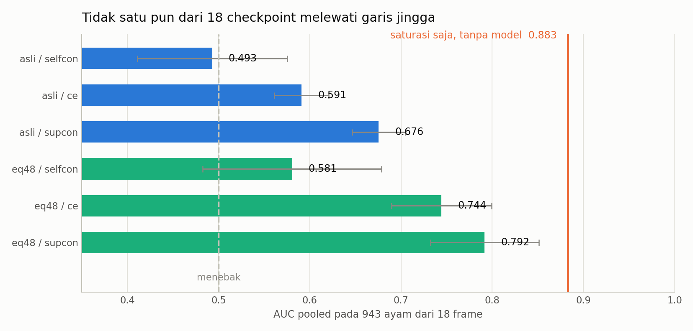
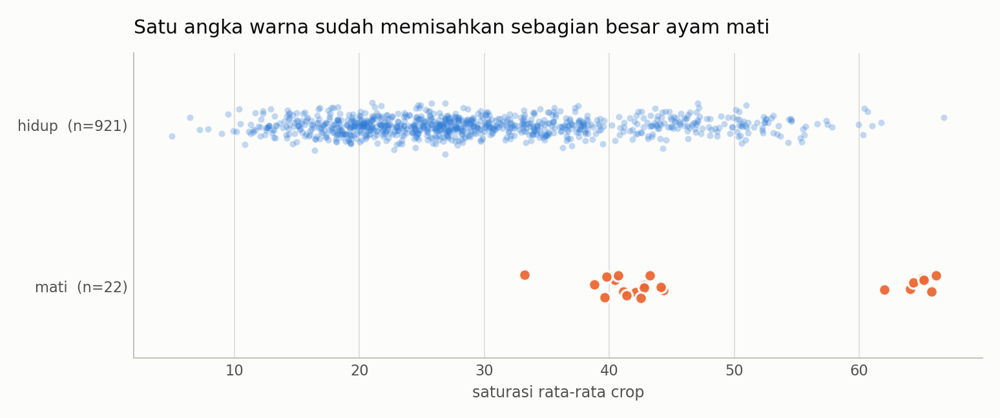
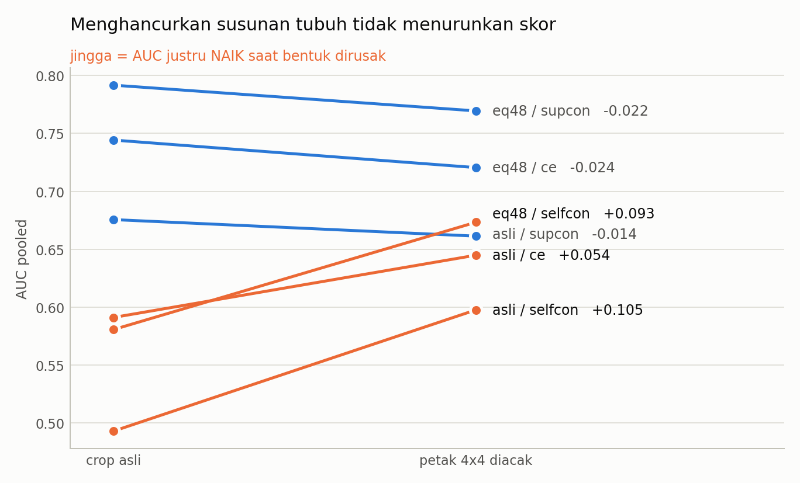

# Kronologi Lengkap Eksperimen 2: Hari Laci Dibuka

Dokumen ini adalah **lanjutan langsung** dari
[`kronologi_lengkap.md`](kronologi_lengkap.md). Yang pertama bercerita dari
permintaan awal sampai Babak 13 - ketika soal ujian akhirnya dikunci di dalam
laci dan tidak boleh disentuh. Dokumen kedua ini bercerita tentang **hari laci
itu dibuka**: 18 run pelatihan, registry yang dibekukan, dan angka test yang
pertama kali boleh dilihat.

Ditulis untuk dibaca berurutan, sama seperti dokumen pertama. Tiap gagasan
penting diberi **perumpamaan** supaya bisa disampaikan tanpa istilah teknis,
dan tiap angka besar diberi **gambar**.

> **Ringkasan satu paragraf untuk yang tidak punya waktu.** Delapan belas run
> selesai tanpa error, registry di-hash dan dibekukan, lalu benchmark test
> `chick` dibuka satu kali saja. Pipeline terbaik - eq48 + SupCon - mencapai
> **AP 0.386 dan AUC 0.792**, dengan urutan yang konsisten di semua metrik:
> supcon > ce > selfcon, eq48 > asli. Tetapi **baseline tanpa model** - hanya
> rata-rata saturasi warna satu crop - mencapai **AUC 0.883**, dan tidak satu
> pun dari 18 checkpoint melewatinya. Gerbang kausal `acak16` justru
> **menaikkan** AUC pada tiga dari enam kombinasi, mengkonfirmasi ulang bahwa
> classifier membaca tekstur, bukan bentuk. Dua bug pelaporan ketahuan dan
> diperbaiki sebelum angkanya dipublikasi. Yang berubah hari ini bukan skornya -
> yang berubah adalah **kita sekarang tahu skornya jujur**.

---

## Daftar isi

| # | Bagian | Hasil pokok |
|---|---|---|
| [1](#1-urutannya-dari-pagi-sampai-sore) | Urutannya, dari pagi sampai sore | 18 run, 0 error, registry beku sebelum test dibuka |
| [2](#2-cacat-yang-ketahuan-sebelum-angkanya-dipublikasi) | Cacat yang ketahuan sebelum angkanya dipublikasi | audit 272/272 yang mustahil - dan sebabnya |
| [3](#3-kurva-loss-satu-pipeline-belajar-satu-lagi-nyaris-tidak) | Kurva loss: satu pipeline belajar, satu lagi nyaris tidak | selfcon turun sehat, **supcon nyaris datar** |
| [4](#4-validation-tetap-jenuh---persis-seperti-ramalan-babak-8) | Validation tetap jenuh - persis seperti ramalan babak 8 | 9/9 run PIO asli val AUC 1.0000 |
| [5](#5-hasil-test-angka-terbaik-dan-angka-yang-mengalahkannya) | Hasil test: angka terbaik, dan angka yang mengalahkannya | **AP 0.386 / AUC 0.792 - kalah dari saturasi 0.883** |
| [6](#6-gerbang-kausal-bentuk-dihancurkan-skornya-malah-naik) | Gerbang kausal: bentuk dihancurkan, skornya malah naik | bentuk dihancurkan, 3 dari 6 AUC malah **naik** |
| [7](#7-kalau-dipakai-sungguhan-hari-ini) | Kalau dipakai sungguhan hari ini | 12.7 dari 22 tertangkap, 120 alarm palsu |
| [8](#8-apa-yang-boleh-dan-tidak-boleh-disimpulkan) | Apa yang boleh dan tidak boleh disimpulkan | 3 boleh, 5 tidak boleh |
| [9](#9-kenapa-babak-ini-tetap-kemajuan) | Kenapa babak ini tetap kemajuan | skornya jujur, itu yang berubah |
| [10](#10-yang-dikerjakan-berikutnya) | Yang dikerjakan berikutnya | kejar 0.883 dulu, baru tambah metode |
| [11](#11-daftar-gambar) | Daftar gambar | 3 figur baru + 16 figur lama |
| [12](#12-laporan-terkait) | Laporan terkait | berkas rinciannya |

---

## Di mana kita berhenti

Ringkas ulang, supaya dokumen ini bisa dibaca sendiri:

| babak | yang terjadi | dokumen |
|---|---|---|
| 1-3 | pipeline dua tahap dibangun, 3 metode kontrastif, tiap metode dapat augmentasinya sendiri | [kronologi 1](kronologi_lengkap.md) |
| 4-5 | **lantai ketajaman** ditemukan (bacc 0.9231 tanpa model); val set jenuh di 1.0 | [kronologi 1](kronologi_lengkap.md) |
| 6-7 | uji di CCTV `chick`: deteksi 100%, klasifikasi hanya AUC 0.65; `imgsz` diperbaiki | [kronologi 1](kronologi_lengkap.md) |
| 8-9 | latih dengan PIO -> bacc 1.0000 yang **palsu** karena `label = domain`; korelasi diganti uji intervensi | [kronologi 1](kronologi_lengkap.md) |
| 10-11 | **temuan terbesar**: 18/18 checkpoint tidak terganggu saat bentuk ayam dihancurkan | [kronologi 1](kronologi_lengkap.md) |
| 12 | skor anomali relatif satu-frame mulai membaca susunan, tapi belum unggul | [kronologi 1](kronologi_lengkap.md) |
| 13 | **batas data dikunci**: chick khusus test, train+val dari PIO + Roboflow; loss dicatat tiap epoch | [kronologi 1](kronologi_lengkap.md) |
| **14** | **laci dibuka** - dokumen ini | kronologi 2 |

Babak 13 menutup soal ujiannya di dalam laci. Yang berikut ini adalah hari
ketika laci itu dibuka - sesudah seluruh jawaban dikumpulkan dan tidak bisa
diubah lagi.

> **Perumpamaan pembuka.** Selama sebelas babak, kita menyusun soal ujian,
> mengerjakannya, lalu memeriksa sendiri jawabannya - dan tiap kali nilainya
> bagus, ternyata yang bagus adalah soalnya, bukan muridnya.
>
> Babak 13 mengubah aturannya: soal ujian ditulis orang lain, disegel, dan
> dikunci di laci. Murid belajar tanpa pernah melihat soal itu. Hari ini
> segelnya dibuka. Yang penting bukan nilainya - yang penting **kita tidak lagi
> bisa menawar nilainya**, karena kunci lacinya baru diputar setelah semua
> jawaban ditandatangani.

---

## 1. Urutannya, dari pagi sampai sore

| jam | yang terjadi |
|---|---|
| 11:52 - 12:25 | 9 run PIO asli (3 pipeline x 3 seed), 1972 detik komputasi |
| 12:25 - 12:57 | 9 run PIO eq48 (3 pipeline x 3 seed), 1942 detik komputasi |
| 13:0x | registry dibekukan: SHA-256 checkpoint, config, split, dan 10 berkas sumber |
| 13:0x | test dibuka pertama kali - lalu **dua bug pelaporan ketahuan** |
| 13:1x | bug diperbaiki, registry dibekukan ulang, test dijalankan ulang |

Delapan belas run selesai dengan exit code 0, tanpa satu pun error. Tahap
contrastive selalu berjalan penuh 60 epoch; yang berhenti lebih awal hanya
linear probe dan CE.

Urutan ini bukan basa-basi administratif. **Registry dibekukan sebelum test
dibuka** - artinya daftar checkpoint yang boleh diuji sudah terkunci dan
ter-hash sebelum ada satu angka test pun yang terlihat. Tidak ada kesempatan
untuk "mencoba yang lain" setelah melihat hasilnya.

> **Perumpamaan.** Seperti menyegel amplop jawaban dan menandatangani segelnya
> di depan saksi, sebelum panitia membuka kunci soal. Kalau amplopnya dibuka
> belakangan, tanda tangannya tetap di situ - orang bisa memeriksa bahwa isinya
> tidak diganti.

---

## 2. Cacat yang ketahuan sebelum angkanya dipublikasi

Test dibuka, tabelnya terbit - dan satu kolomnya mustahil. Audit crop
`bukan ayam` melaporkan **272 dari 272** di setiap baris, untuk top-1, top-3,
dan top-5 sekaligus. Padahal top-1 pada 18 frame paling banyak memuat **18**
crop. Angka itu tidak mungkin.

Penyebabnya satu baris:

```python
# salah - nilai kedua dari ranks_within_frame adalah PERSENTIL, bukan peringkat
_, rel_op_rank, rel_op_norm = ranks_within_frame(...)
# benar
rel_op_rank, _, rel_op_norm = ranks_within_frame(...)
```

Karena persentil selalu di bawah 1, syarat `peringkat <= k` selalu benar, jadi
seluruh 272 crop dihitung "masuk top-k". Bug kedua lebih sederhana:
`report_fixed_chick.py` menulis judul "Sensitivitas acak16" beserta
peringatannya, tetapi **tidak pernah mengeluarkan tabelnya** - gerbang kausal
tidak menghasilkan satu angka pun yang terbaca.

Keduanya diperbaiki lebih dulu, registry dibekukan ulang supaya `git_commit`
dan `source_sha256` menunjuk ke kode yang sudah benar, lalu seluruh benchmark
dijalankan ulang. Tabel metrik utama terbit **identik angka demi angka** -
karena fungsi `threshold_free` menghitung peringkatnya sendiri dengan benar -
dan hanya kolom audit yang berubah. Itu bukti bahwa perbaikannya tepat sasaran
dan tidak diam-diam menggeser hasil.

> **Perumpamaan.** Timbangan di pasar menunjukkan 272 kilo untuk sekantong
> cabai. Yang benar bukan mencari pembeli yang mau percaya, tapi menyadari
> bahwa jarumnya sedang membaca skala yang salah. Sesudah diperbaiki, cabainya
> tetap cabai yang sama - hanya angkanya yang akhirnya masuk akal.

---

## 3. Kurva loss: satu pipeline belajar, satu lagi nyaris tidak

Permintaan di babak 13 - loss tercatat tiap epoch - sekarang punya
hasilnya. Rata-rata tiga seed, dari epoch pertama ke epoch terakhir:

| varian | tahap | train loss | validation loss |
|---|---|---|---|
| asli | selfcon contrastive (60 ep) | 3.17 -> 0.24 | 3.19 -> 1.19 |
| asli | **supcon contrastive (60 ep)** | **4.09 -> 3.54** | **3.81 -> 3.58** |
| asli | CE (20-26 ep) | 0.44 -> 0.04 | 0.11 -> 0.01 |
| eq48 | selfcon contrastive (60 ep) | 3.64 -> 0.33 | 3.73 -> 1.34 |
| eq48 | **supcon contrastive (60 ep)** | **4.23 -> 3.55** | **4.05 -> 3.62** |
| eq48 | CE (20-22 ep) | 0.57 -> 0.12 | 0.38 -> 0.02 |

SelfCon sehat: train dan validation turun bersama, tidak ada divergensi liar.
Tetapi **SupCon nyaris tidak bergerak** - 4.09 turun ke 3.54 dalam 60 epoch
penuh. Loss SupCon memang tidak menuju nol karena dinormalisasi atas banyak
positif, jadi datar bukan otomatis berarti gagal. Yang mencurigakan adalah
kombinasinya dengan fakta lain: probe linier sesudahnya turun sampai
0.0005-0.0014, dan SupCon-lah yang justru menang di test.

Itu menimbulkan pertanyaan yang belum terjawab: kalau tahap contrastive-nya
hampir tidak belajar, **siapa yang sebenarnya memisahkan kelasnya?** Dugaan
sementara: probe liniernya, bekerja di atas fitur backbone yang sudah cukup
terpisah sejak awal karena `label = domain`. Ini ditulis sebagai pekerjaan yang
harus diperiksa, bukan sebagai keberhasilan contrastive.

> **Perumpamaan.** Seorang pelatih mengaku muridnya menang lomba berkat latihan
> enam bulan. Tapi catatan absensinya menunjukkan si murid hampir tidak pernah
> datang. Mungkin dia memang berbakat sejak awal - tapi kalau begitu, jangan
> kreditkan kemenangannya ke latihan.

---

## 4. Validation tetap jenuh - persis seperti ramalan babak 8

Seluruh 9 run PIO asli mencapai **AUC validation 1.0000**. Checkpoint terpilih
sering pada epoch yang sangat awal - SupCon pada epoch **1, 1, dan 2**.

| varian | metode | epoch terpilih (s42/s43/s44) | val bacc | val AUC |
|---|---|---|---|---|
| asli | ce | 11 / 10 / 5 | 1.0000 semua | 1.0000 |
| asli | selfcon | 10 / 3 / 36 | 1.0000 / 1.0000 / 0.9913 | 1.0000 |
| asli | supcon | 1 / 1 / 2 | 1.0000 / 0.9957 / 0.9957 | 1.0000 |
| eq48 | ce | 5 / 7 / 7 | 1.0000 semua | 1.0000 |
| eq48 | selfcon | 24 / 8 / 6 | 0.9120 / 0.9245 / 0.8940 | 0.9930 / 0.9898 / 0.9674 |
| eq48 | supcon | 2 / 4 / 1 | 1.0000 / 1.0000 / 0.9625 | 1.0000 / 1.0000 / 0.9996 |

Model yang "selesai belajar" pada epoch 1 bukan model yang menguasai soal. Itu
model yang menemukan bahwa soalnya sudah terjawab sejak halaman sampul.

Satu-satunya baris yang **tidak** jenuh adalah selfcon pada eq48. Itu konsisten
dengan babak 8: equalization memotong jalan pintas ketajaman (val AUC ketajaman
0.878 -> 0.565), dan metode tanpa label paling terpukul. SupCon yang punya label
- dan label itu identik dengan domain - tetap 1.0000.

---

## 5. Hasil test: angka terbaik, dan angka yang mengalahkannya

Kohortnya: **943 ayam valid dari 18 frame** - 22 mati, 921 hidup - ditambah 272
crop `bukan ayam` sebagai pengganggu pada peringkat operational. Rata-rata tiga
seed.

| varian | metode | AP pooled | AUC pooled | Recall@3 | MRR |
|---|---|---:|---:|---:|---:|
| asli | selfcon | 0.024 +/- 0.006 | 0.493 +/- 0.101 | 0.037 | 0.080 |
| asli | ce | 0.039 +/- 0.005 | 0.591 +/- 0.037 | 0.093 | 0.149 |
| asli | supcon | 0.091 +/- 0.026 | 0.676 +/- 0.036 | 0.343 | 0.312 |
| eq48 | selfcon | 0.033 +/- 0.011 | 0.581 +/- 0.120 | 0.093 | 0.147 |
| eq48 | ce | 0.165 +/- 0.086 | 0.744 +/- 0.067 | 0.361 | 0.346 |
| **eq48** | **supcon** | **0.386 +/- 0.063** | **0.792 +/- 0.073** | **0.519** | **0.536** |

Urutannya konsisten di keempat metrik: **supcon > ce > selfcon**, dan **eq48 >
asli**. Itu kabar baiknya, dan itu nyata.

Lalu baseline tanpa model diukur pada crop test yang sama - bukan model apa pun,
hanya satu angka statistik gambar:

| ciri | AUC pooled | AP pooled | Recall@3 |
|---|---:|---:|---:|
| **saturasi** | **0.883** | 0.299 | 0.389 |
| bbox sisi pendek | 0.786 | 0.057 | 0.167 |
| luas bbox | 0.724 | 0.043 | 0.167 |
| kepercayaan detektor | 0.540 | 0.024 | 0.000 |
| ketajaman | 0.536 | 0.032 | 0.111 |



*Enam pipeline, AUC pooled, rata-rata tiga seed dengan simpangan antar-seed.
Garis jingga adalah saturasi saja - tanpa model, tanpa training, tanpa GPU.
Tidak satu pun batang menyentuhnya.*

**Ini angka terpenting dari seluruh babak.** Model terbaik hasil 18 run mencapai
AUC 0.792. Rata-rata saturasi satu crop mencapai 0.883. Tidak satu pun dari 18
checkpoint melewatinya.

Modelnya menang hanya pada AP (0.386 vs 0.299) dan Recall@3 (0.519 vs 0.389) -
artinya ia lebih baik **menaruh ayam mati di peringkat paling atas**, walaupun
urutan keseluruhannya lebih buruk. Itu perbedaan yang nyata dan ada gunanya
untuk operator yang hanya memeriksa 3 kandidat teratas per frame. Tapi itu bukan
"model mengenali ayam mati".



*Kenapa satu angka warna sudah cukup jauh: 22 ayam mati (jingga) hampir semuanya
duduk di saturasi 39-67, sementara 921 ayam hidup (biru) menumpuk di 10-35. Ayam
mati di dataset ini kebetulan terekam pada bagian lantai yang warnanya lebih
pekat.*

> **Perumpamaan.** Lomba menebak berat sapi. Seorang ahli dengan alat ukur
> lengkap menebak dalam selisih 40 kilo. Seorang anak yang cuma melihat sekilas
> dan berkata "yang di kandang kanan lebih berat" ternyata lebih sering benar,
> karena kandang kanan kebetulan berisi sapi yang lebih tua.
>
> Anak itu tidak bisa menebak berat sapi. Dia menebak kandang. Dan selama
> ujiannya disusun begitu, dia akan terus menang - tanpa pernah belajar apa-apa
> tentang sapi.

---

## 6. Gerbang kausal: bentuk dihancurkan, skornya malah naik

Perlakuan `acak16` yang sama dari babak 10 - crop dipecah 4x4 lalu petaknya
diacak (derangement, tanpa petak yang tetap di tempatnya) - dipakai lagi di
sini. Bentuk dan pose hancur; tekstur dan warna lokal utuh.

| varian | metode | AUC asli | AUC acak16 | delta |
|---|---|---:|---:|---:|
| asli | ce | 0.591 | 0.645 | **+0.054** |
| asli | selfcon | 0.493 | 0.598 | **+0.105** |
| asli | supcon | 0.676 | 0.661 | -0.014 |
| eq48 | ce | 0.744 | 0.721 | -0.024 |
| eq48 | selfcon | 0.581 | 0.673 | **+0.093** |
| eq48 | supcon | 0.792 | 0.769 | -0.022 |



*Tiap garis satu kombinasi. Garis jingga naik: menghancurkan susunan tubuh
justru MENAIKKAN AUC. Garis biru turun, tapi turunnya kecil - paling besar
-0.024.*

Merusak susunan petak **tidak menurunkan** AUC; pada tiga dari enam kombinasi
malah **menaikkannya**. Model yang benar-benar membaca bentuk dan posisi tubuh
ayam seharusnya runtuh di sini. Ini mengkonfirmasi ulang temuan babak 10, kali
ini di bawah protokol test yang jauh lebih ketat: **classifier membaca tekstur,
bukan bentuk.**

Ada satu pengecualian yang menarik. Pada **skor relatif** eq48+supcon, AP jatuh
dari 0.216 ke 0.046 - komponen relatifnya jelas peka pada susunan. Sayangnya
komponen relatif itu justru yang hasilnya lebih rendah daripada skor absolut
(AP 0.223 vs 0.386). Jadi bagian yang benar-benar melihat bentuk adalah bagian
yang paling lemah.

> **Perumpamaan.** Kita curiga seseorang membaca buku atau cuma menghafal sampul.
> Kita robek halamannya lalu acak urutannya, dan tanyakan lagi isinya. Kalau
> jawabannya tetap benar - apalagi **lebih** benar - dia tidak pernah membaca
> halamannya.

---

## 7. Kalau dipakai sungguhan hari ini

Ambang `tau_val` dihitung murni dari validation, tidak pernah dari chick:

| varian | metode | bacc | recall mati | spesifisitas | presisi mati | TP dari 22 | FP |
|---|---|---:|---:|---:|---:|---:|---:|
| asli | selfcon | 0.492 | 0.000 | 0.984 | 0.000 | 0.0 | 15.0 |
| asli | ce | 0.528 | 0.121 | 0.935 | 0.039 | 2.7 | 59.7 |
| asli | supcon | 0.533 | 0.091 | 0.975 | 0.032 | 2.0 | 23.3 |
| eq48 | selfcon | 0.527 | 0.212 | 0.841 | 0.032 | 4.7 | 146.0 |
| eq48 | ce | 0.648 | 0.333 | 0.963 | 0.203 | 7.3 | 34.0 |
| eq48 | supcon | 0.723 | 0.576 | 0.870 | 0.105 | 12.7 | 120.0 |

Yang terbaik menangkap 12.7 dari 22 ayam mati - dan menukarnya dengan 120 alarm
palsu. **Sembilan dari sepuluh alarm keliru.** (Presisi 0.105 pada tabel adalah
rata-rata presisi tiga seed; dihitung dari rata-rata TP dan FP nilainya 0.096 -
keduanya bercerita sama.) Sebagai alat operasional, ini belum layak pakai.

Audit crop `bukan ayam` menambah satu lapisan lagi. Dari 272 crop yang bukan
ayam sama sekali, berapa yang ikut naik ke peringkat teratas:

| varian | metode | top-1 | top-3 | top-5 |
|---|---|---:|---:|---:|
| asli | ce | 17.3 | 47.3 | 74.0 |
| asli | selfcon | 16.0 | 46.0 | 73.3 |
| asli | supcon | 4.3 | 15.7 | 25.7 |
| eq48 | ce | 17.0 | 49.7 | 76.7 |
| eq48 | selfcon | 17.0 | 48.0 | 74.3 |
| eq48 | supcon | 5.7 | 23.3 | 38.3 |

Batas teoretisnya 18 - satu peringkat-1 per frame. Jadi pada `ce` dan `selfcon`,
**hampir setiap frame menaruh objek bukan-ayam di peringkat 1**. SupCon jauh
lebih bersih (4.3 dan 5.7 dari 18), dan ini satu-satunya sisi di mana
keunggulannya konsisten.

---

## 8. Apa yang boleh dan tidak boleh disimpulkan

**Boleh disimpulkan:**

1. Pipeline lengkap berjalan end-to-end di bawah protokol yang ketat: loss
   tercatat tiap epoch, 18 run reproducible, registry ter-hash, test dibuka
   sekali saja tanpa seleksi apa pun dari hasilnya.
2. Ada urutan yang konsisten antar-pipeline - supcon > ce > selfcon, eq48 >
   asli - dan urutan itu sama pada AP, AUC, Recall@3, dan MRR.
3. Equalization 48 px membantu di test, bukan hanya di validation: AP eq48
   supcon 0.386 vs asli 0.091, naik lebih dari empat kali lipat.

**Tidak boleh disimpulkan:**

1. **Tidak boleh** diklaim model mengenali ayam mati. Baseline saturasi tanpa
   model mengalahkan seluruh 18 checkpoint pada AUC.
2. **Tidak boleh** dikreditkan ke fungsi loss. Pada tiap diagonal, loss dan
   augmentasi berubah bersamaan - ini perbandingan pipeline, bukan atribusi
   kausal. (Masalah dua faktor dari babak 3 masih berlaku utuh.)
3. **Tidak boleh** dibaca sebagai bukti membaca pose. Gerbang acak16 justru
   menaikkan AUC pada tiga kombinasi.
4. **Tidak boleh** disebut hasil konfirmatori. Chick adalah benchmark tetap
   **retrospektif** - dataset itu sudah pernah dibaca pada eksperimen historis
   proyek ini, dari babak 6 sampai babak 12. Protokol sekarang mencegah
   kebocoran ke depan, tapi tidak bisa menghapus ingatan eksperimen yang sudah
   terjadi.
5. **Tidak boleh** dianggap cukup datanya. Hanya 98 crop mati di development dan
   22 ayam mati di test. Satu ayam mati bernilai 4.5 poin recall.

> **Perumpamaan untuk nomor 4.** Seorang guru menyegel soal ujian dan bersumpah
> tidak memberitahukannya. Masalahnya, dia sudah pernah membahas soal itu di
> kelas tahun lalu. Segelnya sah dan niatnya benar - tapi ujiannya tetap tidak
> bisa disebut ujian pertama.

---

## 9. Kenapa babak ini tetap kemajuan

Kalau dibaca dari angkanya saja, babak 14 kelihatan seperti kegagalan: model
terbaik kalah dari satu angka warna. Tapi yang berubah hari ini bukan skornya -
yang berubah adalah **kita sekarang tahu skornya jujur**.

Bandingkan dengan babak 8. Waktu itu balanced accuracy 1.0000 terlihat seperti
kemenangan besar, dan butuh dua babak penuh untuk menemukan bahwa angka itu
palsu. Hari ini, angka 0.792 langsung datang bersama tiga hal yang
membatalkannya: baseline yang mengalahkannya, gerbang kausal yang tidak dilewati,
dan audit yang menunjukkan berapa banyak alarm yang salah sasaran.

Menemukan kelemahan sendiri pada hari yang sama dengan hasilnya - itu yang tidak
dimiliki sebelas babak sebelumnya.

> **Perumpamaan.** Termometer yang rusak dan menunjukkan 36.5 derajat untuk
> semua orang tidak berguna, walaupun angkanya enak dilihat. Termometer yang
> menunjukkan 39 dan memang benar 39 jauh lebih berharga - meski beritanya buruk.
> Babak 14 adalah hari kita berhenti memakai termometer yang pertama.

---

## 10. Yang dikerjakan berikutnya

1. **Kejar baseline saturasi dulu.** Sebelum menambah metode apa pun, model harus
   bisa mengalahkan AUC 0.883 dari satu angka warna. Kalau tidak bisa, menambah
   pipeline hanya menambah biaya komputasi tanpa menambah pengetahuan.
2. **Periksa kurva SupCon yang datar.** Perlu dipastikan apakah temperatur,
   ukuran batch, atau jumlah positif per anchor membuat tahap contrastive-nya
   praktis tidak belajar - dan kalau iya, apakah keunggulan SupCon di test
   sebenarnya milik probe liniernya.
3. **Cari sumber ayam mati kedua** dengan domain berbeda dari Roboflow. Selama
   semua ayam mati berasal dari satu domain close-up, `label = domain` tidak akan
   pernah bisa dipatahkan dari sisi data - dan ini akar yang sama dengan babak 8.
4. **Benchmark prospektif**: frame CCTV baru yang belum pernah disentuh proyek
   ini sama sekali, supaya klaim konfirmatori akhirnya mungkin.

Catatan reproduksi:

```bash
sh run_dev_full.sh > outputs/logs/dev_full.log 2>&1
python src/build_dev_registry.py
python src/eval_fixed_chick.py --registries \
    outputs/predictions/pio_dev_registry.json,outputs/predictions/pio_eq_dev_registry.json
python src/report_fixed_chick.py
python src/figur_babak14.py
```

Rincian protokol dan angka lengkapnya:
[`pio_development_protocol.md`](pio_development_protocol.md),
[`fixed_chick.md`](fixed_chick.md), dan
[`update_14_september.md`](update_14_september.md).

---

## 11. Daftar gambar

Tiga figur baru dibuat khusus untuk babak ini, semuanya di `outputs/reports/`
dan dihasilkan oleh satu skrip: `python src/figur_babak14.py`.

| gambar | isi | dibaca di |
|---|---|---|
| [`babak14_vs_baseline.png`](babak14_vs_baseline.png) | **6 pipeline vs baseline saturasi** - tidak satu pun batang menyentuh garis jingga | [bagian 5](#5-hasil-test-angka-terbaik-dan-angka-yang-mengalahkannya) |
| [`babak14_saturasi.png`](babak14_saturasi.png) | sebaran saturasi 22 mati vs 921 hidup - kenapa satu angka warna sudah cukup | [bagian 5](#5-hasil-test-angka-terbaik-dan-angka-yang-mengalahkannya) |
| [`babak14_acak16.png`](babak14_acak16.png) | **gerbang kausal**: menghancurkan bentuk malah menaikkan AUC pada 3 dari 6 | [bagian 6](#6-gerbang-kausal-bentuk-dihancurkan-skornya-malah-naik) |

Enam belas figur dari babak 1-12 tetap ada di dokumen pertama:
[daftar gambar kronologi 1](kronologi_lengkap.md#13-daftar-gambar-hasil-eksperimen).
Yang paling relevan untuk dibaca berdampingan dengan dokumen ini:

| gambar lama | kenapa relevan sekarang |
|---|---|
| [`acak_bentuk.jpg`](acak_bentuk.jpg) | versi babak 10 dari gerbang kausal yang sama - hasilnya juga tidak turun |
| [`domain_gap.jpg`](domain_gap.jpg) | jurang domain close-up vs CCTV yang masih jadi akar `label = domain` |
| [`pio_equalize.jpg`](pio_equalize.jpg) | apa yang sebenarnya dilakukan eq48, varian yang menang di test |

---

## 12. Laporan terkait

| berkas | isi |
|---|---|
| [`kronologi_lengkap.md`](kronologi_lengkap.md) | **dokumen pertama** - babak 1 sampai 13 |
| [`update_14_september.md`](update_14_september.md) | ringkasan eksekutif hari yang sama |
| [`pio_development_protocol.md`](pio_development_protocol.md) | batas data development + aturan loss per epoch |
| [`fixed_chick.md`](fixed_chick.md) | tabel test lengkap, semua scorer dan semua intervensi |
| [`same_frame_stage1.md`](same_frame_stage1.md) | Tahap 1 skor relatif satu-frame |
| [`same_frame_stage1_causal.md`](same_frame_stage1_causal.md) | gerbang kausal asli vs acak16 pada skor relatif |
| [`pio_saja.md`](pio_saja.md) | percobaan PIO, uji intervensi, vonis akhir |
| [`comparison.md`](comparison.md) | grid 3x3 x 5 seed + lantai ketajaman |
| [`../../README.md`](../../README.md) | ringkasan proyek + keputusan desain |

---

## Penutup: satu kalimat untuk babak 14

Delapan belas run diselesaikan di bawah protokol yang paling ketat sejauh ini -
registry ter-hash dan dibekukan sebelum satu angka test pun terlihat - dan
hasilnya jelas: pipeline terbaik (eq48 + SupCon, AP 0.386 / AUC 0.792) **kalah
pada AUC dari satu angka saturasi warna tanpa model (0.883)**, gerbang `acak16`
justru menaikkan AUC pada tiga dari enam kombinasi, dan pada ambang operasional
sembilan dari sepuluh alarmnya salah sasaran.

**Langkah berikutnya yang akan bergerak:** mengalahkan AUC 0.883 lebih dulu.
Selama satu angka warna masih menang, menambah metode hanya menambah biaya
komputasi. Dua syaratnya sudah diketahui - sumber ayam mati kedua dengan domain
berbeda, dan frame CCTV baru yang belum pernah disentuh proyek ini - dan
keduanya butuh anotasi baru, bukan arsitektur baru.

> **Perumpamaan penutup.** Sebelas babak pertama adalah belajar membaca
> timbangan. Babak 12 dan 13 adalah menyegel timbangannya supaya tidak bisa
> dicurangi. Babak 14 adalah menimbang - dan mendapati bahwa yang selama ini
> kita kira berat, ternyata cuma kantongnya.
