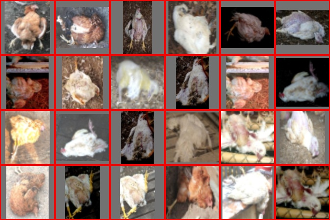
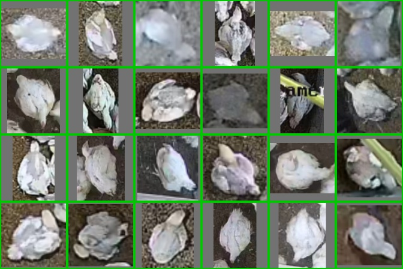
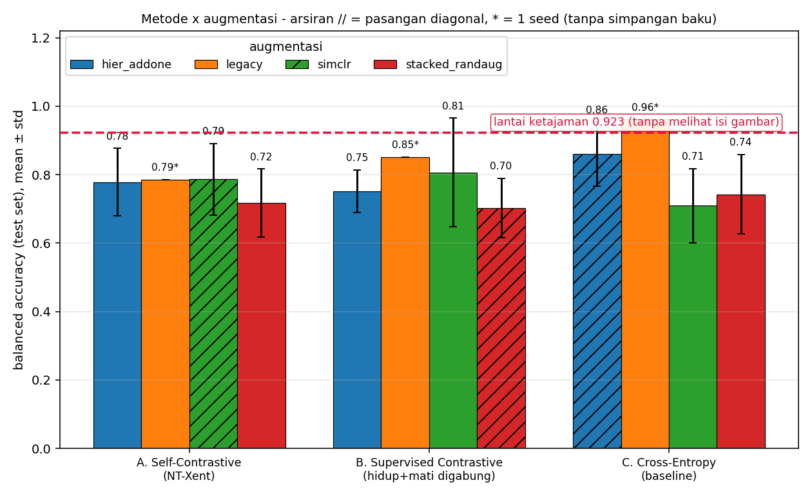
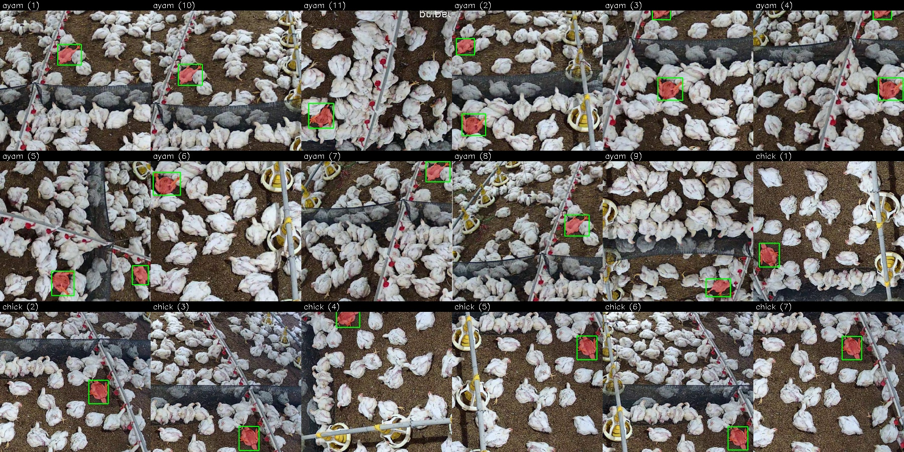
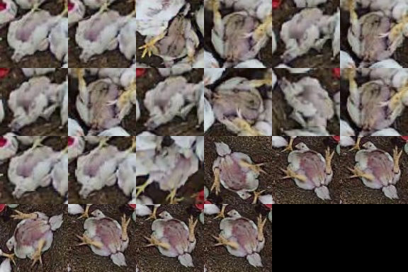
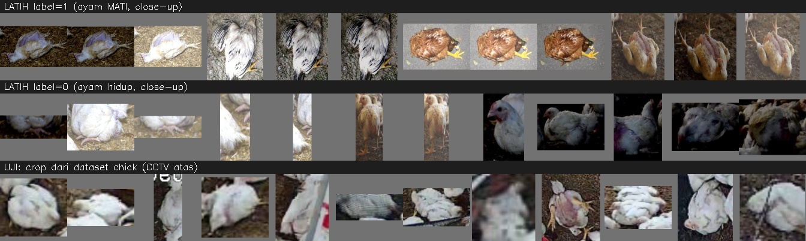
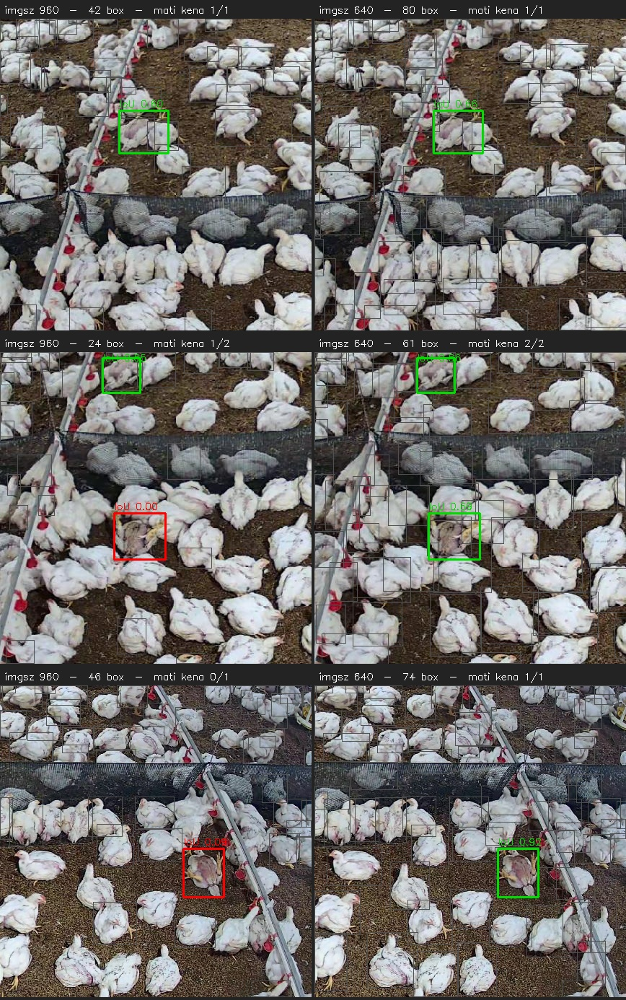
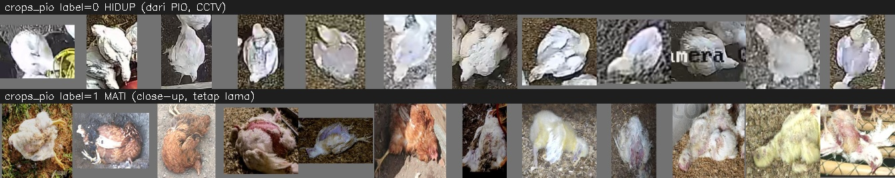
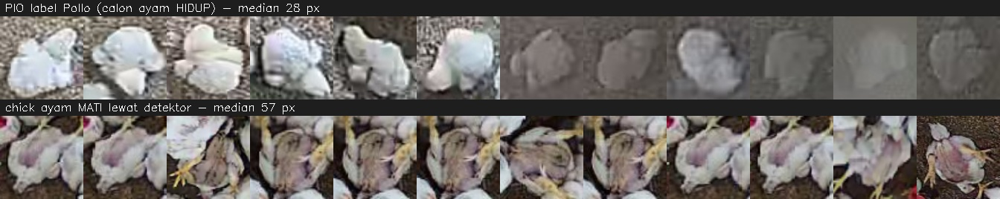

# Kronologi Lengkap Eksperimen: Deteksi + Klasifikasi Ayam Mati

Dokumen ini menceritakan **seluruh perjalanan** proyek ini dari permintaan
pertama sampai temuan terakhir - apa yang dikerjakan, apa yang ditemukan, apa
yang ternyata salah, dan **kenapa** setiap perubahan diambil.

Ditulis untuk dibaca berurutan. Tiap
bagian penting diberi **perumpamaan** supaya gagasannya bisa disampaikan tanpa
istilah teknis.

> **Ringkasan satu paragraf untuk yang tidak punya waktu.** Pipeline deteksi +
> klasifikasi ayam mati berhasil dibangun dan berjalan. Detektornya **sangat
> baik** (22/22 ayam mati tertangkap, 100%). Classifier-nya **kelihatan sangat
> baik** (akurasi berimbang sampai 1.0000) tapi ternyata **tidak benar-benar
> melihat ayam**: ia membaca ketajaman dan tekstur gambar, bukan pose ayamnya.
> Dibuktikan dengan menghancurkan bentuk ayam di gambar - skornya tidak turun.
> Pada data CCTV yang sesungguhnya, skornya jatuh ke 0.65 (0.5 = menebak). Tiga
> cara penataan data dicoba untuk memperbaikinya; tidak satu pun berhasil.
> Akarnya jumlah data latih, dan itu butuh anotasi baru.

---

## Daftar isi

| # | Babak | Hasil pokok |
|---|---|---|
| [0](#0-peta-jalan-singkat) | Peta jalan singkat | urutan 8 babak |
| [1](#1-babak-1-merancang-pipeline-dua-tahap) | Merancang pipeline | 2 tahap: YOLO -> classifier |
| [2](#2-babak-2-tiga-metode-yang-dibandingkan) | Tiga metode kontrastif | selfcon / supcon / ce |
| [3](#3-babak-3-tiap-metode-dapat-augmentasinya-sendiri) | Augmentasi per paper | masalah 2 faktor muncul |
| [4](#4-babak-4-temuan-yang-mengubah-segalanya---lantai-ketajaman) | **Lantai ketajaman** | bacc 0.9231 tanpa model |
| [5](#5-babak-5-val-set-yang-tidak-bisa-memilih) | Val set jenuh | tidak bisa kalibrasi ambang |
| [6](#6-babak-6-uji-di-data-sesungguhnya-cctv-chick) | Uji di CCTV `chick` | deteksi 100%, AUC 0.65 |
| [7](#7-babak-7-dugaan-keliru-imgsz-dan-arah-yang-terbalik) | `imgsz` 960 -> 640 | recall 36% -> 100% |
| [8](#8-babak-8-mencoba-dataset-pio-dan-angka-yang-menipu) | Latih dengan PIO | bacc 1.0000 yang palsu |
| [9](#9-babak-9-salah-saya-sendiri---korelasi-bukan-sebab) | **Kekeliruan saya** | rho tinggi bukan bukti |
| [10](#10-babak-10-temuan-terbesar---classifier-tidak-melihat-bentuk-ayam) | **Classifier buta bentuk** | 18/18 tak terganggu |
| [11](#11-babak-11-membandingkan-dengan-acuan-yang-benar) | Acuan yang benar | tidak ada yang menang |
| [12](#12-kumpulan-masalah-yang-ditemukan) | Daftar masalah | 11 masalah + statusnya |
| [13](#13-daftar-gambar-hasil-eksperimen) | Daftar gambar | 16 figur |
| [15](#15-menghitung-ulang-semuanya) | Reproduksi | perintah lengkap |

---

## 0. Peta jalan singkat

```
BABAK 1-3   membangun           rancang pipeline, 3 metode, 3 augmentasi
                                    |
BABAK 4-5   curiga               "kok angkanya bagus sekali?"
                                    |  ukur jalan pintas tanpa model
                                    v
BABAK 6-7   uji di dunia nyata   CCTV chick: deteksi 100%, classifier 0.65
                                    |
BABAK 8     cari jalan keluar    latih dgn PIO -> bacc 1.0000 (palsu)
                                    |
BABAK 9     salah langkah        simpulkan dari korelasi -> KELIRU
                                    |  ganti dengan uji sebab
                                    v
BABAK 10-11 temuan sebenarnya    model tidak melihat bentuk ayam sama sekali
```

Pola yang berulang di seluruh proyek: **setiap kali angkanya membaik, ternyata
yang membaik adalah kemudahan soalnya, bukan kemampuan modelnya.** Itu benang
merah dokumen ini.

---

## 1. Babak 1: merancang pipeline dua tahap

### Yang diminta

Membangun pipeline yang: mendeteksi ayam di gambar kandang, lalu menilai tiap
ayam **hidup atau mati**, dengan classifier hasil *contrastive learning*.

### Yang dibangun

```
     gambar kandang
           |
   [1] YOLOv8m deteksi ayam            src/detect.py
           |  bounding box per ekor
           v
   [2] crop tiap bbox + letterbox      src/common.py: to_square()
           |  semua jadi 224 x 224
           v
   [3] classifier kontrastif           src/train.py
           |
           v
     hidup / MATI + peluang
```

### Kenapa dua tahap, bukan satu YOLO 2-kelas

Ini keputusan desain pertama, dan alasannya praktis: **tidak ada satu pun
dataset deteksi di disk yang punya kelas ayam mati.** Semuanya `nc: 1` (satu
kelas, "ayam"). Melatih YOLO 2-kelas berarti menganotasi ulang dari nol.

Dua tahap memisahkan dua soal yang berbeda kesulitannya:

- **"Di mana ayamnya?"** - mudah, dan sudah ada bobot YOLO yang bagus.
- **"Ayam ini mati atau hidup?"** - sulit, dan di situlah seluruh persoalan
  sesungguhnya berada (terbukti benar di babak 6).

> **Perumpamaan.** Seperti memisahkan tugas *pengantar surat* dan *pembaca
> surat*. Pengantar cuma perlu tahu "ini sebuah surat" - itu gampang. Pembaca
> harus mengerti isinya - itu yang susah. Menggabungkan keduanya jadi satu
> pekerjaan membuat kita tidak bisa tahu siapa yang salah kalau hasilnya
> keliru.

### Bentuk crop latihnya



*Crop ayam mati - dari foto close-up.*



*Crop ayam hidup. Perhatikan bilah abu-abu di tepi (letterbox) - ini nanti jadi
masalah sendiri di babak 4.*

### Keputusan desain penting di tahap ini

**(a) Letterbox, bukan resize paksa.** Semua crop dijadikan 224x224 dengan
menambah bilah abu-abu, bukan dengan menarik gambarnya.

*Kenapa:* menarik gambar mengubah perbandingan bentuk badan ayam. Ayam mati
tergeletak memanjang; kalau ditarik jadi persegi, bentuk itu rusak - padahal
bentuk itulah sinyalnya. (Catatan: keputusan ini nanti melahirkan masalah
sendiri di babak 4.)

**(b) Split per gambar asal, bukan per crop.** Dataset ini hasil augmentasi
Roboflow - satu foto asli muncul sampai 3x dengan nama berbeda.

*Kenapa:* kalau displit per crop, versi augmentasi dari foto yang sama bocor ke
train **dan** test sekaligus. Modelnya lalu "mengenali" foto yang sudah pernah
dilihat, dan skornya palsu. `build_crops.py` memetakan nama file kembali ke
foto aslinya, membagi di level itu, lalu memverifikasi ulang.

> **Perumpamaan.** Seperti ujian di mana soal ujian ternyata sama dengan soal
> latihan, cuma diganti nama variabelnya. Nilainya tinggi, tapi tidak ada yang
> dipelajari.

**(c) Augmentasi TIDAK memakai rotasi.** Hanya flip horizontal, skala, warna,
blur.

*Kenapa:* orientasi justru sinyal utamanya - ayam mati tergeletak/terlentang,
ayam hidup berdiri tegak. Memutar gambar 90 derajat menghapus tepat sinyal yang
ingin dipelajari.

> **Perumpamaan.** Mengajari orang membedakan orang tidur dan orang berdiri,
> tapi fotonya diputar-putar acak dulu. Perbedaannya hilang sebelum sempat
> dipelajari.

---

## 2. Babak 2: tiga metode yang dibandingkan

| | Metode | Label saat melatih encoder | Yang dianggap "mirip" |
|---|---|---|---|
| **A** | `selfcon` - Self-Contrastive (SimCLR/NT-Xent) | **tidak** dipakai | hanya augmentasi dari gambar yang sama |
| **B** | `supcon` - Supervised Contrastive | dipakai | semua gambar sekelas dalam batch |
| **C** | `ce` - Cross-Entropy biasa | dipakai | - (tanpa contrastive) |

Arsitektur (ResNet18), data, ukuran input, dan jumlah epoch **identik** untuk
ketiganya.

> **Perumpamaan untuk contrastive learning.** Bayangkan menyusun foto di atas
> meja. Aturannya: foto yang "mirip" didekatkan, yang "beda" dijauhkan.
> Perbedaan ketiga metode cuma pada **siapa yang menentukan arti "mirip"**:
>
> - `selfcon`: mirip = foto yang sama, cuma difoto ulang dengan filter beda.
>   Tidak pernah diberi tahu mana ayam mati. Seperti menyusun foto tanpa
>   melihat keterangannya sama sekali.
> - `supcon`: mirip = sama-sama ayam mati. Diberi tahu labelnya.
> - `ce`: tidak menyusun apa-apa, langsung disuruh menebak "mati atau hidup"
>   lalu dikoreksi.

Pada A dan B, setelah encoder dilatih, encoder **dibekukan**, lalu hanya satu
lapis linear (*linear probe*) yang dilatih di atasnya.

*Kenapa dibekukan:* yang ingin diukur adalah **mutu representasi** hasil
contrastive. Kalau encoder-nya ikut dilatih lagi, yang terukur jadi campuran
"representasinya bagus" dan "fine-tuning-nya bagus" - dan kita tidak bisa tahu
mana yang menyumbang.

---

## 3. Babak 3: tiap metode dapat augmentasinya sendiri

Tiap metode diberi kebijakan augmentasi **dari paper aslinya**:

| Metode | Augmentasi | Paper sumber |
|---|---|---|
| `selfcon` | `simclr` | Chen dkk., ICML 2020 |
| `supcon` | `stacked_randaug` | Khosla dkk., NeurIPS 2020 |
| `ce` | `hier_addone` | Zhang & Ma, CVPR 2022 |


*Satu ayam yang sama, diaugmentasi oleh tiga kebijakan berbeda.*


*`simclr` - crop acak agresif + warna diubah kuat + blur.*


*`stacked_randaug` - beberapa operasi acak ditumpuk.*


*`hier_addone` - menambah satu operasi secara bertingkat.*

### Masalah yang langsung muncul: perbandingannya jadi 2 faktor

Kalau `selfcon`+`simclr` dibandingkan dengan `ce`+`hier_addone`, **dua hal
berubah bersamaan**: fungsi loss-nya DAN augmentasinya. Kalau hasilnya beda,
kita tidak bisa tahu penyebabnya yang mana.

> **Perumpamaan.** Dua orang diberi diet berbeda **dan** jadwal olahraga
> berbeda. Yang satu turun 5 kg. Dietnya yang bekerja, atau olahraganya? Tidak
> bisa dijawab - dan menambah peserta tidak menolong, karena sebabnya memang
> tercampur sejak awal.

**Perubahan yang diambil:** dijalankan **seluruh grid 3x3** (`--grid full`),
bukan cuma diagonalnya.

*Kenapa:* dengan grid penuh, augmentasi bisa **ditahan** sementara loss
divariasikan (itu perbandingan metode yang sah), dan sebaliknya. Diagonal tetap
dilaporkan karena itu yang diminta, tapi diberi catatan bahwa ia tidak bisa
mengatribusikan sebab.

### Tahap probe dikunci ke `minimal`

Untuk `selfcon`/`supcon`, tahap linear probe sengaja selalu memakai augmentasi
`minimal` (flip saja), walau tahap kontrastifnya berbeda-beda.

*Kenapa:* probe mengukur mutu **encoder**. Kalau augmentasi probe juga ikut
berbeda per metode, angkanya mencampur dua efek lagi.

*Asimetri yang diakui terbuka:* `ce` tidak bisa ikut dikunci, karena bagi `ce`
kepala klasifikasi **adalah** satu-satunya tahap latihnya. Ini dicatat di
laporan, bukan disembunyikan.

---

## 4. Babak 4: temuan yang mengubah segalanya - lantai ketajaman

Hasil grid 3x3 x 5 seed keluar. Angka terbaik: `ce`+`hier_addone` bacc
**0.8599 +/- 0.0940**, `legacy ce` bahkan **0.9615**.



Kelihatan bagus. Lalu muncul pertanyaan yang mengubah arah seluruh proyek:

> **"Kalau 'classifier'-nya tidak melihat gambar sama sekali, cuma mengukur
> satu angka sederhana - seberapa tinggi skornya?"**

### Hasilnya mengejutkan

Dibuat pembanding yang **bukan model**: hanya mengukur **ketajaman** gambar
(variance of Laplacian), satu ambang dicocokkan di train, lalu diuji di test.
Tanpa jaringan saraf, tanpa belajar, tanpa melihat isi gambar.

| "classifier" | bal.acc test | AUC test |
|---|---|---|
| **KETAJAMAN SAJA** (bukan model) | **0.9231** | **0.9670** |
| `ce` + `hier_addone` (5 seed) | 0.8599 +/- 0.0940 | 0.9605 |
| `selfcon` + `simclr` (5 seed) | 0.7863 +/- 0.1049 | 0.9132 |
| `supcon` + `stacked_randaug` (5 seed) | 0.7028 +/- 0.0863 | 0.8703 |

**Mengukur ketajaman saja mengalahkan semua model yang dilatih.**

### Kenapa bisa begitu

Penyebabnya ada di **cara datanya terbentuk**, bukan di modelnya:

| | crop ayam hidup | crop ayam mati |
|---|---|---|
| median sisi pendek asli | **83 px** | **212 px** |
| lalu semuanya diperbesar ke | 224 px | 224 px |

Crop ayam hidup diperbesar 2.7x, crop ayam mati hampir tidak. Akibatnya crop
ayam hidup **buram** dan crop ayam mati **tajam** - dan ketajaman jadi penanda
kelas yang nyaris sempurna.

> **Perumpamaan.** Seperti ujian pilihan ganda di mana semua jawaban benar
> kebetulan dicetak dengan tinta lebih tebal. Murid bisa dapat nilai 92 tanpa
> bisa membaca soalnya sama sekali. Dan kalau dia memang menemukan pola tinta
> itu, **dia tidak akan pernah repot-repot belajar materinya** - toh sudah
> cukup untuk lulus.

### Kebocoran kedua: bantalan letterbox

Keputusan letterbox di babak 1 ternyata punya efek samping. Karena crop
disimpan **sudah dipersegi**, bilah abu-abu (114,114,114) ikut terpanggang ke
dalam berkas - jadi augmentasi apa pun **tidak bisa menghapusnya**.

| | crop hidup | crop mati |
|---|---|---|
| median bagian piksel bantalan | 0.174 | 0.138 |
| crop tanpa bilah sama sekali | 0/20 | 23/55 |

Kekuatan mengurutkan AUC **0.9038** - hampir sebaik ketajaman. Tapi ambangnya
tidak berpindah dari train ke test (bacc test cuma 0.6538), jadi dicatat
sebagai peringatan, bukan lantai resmi.

### Perubahan yang diambil

1. **Ditambahkan baris "lantai" ke tabel hasil.** Tiap konfigurasi sekarang
   dibandingkan dengan 0.9231, bukan dengan 0.5.

   *Kenapa:* tanpa baris itu, pembaca akan menyimpulkan modelnya berhasil -
   padahal hasil yang sama bisa dicapai tanpa belajar apa pun.

2. **Dibuat `src/eval_shortcut_baseline.py`** - alat permanen yang mengukur 7
   jalan pintas (ketajaman, ukuran bbox, rasio, saturasi, terang, hue, std
   terang) pada susunan data **apa pun**, tanpa model.

   *Kenapa:* supaya setiap susunan data baru diperiksa dulu sebelum angka
   modelnya dipercaya. Ini jadi kebiasaan wajib di babak-babak berikutnya, dan
   langsung terbukti berguna di babak 8.

3. **Metrik utama diubah ke balanced accuracy**, bukan akurasi biasa.

   *Kenapa:* 79% test set berisi ayam mati, jadi model yang menjawab "mati"
   untuk semuanya sudah dapat akurasi 79%.

### Apa yang akhirnya lolos dari lantai

Hanya satu, dan hanya pada **urutan** (AUC), bukan keputusan:

| Augmentasi | Metode | AUC | salah urut | n seed |
|---|---|---|---|---|
| `simclr` | supcon | **0.9945 +/- 0.0085** | 1.0 dari 182 pasangan | 5 |

Lantai ketajaman AUC-nya 0.9670 (setara salah mengurutkan 6 dari 182 pasangan).
Jadi konfigurasi ini **benar-benar** mengurutkan lebih baik daripada tidak
belajar - satu-satunya di seluruh grid.

> **Perumpamaan AUC vs bal.acc.** AUC = "bisakah dia mengurutkan pasien dari
> yang paling sakit ke paling sehat?" Bal.acc = "di mana dia menarik garis
> antara sakit dan sehat?" Bisa saja urutannya sempurna tapi garisnya ditarik
> di tempat yang salah - dan di sini, dengan cuma 7 ayam hidup di test, salah
> satu crop saja sudah memotong 7.14 poin bal.acc.

---

## 5. Babak 5: val set yang tidak bisa memilih

Kalau masalahnya cuma ambang yang salah, kalibrasi di validation set
seharusnya menolong. Dicoba - dan **tidak bisa**.

| | jumlah |
|---|---|
| val set | 22 crop |
| ayam hidup di val | **hanya 14** |
| 1 crop hidup bernilai | **7.14 poin** bal.acc |

Hampir semua konfigurasi mencapai **bacc 1.0000 di val**. Kalau semuanya
sempurna, val tidak bisa dipakai memilih apa pun.

> **Perumpamaan.** Seperti menyeleksi pelamar dengan ujian yang semua orang
> dapat nilai 100. Ujiannya tidak salah - cuma terlalu mudah, jadi tidak
> memberi informasi. Dan karena pesertanya cuma 14 orang, satu jawaban saja
> menggeser nilai 7 poin.

**Akibat yang diterima:** ambang tidak bisa dikalibrasi dengan andal di proyek
ini. Dicatat sebagai batasan, dan inilah salah satu alasan kenapa **uji di data
CCTV sesungguhnya** (babak 6) menjadi jauh lebih penting daripada angka test
set internal.

---

## 6. Babak 6: uji di data sesungguhnya (CCTV `chick`)

Semua angka sampai sini diukur di test set **close-up** - foto ayam dari dekat.
Pertanyaan yang sebenarnya: **apakah ini bekerja di CCTV kandang?**

### Data acuannya

`dataset/chick`: 18 gambar CCTV tampak atas, dengan mask segmentasi (putih =
ayam mati).

| | |
|---|---|
| gambar | 18 (16x 432x432, 2x 400x400) |
| objek berlabel | **22** ayam mati |
| sisi pendek bbox | 46-66 px, median **57** |
| di bawah 32 px | **0%** |



*18 gambar CCTV dengan mask ayam mati. Inilah satu-satunya acuan jujur yang
dimiliki proyek ini.*

Jadi ayam matinya **bukan objek kecil** - dugaan "tidak terdeteksi karena
terlalu kecil" langsung terbantah datanya.

### Hasil: dua angka yang sangat berbeda

| tahap | hasil |
|---|---|
| **deteksi** | **22/22 = 100%** recall, IoU median 0.84, conf rata-rata 0.835 |
| **klasifikasi** | AUC **0.65** (0.5 = menebak) |

Detektornya bahkan **lebih yakin** pada ayam mati (conf 0.835) daripada
rata-rata seluruh deteksi (0.737). Ayam mati tetap berbentuk ayam.



*22 crop yang dihasilkan detektor dari 22 mask acuan - semuanya tertangkap.*

**Jadi hambatannya di classifier, bukan detektor.** Ini penting untuk arah
kerja: menambah usaha di sisi deteksi (ganti arsitektur, latih ulang, 2 kelas)
**tidak akan menggerakkan angka ini sama sekali.**

Mutu kotaknya juga diperiksa, karena kotak yang buruk bisa merusak classifier
walau recall-nya 100%:

| | nilai |
|---|---|
| IoU minimum / median / maksimum | 0.63 / 0.84 / 0.95 |
| piksel mask yang masuk crop (pad 0.10) | **98.6%** |

Jadi crop-nya memang berisi ayamnya, bukan potongan. Classifier menerima
masukan yang benar - dan tetap gagal.

### Kenapa classifier-nya gagal: jurang domain



*Atas: crop latih (close-up). Bawah: crop uji (CCTV tampak atas). Ini gambar
yang paling menjelaskan kenapa AUC-nya 0.65.*

| | crop latih | crop uji |
|---|---|---|
| domain | foto close-up | CCTV tampak atas |
| jumlah | **130** crop dari 36 gambar | 1215 crop dari 18 gambar |
| resolusi | tinggi | jauh lebih rendah |
| sudut | dari samping/depan | dari atas |

> **Perumpamaan.** Seperti melatih dokter hanya dengan foto rontgen beresolusi
> tinggi dari satu rumah sakit, lalu memintanya membaca hasil scan dari mesin
> tua di klinik desa. Penyakitnya sama, gambarnya beda dunia.

Dan jumlahnya: **130 crop latih** untuk perbedaan sehalus mati-vs-hidup. Itu
sangat sedikit - yang nanti terbukti sebagai akar segalanya di babak 10.

---

## 7. Babak 7: dugaan keliru `imgsz`, dan arah yang terbalik

Sebelum angka 100% di atas didapat, kondisi awalnya: ayam mati tampak **sama
sekali tidak terdeteksi**. Dugaan pertama - "objeknya terlalu kecil" - sudah
terbantah (median 57 px, 0% di bawah 32 px).

Tersangka berikutnya: `configs/config.yaml` memakai `imgsz: 960`, dengan
komentar "sama seperti saat training". Niatnya masuk akal. Ternyata **justru
itu** penyebabnya.

| imgsz | recall (IoU>=0.5) | IoU rata-rata |
|---|---|---|
| 256 | **100%** | 0.769 |
| 416 | **100%** | 0.784 |
| **640** | **100%** | **0.797** |
| 768 | 95% | 0.716 |
| **960** (lama) | **36%** | 0.325 |
| 1280 | **0%** | 0.032 |



*Hijau = ayam mati tertangkap, merah = lolos, abu-abu = deteksi lain. Kiri
`imgsz 960`, kanan `imgsz 640` - satu angka di config, selisih 36% vs 100%.*

### Kenapa memperbesar justru merusak

- YOLO PIO dilatih pada gambar **1920x1080**, sisi pendek objek median **33
  px**. Pada `imgsz 960`, gambar itu dikecilkan 2x -> jaringan belajar mengenali
  ayam berukuran **~17 px**.
- Gambar `chick` cuma **432x432**. Pada `imgsz 960` gambar ini **diperbesar
  2.2x** -> tiap ayam jadi **~114 px** di input jaringan. Sekitar **7x lebih
  besar** daripada yang pernah dilihat saat latihan.
- `args.yaml` mencatat `multi_scale: False`. Model memang tidak pernah dilatih
  menghadapi objek sebesar itu.

Dikonfirmasi lewat uji terpisah (gambar diperbesar dulu, `imgsz` disamakan
dengan ukuran gambar supaya YOLO tidak menskala lagi):

| skala gambar | sisi objek di input | recall |
|---|---|---|
| 0.50 | 28 px | 100% |
| 1.00 | 57 px | 100% |
| 1.50 | 85 px | 100% |
| 2.00 | 114 px | **41%** |
| 3.00 | 171 px | **0%** |

Yang menentukan adalah **ukuran objek dalam piksel di input jaringan**, bukan
angka `imgsz`-nya. Runtuhnya mulai sekitar 100 px - persis di mana `imgsz 960`
menempatkan ayam-ayam ini.

> **Perumpamaan.** Seperti orang yang belajar mengenali wajah dari foto ukuran
> KTP, lalu diminta mengenali wajah dari baliho raksasa yang ditempel di
> mukanya. Terlalu besar juga gagal - dia tidak pernah melihat wajah sebesar
> itu. Bukan soal "makin besar makin jelas"; yang penting **sesuai dengan
> ukuran yang pernah dipelajari**.

**Perubahan yang diambil:** `detection.imgsz` **960 -> 640**, lengkap dengan
tabel pengukurannya ditulis di komentar config.

*Kenapa ditulis di komentar:* supaya orang berikutnya yang berpikir "kenapa
tidak 960 saja, kan sama dengan training?" langsung menemukan jawabannya di
tempat kejadian - bukan mengulangi kekeliruan yang sama.

**Tambahan:** 9 bobot YOLO yang ada diuji semua. Yang sudah dipakai
(`cmp_yolov8m`) memang terbaik: recall 100%, IoU 0.797. **Tidak perlu melatih
detektor baru** - satu hal yang berhasil dipastikan tidak perlu dikerjakan.

---

## 8. Babak 8: mencoba dataset PIO, dan angka yang menipu

Diagnosis babak 6 jelas: crop latih semuanya close-up, terlalu sedikit, dan
domainnya beda dari CCTV. Saran awal saya: **labeli 1215 crop hasil deteksi
dari 18 gambar `chick`** - itu akan memberi crop latih dari domain CCTV.

**Permintaan Anda: jangan pakai 1215 crop itu. Coba latih dengan dataset PIO
saja.**

*Kenapa permintaan itu tepat:* 18 gambar `chick` adalah satu-satunya test set
jujur yang ada. Memakai crop-nya untuk latihan berarti **membakar satu-satunya
alat ukur yang tidak bisa ditipu**. Saran itu dicabut dari laporan.

### Yang dikerjakan

PIO = dataset CCTV tampak-atas, domainnya jauh lebih dekat ke `chick`.

`data/crops_pio/`:

| | |
|---|---|
| ayam hidup | **294** crop dari 26 gambar PIO (bbox ground truth) |
| ayam mati | **98** crop dari 36 foto close-up |
| split | train 179/58, val 58/19, test 57/21 |
| kebocoran antar split | **0** |



*Crop dari dataset PIO - domainnya CCTV tampak atas, jauh lebih mirip `chick`.*

Lalu 9 model dilatih (3 metode x 3 seed). Hasilnya:

| metode | seed | test bacc | test AUC |
|---|---|---|---|
| ce | 42, 43, 44 | **1.0000** | 1.0000 |
| supcon | 42, 43 | **1.0000** | 1.0000 |
| supcon | 44 | 0.9912 | 1.0000 |
| selfcon | 43 | 0.9825 | 1.0000 |
| selfcon | 44 | 0.9348 | 0.9933 |
| selfcon | 42 | 0.9261 | 0.9916 |

Dibandingkan lantai lama 0.9231, ini lompatan besar. **Dan justru itu yang
mencurigakan.**

### Kenapa angka itu palsu

**Langkah 1 - periksa dataset sumbernya:**

```
_pio_yolo/labels/train/*.txt  ->  kelas unik: 0
data.yaml                     ->  nc: 1, names: ['Pollo']
```

PIO punya **satu kelas**. Ia hanya bisa menyumbang ayam **HIDUP**. Ayam mati
tetap harus datang dari foto close-up.

**Akibatnya fatal: label menjadi identik dengan sumber dataset.**
Setiap ayam hidup = dari PIO = CCTV. Setiap ayam mati = dari close-up. Model
tidak perlu tahu apa pun tentang ayam; cukup membedakan **kamera**.



*Crop PIO (atas) vs crop chick (bawah) - domainnya memang lebih dekat, tapi itu
tidak menolong kalau labelnya sendiri sudah menandai domain.*

> **Perumpamaan.** Ujian membedakan kucing dan anjing. Semua foto kucing
> diambil pakai iPhone, semua foto anjing pakai kamera CCTV butut. Nilainya
> 100. Tapi yang dipelajari adalah merek kamera - dan begitu diberi foto kucing
> dari CCTV, dia jawab "anjing" dengan sangat yakin.

**Langkah 2 - ukur jalan pintasnya** (pakai alat dari babak 4):

| susunan data | crop | ketajaman saja: bacc / AUC | ukuran bbox saja: bacc / AUC |
|---|---|---|---|
| close-up (lama) | 130 | 0.8846 / 0.9670 | 0.7995 / 0.9176 |
| **PIO** | 392 | **0.8434 / 0.8596** | **0.8797 / 0.9858** |

Ketajaman **saja** sudah memberi bacc 0.8434. Ukuran bbox saja 0.8797. Tanpa
melihat isi gambar sama sekali.

**Langkah 3 - uji yang paling telanjang:** beri model PIO foto ayam **HIDUP**
close-up. Jawaban benar: p(mati) rendah.


*Ayam ini hidup. Model menjawab p(mati) = 0.813.*

Ia menyebut ayam hidup yang jelas-jelas hidup sebagai mati - karena fotonya
close-up, dan di dunia latihnya semua close-up berarti mati.

| | test close-up (kedua kelas close-up) | test PIO |
|---|---|---|
| dilatih close-up `ce` | 0.9093 / 0.9341 | 0.9561 / 0.9825 |
| **dilatih PIO `ce`** | **0.5714** / 0.8791 | 1.0000 / 1.0000 |

Di test yang **kedua kelasnya sama-sama close-up** - di mana jalan pintas domain
tidak tersedia - model PIO jatuh ke **0.44-0.57**, yaitu menebak.

### Perubahan yang diambil: samakan resolusinya

`crops.equalize_resolution` sebelumnya cuma *stub* di config (ada namanya, tidak
ada fungsinya). Dibuat benar-benar bekerja di `src/build_crops.py`: tiap crop
diturunkan ke sisi pendek yang sama **sebelum** di-letterbox ke 224.


*Kiri: crop asli. Kanan: setelah sisi pendeknya disamakan ke 48 px. Crop mati
yang tadinya tajam sekarang sama buramnya dengan crop hidup.*

*Kenapa sebelum letterbox:* kalau sesudah, bilah bantalannya ikut diburamkan
dan muncul artefak baru.

Hasilnya, dengan `target_short_side: 48`:

| | sebelum | sesudah |
|---|---|---|
| ketajaman saja (AUC terarah) | 0.8596 | **0.5806** |
| ce test bacc | 1.0000 | 0.9595 +/- 0.0388 |
| supcon test bacc | 0.9971 | 0.9833 +/- 0.0061 |

Jalan pintas ketajaman **runtuh** (0.8596 -> 0.5806), tapi skor modelnya
**nyaris tidak turun**. Artinya ada jalan pintas **lain** yang masih dipakai.

*Catatan penting:* ini perbaikan **pengukuran**, bukan perbaikan model. Angkanya
jadi lebih jujur; modelnya tidak jadi lebih pintar.

---

## 9. Babak 9: salah saya sendiri - korelasi bukan sebab

Bagian ini ditulis apa adanya karena **kekeliruannya instruktif**, dan metode
yang menggantikannya adalah sumbangan terpenting dokumen ini.

### Apa yang disimpulkan (dan keliru)

Mencari jalan pintas yang tersisa, dihitung korelasi Spearman antara p(mati)
dan berbagai ciri crop. Hasilnya:

```
rho(p_mati, hue) = -0.599
```

Korelasinya kuat, dan **hampir ditulis ke laporan**: "model eq48 bertahan
skornya karena ia menempel pada **warna/hue**."

Ada pendukungnya pula: baseline hue saja pada `crops_pio_eq` memang memberi bacc
0.8734 / AUC 0.9181 - naik dari 0.6103 / 0.9056 sebelum disamakan. Ceritanya
rapi sekali: "ketajaman ditutup, model pindah ke warna."

### Kenapa itu keliru

Sebelum ditulis, diuji dulu - dan untungnya begitu. Hue gambarnya **diputar**
+26 derajat, lalu AUC diukur ulang:

| perlakuan | AUC (ce/eq48) |
|---|---|
| asli | 1.000 |
| **hue diputar +26** | **0.998** |
| **abu-abu penuh (warna dibuang)** | **1.000** |

Warnanya dibuang **seluruhnya** dan AUC tidak bergerak. **Model tidak membaca
hue sama sekali.** rho -0.599 itu cuma penumpang.

### Kenapa korelasi tidak bisa dipakai di sini

Karena label identik dengan domain, **semua** ciri domain berkorelasi dengan
label. Hue berkorelasi, ketajaman berkorelasi, saturasi berkorelasi - semuanya,
sekaligus, tanpa satu pun harus benar-benar dipakai model.

Dan satu hal lagi: baseline jalan pintas mengukur **apa yang tersedia**, bukan
**apa yang dipakai**. Dua pertanyaan berbeda, dan di sini jawabannya memang
berbeda.

> **Perumpamaan.** Di kota itu, setiap kali penjualan es krim naik, kasus
> tenggelam juga naik. Korelasinya kuat dan nyata. Tapi melarang es krim tidak
> akan menyelamatkan siapa pun - keduanya cuma sama-sama mengikuti musim panas.
>
> Satu-satunya cara tahu es krim penyebabnya: **hentikan es krim, lalu lihat
> apakah angka tenggelam berubah.** Itulah yang dilakukan di babak 10.

### Perubahan yang diambil: dibuat `src/eval_intervensi.py`

Alat permanen yang **merusak satu ciri, menahan yang lain, lalu mengukur
akibatnya**:

| perlakuan | yang dirusak | yang ditahan |
|---|---|---|
| `asli` | - | - (acuan) |
| `abu` | warna seluruhnya | bentuk, tekstur, ketajaman |
| `hue+26` | warna diputar | bentuk, tekstur, ketajaman |
| `kabur` | ketajaman (blur sigma 4) | bentuk, warna |
| **`acak16`** | **bentuk & pose** | **tekstur & warna lokal** |

Kekeliruan itu ditulis **di dalam docstring skripnya**, bukan dihapus:

```
Catatan sejarah yang membuat skrip ini ada: dari rho(p_mati, hue) = -0.599
sempat disimpulkan "model menempel pada hue". Intervensi membantahnya -
memutar hue +26 hampir tidak menggeser AUC (1.000 -> 0.998 pada ce/eq48),
...  Kesimpulan yang benar bukan "model membaca hue", melainkan "model
tidak membaca bentuk ayam sama sekali". rho tinggi ternyata cuma penumpang.
```

*Kenapa ditulis, bukan dihapus:* supaya orang berikutnya yang melihat korelasi
tinggi tidak mengulangi langkah yang sama. Kekeliruan yang didokumentasikan
adalah pagar; kekeliruan yang dihapus adalah lubang yang menunggu.

---

## 10. Babak 10: temuan terbesar - classifier tidak melihat bentuk ayam

### Gagasan ujinya

Perlakuan `acak16`: crop dipecah jadi **4x4 = 16 petak**, lalu petaknya
**diacak**. Bentuk dan pose ayam **hancur total**. Tekstur dan warna lokal
**utuh**.

```python
def t_acak(im, n=4):
    """Pecah n x n petak lalu acak - bentuk mati, tekstur tersisa."""
    h, w = im.shape[:2]
    hs, ws = h // n, w // n
    petak = [im[i * hs:(i + 1) * hs, j * ws:(j + 1) * ws].copy()
             for i in range(n) for j in range(n)]
    out = im.copy()
    for k, idx in enumerate(_rng.permutation(len(petak))):
        i, j = divmod(k, n)
        out[i * hs:(i + 1) * hs, j * ws:(j + 1) * ws] = petak[idx]
    return out
```

**Kenapa uji ini tepat sasaran:** mati-vs-hidup pada dasarnya soal **pose** -
ayam mati tergeletak, ayam hidup berdiri. Kalau model benar-benar membaca pose,
mengacak petak harus **meruntuhkan** skornya. Kalau skornya **tidak bergerak**,
model itu tidak pernah melihat ayamnya.

> **Perumpamaan.** Ambil foto orang, potong jadi 16 kotak, acak seperti puzzle
> yang salah susun. Manusia langsung kehilangan kemampuan menjawab "orang ini
> berdiri atau berbaring?" - karena pertanyaan itu **tentang susunannya**.
>
> Kalau sebuah sistem tetap menjawab dengan yakin dan tetap benar, maka ia
> tidak pernah menjawab pertanyaan itu. Ia menjawab pertanyaan lain - misalnya
> "apakah foto ini berbutir halus atau kasar?" - yang kebetulan jawabannya
> sama.

### Hasilnya


*Tiga ayam mati berbeda. Kolom: asli, diacak 2x2, 4x4, 8x8. Paling kanan:
grafik AUC terhadap tingkat pengacakan - garisnya mendatar.*

**Pada 9 checkpoint yang diuji penuh (5 perlakuan):**

| model | asli | abu | hue+26 | **kabur** | **acak16** |
|---|---|---|---|---|---|
| ce / PIO asli | 1.000 | 1.000 | 1.000 | 1.000 | **1.000** |
| selfcon / PIO asli | 1.000 | 0.999 | 1.000 | 0.994 | **0.998** |
| supcon / PIO asli | 1.000 | 1.000 | 1.000 | 0.967 | **0.999** |
| ce / close-up | 0.934 | 0.984 | 0.923 | **0.396** | **0.940** |
| selfcon / close-up | 0.967 | 0.945 | 0.940 | **0.769** | **0.995** |
| supcon / close-up | 0.890 | 0.912 | 0.885 | **0.269** | **0.918** |

**Diulang pada SELURUH 18 checkpoint** (3 metode x 3 seed x 2 susunan data):

| | |
|---|---|
| selisih AUC rata-rata (asli -> diacak) | **-0.0100** |
| checkpoint yang turun > 0.05 | **1 dari 18** |
| rentang AUC setelah diacak | 0.807 - 1.000 |

**Kontrol granularitas:** diacak lebih halus lagi, petak 28 px (8x8) - lebih
kecil daripada badan ayam. AUC masih **0.90-0.95**.

### Tiga kesimpulan yang mengikuti

**(a) Model membaca tekstur/ketajaman, bukan pose.** Satu-satunya perlakuan
yang benar-benar meruntuhkan skor adalah **blur** - dan hanya pada model
close-up (ce 0.934 -> 0.396, supcon 0.890 -> 0.269). Itu persis tanda tangan
jalan pintas ketajaman dari babak 4.

**(b) Ini BUKAN akibat PIO.** Model close-up yang lama - yang dilatih jauh
sebelum PIO disentuh - juga tidak terganggu. Jadi ini sifat **seluruh
pipeline**, bukan akibat satu keputusan data.

**(c) Akarnya jumlah data.** Dengan 130-392 crop latih, **tekstur global sudah
cukup** memisahkan kedua kelas. Model tidak pernah punya **alasan** untuk
belajar pose - belajar pose itu mahal, dan tidak ada hadiahnya.

> **Perumpamaan untuk (c) **
> Murid diberi 130 soal latihan. Dia sadar semua jawaban "A" kebetulan dicetak
> miring. Dia pakai pola itu, nilainya 95, **dan dia berhenti belajar di situ**
> - bukan karena bodoh, tapi karena **tidak ada gunanya belajar lebih**.
>
> Kita tutup satu celah (hapus cetak miring). Dia temukan celah lain (jawaban A
> selalu paling panjang). Kita tutup lagi - ketemu lagi. Dengan 130 soal, celah
> **selalu ada**.
>
> Yang mengubah keadaan bukan menutup celah satu per satu, tapi **memberi 10
> ribu soal dari banyak sumber berbeda** - sampai tidak ada pola dangkal yang
> bertahan, dan belajar materinya jadi jalan yang paling murah.

---

## 11. Babak 11: membandingkan dengan acuan yang benar

Setelah resolusi disamakan, di `chick` hasilnya naik **+0.074** dibanding PIO
asli (7/9 pasangan naik, Wilcoxon p = 0.055). Sempat terlihat seperti kemajuan
pertama yang nyata.

### Dua hal membatalkan tafsiran itu

**(a) Kekuatan ujinya lemah.** Diperiksa dari lima arah:

| cara mengukur | hasil |
|---|---|
| Wilcoxon signed-rank (n=9) | p = 0.055 |
| uji permutasi tanda (eksak, 2^9 = 512) | p = 0.039 |
| **tanpa satu pencilan (ce s44, +0.319)** | mean +0.044, **p = 0.109** |
| selang bootstrap 95% | [+0.015, +0.147] |
| rata-rata per metode dulu (n=3) | +0.149 / +0.031 / +0.043 |

Satu pencilan dibuang, p naik ke 0.109. Arahnya positif di semua cara, tapi
**cukup untuk dilanjutkan, belum cukup untuk diklaim**.

**(b) Acuannya salah.** Ini yang lebih menentukan. +0.074 itu **eq48 melawan
PIO-asli**. Tapi pertanyaan aslinya: "apakah ini lebih baik daripada **yang
sudah ada**?" - dan yang sudah ada adalah model close-up.

Masalahnya, angka close-up yang dipakai sebagai acuan selama ini **cuma 1
seed** (0.522 / 0.569 / 0.606). Jadi model close-up dilatih ulang dengan 3 seed
yang sama (42/43/44), lalu ketiga kelompok dibandingkan **berpasangan per
metode-dan-seed**.

### Hasil akhir

| susunan data latih | AUC chick (9 ckpt) | selisih vs close-up | naik | Wilcoxon |
|---|---|---|---|---|
| **close-up** (yang sudah ada) | **0.651 +/- 0.062** | - (acuan) | - | - |
| PIO saja | 0.600 +/- 0.087 | **-0.051 +/- 0.111** | 3/9 | p = 0.301 |
| PIO + resolusi disamakan 48px | 0.674 +/- 0.080 | **+0.023 +/- 0.086** | 7/9 | p = 0.570 |

Per metode:

| metode | close-up | PIO asli | PIO eq48 |
|---|---|---|---|
| ce | 0.616 +/- 0.067 | 0.542 +/- 0.090 | 0.691 +/- 0.083 |
| selfcon | 0.675 +/- 0.061 | 0.580 +/- 0.036 | 0.611 +/- 0.061 |
| supcon | 0.662 +/- 0.038 | 0.676 +/- 0.060 | 0.719 +/- 0.050 |

Sebaran antar seed (0.062-0.087) **lebih besar** daripada jarak antar kelompok
(0.023-0.074). Artinya: perbedaan kelompok tenggelam di dalam derau seed.

**Jadi yang sebenarnya terjadi: PIO saja menurunkan skor, dan menyamakan
resolusi mengembalikannya ke titik awal.** +0.074 itu nyata, tapi ia perbaikan
atas kerusakan yang dibuat PIO sendiri - bukan kemajuan atas model yang sudah
ada. Terhadap acuan yang benar: **+0.023, p = 0.570** - tidak terbedakan dari
derau.

**Dan ini justru yang diperkirakan oleh babak 10.** Kalau tidak ada satu pun
model yang membaca bentuk ayam, menata ulang data yang sama memang tidak bisa
menolong - yang ditata ulang cuma jalan pintas mana yang paling mudah dipakai.
Dua temuan itu saling menguatkan.

### Pelajaran metodologis yang ikut keluar

Angka 1-seed **salah di kedua sisi**: PIO (0.566/0.442/0.642) dan close-up
(0.522/0.569/0.606) sama-sama tidak mewakili. Sebaran antar seed merentang 0.21
poin pada ce PIO dan 0.14 poin pada ce close-up.

> **Perumpamaan.** Menilai dua restoran dari satu kali makan masing-masing.
> Yang satu kebetulan kokinya sedang libur. Kesimpulannya bisa terbalik
> sepenuhnya - dan yang lebih berbahaya, **angka acuan pembandingnya** juga bisa
> salah, sehingga semua perbandingan sesudahnya ikut miring.

**Dengan 22 ayam mati di test, satu seed tidak boleh dipakai menyimpulkan apa
pun** - termasuk untuk angka acuan.

**Perubahan yang diambil:** dibuat `configs/config_closeup_ckpt.yaml` - salinan
`config.yaml` yang **hanya** berbeda di `runs_dir`.

*Kenapa config terpisah:* supaya melatih ulang acuan **tidak menimpa**
`outputs/runs` milik studi utama. Semua angka lama tetap bisa diperiksa.

---

## 12. Kumpulan masalah yang ditemukan

Diurutkan menurut dampaknya.

| # | Masalah | Dampak | Status |
|---|---|---|---|
| 1 | **Classifier tidak membaca bentuk ayam** (18/18 ckpt) | seluruh angka klasifikasi bukan kemampuan mengenali ayam mati | **terbukti, belum teratasi** - butuh data baru |
| 2 | **Jalan pintas ketajaman**: bacc 0.9231 tanpa model | semua hasil di bawah lantai itu tidak membuktikan apa pun | **terukur**, ada alat permanen |
| 3 | **Label = domain** pada susunan PIO | bacc 1.0000 yang palsu | **terbukti**, sudah didokumentasikan |
| 4 | **`imgsz: 960`** salah arah | recall 36% bukan 100% | **SELESAI** -> 640 |
| 5 | **Crop latih cuma 130**, satu domain | jurang domain ke CCTV | **teridentifikasi**, akar masalah #1 |
| 6 | **Tidak ada ayam mati di domain CCTV** di seluruh disk | batas struktural; ayam mati selalu close-up | **batas nyata**, butuh anotasi |
| 7 | **Val set jenuh** di bacc 1.0 (14 ayam hidup) | tidak bisa memilih model / kalibrasi ambang | **batas yang diterima** |
| 8 | **Bantalan letterbox bocor** (AUC 0.9038) | augmentasi tidak bisa menghapusnya | **dicatat**, tidak diperbaiki (harus bangun ulang crop) |
| 9 | **Perbandingan 2 faktor** (loss + aug berubah bersamaan) | diagonal tidak bisa mengatribusikan sebab | **diatasi** lewat grid 3x3 |
| 10 | **Kesimpulan dari korelasi** (kekeliruan saya) | hampir menulis sebab yang salah ke laporan | **SELESAI** - diganti uji intervensi |
| 11 | **Angka acuan 1 seed** | perbandingan miring, tafsiran terbalik | **SELESAI** - semua 3 seed |

### Masalah yang dinyatakan di luar lingkup

Supaya jelas apa yang **tidak** dikerjakan dan kenapa:

| | kenapa tidak |
|---|---|
| melabeli 1215 crop CCTV | diminta jangan - dan itu tepat, akan membakar satu-satunya test set jujur |
| mengubah `bbox_padding` | dipakai bersama crop latih & inferensi; mengubahnya membatalkan semua angka lama |
| membangun ulang `data/crops/` utama | sama - seluruh grid 3x3 x 5 seed harus diulang |
| rotasi di augmentasi | menghapus sinyal pose, yaitu sinyal utamanya |
| melatih detektor baru | sudah 100%; 9 bobot diuji, yang dipakai memang terbaik |

---

## 13. Daftar gambar hasil eksperimen

Semua ada di `outputs/reports/`.

| gambar | isi | babak |
|---|---|---|
| [`aug/policies_side_by_side.jpg`](aug/policies_side_by_side.jpg) | 3 kebijakan augmentasi pada ayam yang sama | 3 |
| [`aug/simclr.jpg`](aug/simclr.jpg) | view hasil `simclr` | 3 |
| [`aug/stacked_randaug.jpg`](aug/stacked_randaug.jpg) | view hasil `stacked_randaug` | 3 |
| [`aug/hier_addone.jpg`](aug/hier_addone.jpg) | view hasil `hier_addone` | 3 |
| [`crops_review_dead.jpg`](crops_review_dead.jpg) | contoh crop ayam mati (latih) | 1 |
| [`crops_review_alive.jpg`](crops_review_alive.jpg) | contoh crop ayam hidup (latih) | 1 |
| [`comparison.png`](comparison.png) | grafik perbandingan 3 metode | 4 |
| [`chick_masks.jpg`](chick_masks.jpg) | 22 mask acuan ayam mati | 6 |
| [`chick_imgsz_960_vs_640.jpg`](chick_imgsz_960_vs_640.jpg) | **deteksi 36% vs 100%** | 7 |
| [`chick_det_crops.jpg`](chick_det_crops.jpg) | 22 crop hasil deteksi | 6 |
| [`domain_gap.jpg`](domain_gap.jpg) | **crop latih vs crop uji** | 6 |
| [`crops_pio_review.jpg`](crops_pio_review.jpg) | crop dari dataset PIO | 8 |
| [`pio_vs_chick.jpg`](pio_vs_chick.jpg) | PIO vs chick berdampingan | 8 |
| [`pio_salah_hidup.jpg`](pio_salah_hidup.jpg) | **ayam hidup disebut mati, p 0.813** | 8 |
| [`pio_equalize.jpg`](pio_equalize.jpg) | crop sebelum vs sesudah disamakan | 8 |
| [`acak_bentuk.jpg`](acak_bentuk.jpg) | **bentuk diacak, AUC tidak bergeming** | 10 |


---

## 15. Menghitung ulang semuanya

```bash
PY="C:/Arib/MASSA AYAM/generalisasi-ayam-skripsi/.venv-yolo/Scripts/python.exe"
```

### Pipeline utama

```bash
$PY src/detect.py                      # [1] deteksi
$PY src/build_crops.py                 # [2] crop berlabel
$PY src/train.py --method all --grid full --seeds 42,43,44,45,46
$PY src/report.py                      # tabel + grafik
```

### Diagnosis deteksi (babak 7)

```bash
$PY src/eval_detect_masks.py --sweep   # tabel imgsz 256..1280
$PY src/eval_detect_masks.py --vis     # gambar 960 vs 640
```

### Jalan pintas yang TERSEDIA (babak 4)

```bash
$PY src/eval_shortcut_baseline.py --crops data/crops
$PY src/eval_shortcut_baseline.py --crops data/crops_pio
$PY src/eval_shortcut_baseline.py --crops data/crops_pio_eq
```

### Ablasi PIO (babak 8)

```bash
$PY src/build_crops.py --config configs/config_pio.yaml --alive-source pio
$PY src/train.py --config configs/config_pio.yaml --method all \
    --seeds 42,43,44 --save-model all

$PY src/build_crops.py --config configs/config_pio_eq.yaml --alive-source pio
$PY src/train.py --config configs/config_pio_eq.yaml --method all \
    --seeds 42,43,44 --save-model all
```

### Acuan close-up 3 seed (babak 11)

```bash
$PY src/train.py --config configs/config_closeup_ckpt.yaml --method all \
    --seeds 42,43,44 --save-model all
```

### Uji di chick

Praproses crop uji **ikut config**. Model yang dilatih pada crop 48 px **harus**
diuji dengan `config_pio_eq`, kalau tidak angkanya tidak berarti.

```bash
$PY src/eval_on_chick.py --config configs/config_closeup_ckpt.yaml \
    --runs outputs/runs_closeup_ckpt
$PY src/eval_on_chick.py --config configs/config_pio.yaml \
    --runs outputs/runs_pio_alive
$PY src/eval_on_chick.py --config configs/config_pio_eq.yaml \
    --runs outputs/runs_pio_eq
```

### Jalan pintas yang DIPAKAI - uji sebab (babak 9-10)

Kolom `acak16` adalah yang terpenting: AUC yang tetap tinggi di situ berarti
model tidak pernah melihat ayamnya.

```bash
$PY src/eval_intervensi.py --config configs/config.yaml --runs outputs/runs
$PY src/eval_intervensi.py --config configs/config_pio.yaml \
    --runs outputs/runs_pio_alive
$PY src/eval_intervensi.py --config configs/config_pio_eq.yaml \
    --runs outputs/runs_pio_eq
```

---

## 16. Laporan terkait

| berkas | isi |
|---|---|
| [`../../README.md`](../../README.md) | ringkasan proyek + keputusan desain |
| [`comparison.md`](comparison.md) | grid 3x3 x 5 seed + lantai ketajaman |
| [`augmentation_report.md`](augmentation_report.md) | 3 kebijakan augmentasi, confound, deviasi paper |
| [`detection_chick.md`](detection_chick.md) | diagnosis deteksi + saran berdampak |
| [`pio_saja.md`](pio_saja.md) | percobaan PIO, uji intervensi, vonis akhir |

---

## Penutup: satu kalimat per babak

1. Pipeline dua tahap dibangun - YOLO lalu classifier - supaya soal "di mana
   ayamnya" dan "ayam ini mati atau hidup" bisa dinilai terpisah.
2. Tiga metode kontrastif disiapkan dengan arsitektur dan data identik.
3. Tiap metode diberi augmentasi dari paper aslinya, yang melahirkan
   perbandingan 2 faktor - diatasi dengan menjalankan grid 3x3 penuh.
4. **Ternyata mengukur ketajaman saja sudah mengalahkan semua model**, karena
   crop ayam hidup lebih kecil lalu diperbesar.
5. Val set jenuh di 1.0 dengan 14 ayam hidup, jadi tidak bisa dipakai memilih
   apa pun.
6. Di CCTV sesungguhnya: **deteksi 100%, klasifikasi 0.65** - hambatannya di
   classifier.
7. Penyebab deteksi awal yang gagal ternyata `imgsz: 960` - arahnya terbalik
   dari dugaan; diperbaiki ke 640, recall 36% -> 100%.
8. Latihan dengan PIO memberi **bacc 1.0000 yang palsu**, karena PIO satu kelas
   sehingga label menjadi identik dengan domain kamera.
9. **Ada kekeliruan** menyimpulkan sebab dari korelasi; diganti dengan uji
   intervensi, dan kekeliruannya ditulis ke dalam kode.
10. **Temuan terbesar: tidak satu pun dari 18 checkpoint membaca bentuk ayam** -
    bentuknya dihancurkan, skornya tidak turun.
11. Terhadap acuan yang benar, **tidak ada satu pun dari tiga susunan data yang
    terbukti lebih baik** - persis yang diperkirakan kalau tidak ada yang
    membaca bentuk.

**Langkah berikutnya yang akan bergerak:** bukan loss baru, bukan augmentasi
baru, bukan penataan ulang data yang sudah ada - melainkan **crop latih yang
jauh lebih banyak dan beragam, dari banyak kandang dan kamera, dengan kedua
kelas hadir di tiap kondisi**. Itu butuh anotasi baru, dan tidak ada jalan
pintas untuk itu.
