# Laporan Lengkap: Uji Kewarasan Pipeline dan Penambahan Domain Ayam Mati

Dua percobaan terakhir, ditulis lengkap dari awal. Berkas ini **berdiri
sendiri**: seluruh angka, tabel, dan gambar yang dirujuk ada di dalamnya, tidak
perlu membuka laporan lain untuk mengikutinya.

| | |
|---|---|
| Tanggal laporan | 22 September 2026 |
| Percobaan A | SDNET2018 (retak beton, **bukan ayam**) sebagai uji kewarasan pipeline |
| Percobaan B | `archive_4` sebagai domain ayam mati kedua (98 -> 298 crop mati) |
| Commit | `b972599` (A), `9f33fff` (B) |
| Gambar | `outputs/reports/laporan_akhir/*.png` (9 berkas) |
| Sumber angka | hanya berkas yang sudah ada di `outputs/` dan `data/`; tidak ada sweep yang dijalankan ulang |

---

## Daftar isi

1. [Ringkasan satu halaman](#1-ringkasan-satu-halaman)
2. [Latar: kenapa dua percobaan ini dijalankan](#2-latar-kenapa-dua-percobaan-ini-dijalankan)
3. [Seluruh susunan data, dari awal](#3-seluruh-susunan-data-dari-awal)
4. [Tahap 1 - deteksi](#4-tahap-1---deteksi)
5. [Tahap 2 - classifier kontrastif](#5-tahap-2---classifier-kontrastif)
6. [Gerbang wajib: lantai jalan pintas](#6-gerbang-wajib-lantai-jalan-pintas)
7. [Percobaan A - hasil SDNET2018](#7-percobaan-a---hasil-sdnet2018)
8. [Perbandingan dengan paper sitasi](#8-perbandingan-dengan-paper-sitasi)
9. [Kenapa hasil non-ayam seperti itu](#9-kenapa-hasil-non-ayam-seperti-itu)
10. [Percobaan B - domain ayam mati kedua](#10-percobaan-b---domain-ayam-mati-kedua)
11. [Cacat evaluasi yang ditemukan](#11-cacat-evaluasi-yang-ditemukan)
12. [Yang boleh dan tidak boleh disimpulkan](#12-yang-boleh-dan-tidak-boleh-disimpulkan)
13. [Reproduksi](#13-reproduksi)
14. [Berkas terkait dan daftar pustaka](#14-berkas-terkait-dan-daftar-pustaka)

---

## 1. Ringkasan satu halaman

Dua percobaan menjawab dua pertanyaan yang berbeda.

**Pertanyaan A - apakah kode/metodenya yang rusak, atau datanya?**
Selama ini setiap angka tinggi pada data ayam selalu bisa dilacak ke jalan
pintas, jadi tidak pernah bisa dibedakan apakah pipeline-nya cacat atau
datanya yang bocor. SDNET2018 (retak beton) memisahkan keduanya: dataset yang
lantai jalan pintasnya rendah, dijalankan dengan **pipeline yang sama persis**,
tanpa satu baris kode pun diubah.

**Jawaban A: pipelinenya berfungsi.** Lolos lantainya sendiri di 3/3 seed,
menggeneralisasi ke dua permukaan yang tidak pernah dilihat, dan rusak dengan
arah yang benar ketika gambarnya dirusak.

**Pertanyaan B - apakah menambah sumber ayam mati kedua memecah `label = domain`?**
Sampai percobaan ini, seluruh crop mati berasal dari satu sumber close-up dan
seluruh crop hidup dari CCTV, sehingga menebak domain sudah cukup untuk
menebak label. Ditambahkan 200 crop mati dari sumber baru (`archive_4`).

**Jawaban B: tidak.** Jalan pintasnya **ditukar**, bukan dibunuh, dan
benchmark uji justru **turun**.

### Tabel vonis

| | Percobaan A - SDNET2018 | Percobaan B - domain mati kedua |
|---|---|---|
| Data | 8.400 ubin beton, 230 foto | 598 crop ayam, 262 gambar dasar |
| Lantai jalan pintas | **0.6430** AUC test (`std_terang`) | **0.8831** AUC test (`saturation`) |
| Hasil terbaik | **0.8573 ± 0.0020** AUC (supcon, 3 seed) | **0.7287 ± 0.0548** AUC (eq48/supcon, 3 seed) |
| Lewat lantai? | **Ya**, 3/3 seed, selisih +0.214 | **Tidak**, satu pun tidak; tertinggal -0.154 |
| Gerbang sebab `acak16` | AUC **turun** 3/3 metode | AUC justru **naik** di 5/6 kombinasi |
| Sebaran antar-seed | ±0.002 - 0.005 | ±0.021 - 0.134 |
| Validation | 0.82 - 0.91, **berguna** | 1.0000 sejak epoch 1, **jenuh** |
| Lintas domain | bertahan (wall 0.8815, pave 0.8623) | tidak diuji ulang |
| Vonis | **pipeline sehat** | **negatif, tetapi informatif** |

Seluruh angka AUC di atas memakai scorer **`absolute`** dan dibandingkan
terhadap **lantai test**, bukan lantai validation. Ketiga hal ini - scorer,
split lantai, dan metriknya - tidak pernah bisa dipertukarkan; §6 menjelaskan
kenapa.

**Satu kalimat gabungan:** kode, arsitektur, ketiga fungsi loss, protokol split
per gambar dasar, kalibrasi ambang dari validation, dan evaluatornya sudah
terbukti bekerja pada data yang bersih; yang menghalangi hasil ayam adalah
**datanya**, dan menambah sumber ayam mati baru tidak memperbaikinya karena
setiap sumber baru membawa domainnya sendiri.

---

## 2. Latar: kenapa dua percobaan ini dijalankan

### 2.1 Masalah yang mendahuluinya

Tugas proyek ini: mendeteksi ayam di kandang lalu memisahkan **ayam mati** dari
**ayam hidup** memakai classifier kontrastif. Tahap deteksi selesai dan terukur
(recall 100%, §4). Tahap klasifikasi tidak pernah bisa dinyatakan berhasil,
karena setiap angka tinggi yang muncul selalu punya penjelasan yang lebih
murah daripada "modelnya belajar mengenali ayam mati":

| temuan | angka | artinya |
|---|---|---|
| Ketajaman crop saja, tanpa model | bacc **0.9231** (susunan `crops` lama) | resolusi sumber membocorkan label |
| Saturasi warna saja, tanpa model | AUC **0.8831** pada benchmark test | satu ciri mentah mengalahkan seluruh checkpoint |
| Pasangan (domain, label) | **100%** terkunci | menebak asal gambar = menebak label |
| Crop diacak 4x4 (`acak16`) | 18/18 checkpoint **tidak terganggu** | model membaca tekstur global, bukan pose |
| Validation AUC | **1.0000 sejak epoch 1** | val tidak bisa memilih epoch maupun ambang |

Semua ini menunjuk ke data. Tetapi tidak satu pun **membuktikan** bahwa
pipeline-nya sendiri sehat. Selama ada kemungkinan cacat di implementasi
classifier, angka rendah pada ayam tidak bisa ditafsirkan.

### 2.2 Dua percobaan, dua fungsi

**Percobaan A - memisahkan sebab.** Jalankan pipeline yang sama persis pada
dataset yang lantainya rendah. Kalau berhasil di sana, cacatnya di data ayam;
kalau gagal di sana juga, cacatnya di kode.

SDNET2018 dipilih karena diukur lebih dulu, sebelum satu baris config pun
ditulis: ciri sederhana tanpa model pada 400 sampel/kelas per sub-domain
menghasilkan AUC tertinggi **0.653** saja (`terang` pada wall). Bandingkan
0.883 pada ayam. Ada ruang untuk belajar di sana.

Aturan yang mengikat percobaan A, dicatat di `configs/config_sdnet.yaml`:
blok `classifier` dan `augmentation` **disalin apa adanya** dari
`configs/config.yaml`. Begitu arsitektur atau augmentasinya disetel ulang untuk
mengejar angka, ini bukan lagi uji pipeline yang sama dan kehilangan seluruh
maknanya. Termasuk yang sengaja tidak diubah walau secara teknis boleh:
kolam RandAugment tetap tanpa rotasi, padahal untuk retak beton rotasi
sebenarnya aman.

**Percobaan B - menyerang `label = domain`.** Kalau seluruh crop mati berasal
dari satu sumber, "mati" dan "close-up" adalah kata yang sama bagi model.
Tambahkan sumber mati kedua dari kamera, pencahayaan, dan skala yang berbeda,
lalu ukur apakah kopling itu patah.

---

## 3. Seluruh susunan data, dari awal

### 3.1 Kronologi susunan data ayam

Lima susunan crop pernah dibuat. Semuanya masih ada di disk dan angka di bawah
dihitung ulang dari `manifest.csv` masing-masing saat laporan ini ditulis.

| susunan | hidup | mati | total | sumber hidup | sumber mati | gambar dasar | catatan |
|---|---:|---:|---:|---|---|---:|---|
| `crops` | 32 | 98 | 130 | `bird_det` | `coco_gt` | 36 | susunan pertama; lantai ketajaman bacc 0.9231 |
| `crops_pio` | 294 | 98 | 392 | `pio_gt` CCTV | `coco_gt` | 62 | split tiga arah |
| `crops_pio_dev` | 294 | 98 | 392 | `pio_gt` | `coco_gt` | 62 | **sebelum** percobaan B |
| `crops_pio_dev2` | **300** | **298** | **598** | `pio_gt` | `coco_gt` 98 + `archive4_rgb` 200 | **262** | **sesudah** percobaan B |
| `crops_pio_dev2_eq` | 300 | 298 | 598 | sama | sama | 262 | hanya piksel berbeda (equalisasi sisi pendek 48 px) |

**Jawaban langsung atas "sebelumnya ada berapa ayam mati, lalu menjadi berapa":**

| | sebelum (`crops_pio_dev`) | sesudah (`crops_pio_dev2`) | perubahan |
|---|---:|---:|---|
| crop **mati** | 98 | **298** | **+200, naik 3,04x** |
| crop **hidup** | 294 | **300** | +6 |
| total | 392 | 598 | +206 |
| rasio hidup : mati | **3,00 : 1** | **1,01 : 1** | hampir seimbang |
| gambar dasar | 62 | 262 | +200 |

Enam crop hidup tambahan itu bukan data baru: pembatas `max_alive_per_dead`
memangkas berapa banyak crop hidup yang boleh masuk manifest, dan karena
jumlah crop mati naik 3x, pembatasnya melonggar sedikit.

**Peringatan berkas yatim.** Folder `data/crops_pio/alive/` dan
`data/crops_pio_dev/alive/` berisi **300** berkas JPG di disk, tetapi
manifestnya hanya mencatat **294**. Enam berkas tertinggal karena pembatas
`max_alive_per_dead: 3.0` memangkas manifest, bukan foldernya:

```
alive_pio_C-W6-0129_000.jpg   alive_pio_P-W4-0004_006.jpg
alive_pio_P-W2-0017_008.jpg   alive_pio_P-W4-0016_011.jpg
alive_pio_P-W3-0007_008.jpg   alive_pio_P-W6-0022_008.jpg
```

Yang berlaku adalah **294** - manifest, bukan isi folder. Menghitung berkas di
disk akan salah enam.

**Catatan susunan `crops` yang pertama.** Lima dari 36 gambar dasarnya
menyumbang crop hidup **dan** mati sekaligus (`image--5-`, `image--10-`,
`image--29-`, `image--42-`, `image--44-`). Itu sebabnya split harus dikunci per
gambar dasar, bukan per crop: kalau tidak, potongan dari foto yang sama bocor
ke train dan test bersamaan.

### 3.2 Rincian train/val susunan `crops_pio_dev2`

Susunan ini **development-only**: dua arah (train/val) saja, tanpa split test
internal. Ujinya memakai benchmark terpisah yang dibekukan (§3.4).

| split | hidup (`pio_gt`) | mati (`coco_gt`) | mati (`archive4_rgb`) | total | gambar dasar |
|---|---:|---:|---:|---:|---:|
| train | 192 | 66 | 118 | **376** | 158 |
| val | 108 | 32 | 82 | **222** | 104 |
| **total** | **300** | **98** | **200** | **598** | **262** |

Tidak ada kebocoran antar-split (`leakage: []`). Kunci split
`manifest_sha256 c1df24cb74c1...` **identik** antara lengan asli dan lengan
eq48, yang membuktikan equalisasi hanya mengubah piksel, bukan pembagian data.

**Dan inilah masalahnya, dinyatakan sebagai tabel silang:**

| domain | hidup | mati |
|---|---:|---:|
| `cctv` | **300** | 0 |
| `closeup` | 0 | **98** |
| `closeup_kaggle` | 0 | **200** |

Tidak ada satu pun sel silang. Pasangan (domain, label) terkunci
**598/598 = 100%**. Sebuah model yang hanya bisa membedakan "ini rekaman CCTV"
dari "ini foto close-up" sudah mencetak nilai sempurna tanpa pernah melihat
seekor ayam.

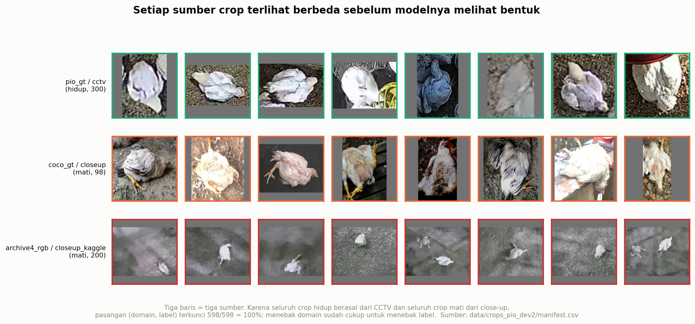

*Gambar 3 - Delapan crop dari tiap sumber, diambil merata sepanjang manifest.
Baris atas (`pio_gt`, hijau) semuanya hidup dan semuanya CCTV: kecil, buram,
dilihat dari atas. Baris tengah (`coco_gt`, jingga) semuanya mati dan
close-up: tajam, penuh bingkai. Baris bawah (`archive4_rgb`, merah) semuanya
mati dari sumber Kaggle: lantai abu-abu, ayam kecil di tengah bingkai utuh.
Perbedaan ketiganya terlihat tanpa perlu melihat ayamnya sama sekali - itulah
arti `label = domain`. Sumber: `data/crops_pio_dev2/manifest.csv`.*

### 3.3 Susunan SDNET2018

Diambil dari zip asli Utah State University (DOI 10.15142/T3TD19, lisensi
CC BY): 56.092 ubin JPG 256x256 dari 230 foto sumber (54 deck, 72 wall,
104 pavement), kamera Nikon 16 MP. Yang dipakai **8.400 ubin = 15,0%**.

| split | retak | utuh | total | foto sumber | peran |
|---|---:|---:|---:|---:|---|
| train | 299 | 891 | 1.190 | 32 | latih (deck saja) |
| val | 103 | 305 | 408 | 11 | pilih epoch + kalibrasi ambang |
| test | 98 | 304 | 402 | 11 | uji in-domain (deck) |
| test_wall | 800 | 2.400 | 3.200 | 72 | **hold-out penuh** |
| test_pave | 800 | 2.400 | 3.200 | 104 | **hold-out penuh** |
| **total** | **2.100** | **6.300** | **8.400** | **230** | |

Rancangannya sengaja meniru pola generalisasi skripsi: **latih di satu domain,
uji di domain lain.** Wall dan pavement tidak pernah disentuh saat latih -
model hanya melihat 1.190 ubin deck, yaitu **8,7%** dari seluruh ubin deck yang
tersedia di dataset aslinya.

Rasio kelas 1:3 disamakan dengan `max_alive_per_dead` pada susunan ayam supaya
ketimpangannya sebanding. Split dilakukan **per foto sumber**, bukan per ubin:
satu foto menyumbang sampai 249 ubin, jadi split per ubin akan membocorkan
potongan dinding yang sama ke train dan test sekaligus.

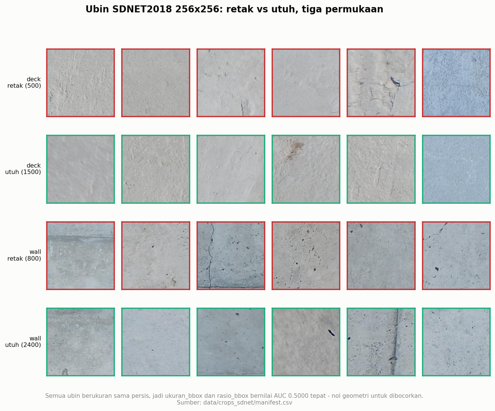

*Gambar 5 - Enam ubin per sel, retak (merah) dan utuh (hijau), untuk ketiga
permukaan. Semua ubin berukuran 256x256 persis, dari kamera yang sama. Karena
itu `ukuran_bbox` dan `rasio_bbox` bernilai AUC **0.5000 tepat**: nol informasi
geometri untuk dibocorkan. Letterbox ke 224 juga tidak menambahkan bantalan
abu-abu sama sekali, sehingga kebocoran bantalan yang pernah ditemukan pada
crop ayam tidak mungkin terjadi di sini. Sumber:
`data/crops_sdnet/manifest.csv`.*

### 3.4 Benchmark uji chick (keluaran tahap deteksi)

Ini data uji yang sesungguhnya - dibekukan, dan **tidak pernah** dipakai untuk
memilih apa pun.

| | jumlah |
|---|---:|
| frame sumber | **18** |
| kotak keluar dari YOLOv8m (conf 0.25, imgsz 640) | **1.215** |
| dilabeli **mati** secara manual | **22** |
| dilabeli **hidup** | **921** |
| dilabeli **bukan ayam** | **272** |
| kohort *clean* (hidup + mati) | **943** |

Ke-18 frame semuanya memuat ayam mati; `ayam (2)` sampai `ayam (5)` memuat dua
ekor, sisanya satu ekor.

**Peringatan besaran sampel:** dengan hanya **22** crop mati, satu crop yang
berpindah sisi ambang menggeser balanced accuracy sebesar **7,14 poin**. Itu
sebabnya tidak ada satu pun klaim di laporan ini yang bersandar pada satu seed.

---

## 4. Tahap 1 - deteksi

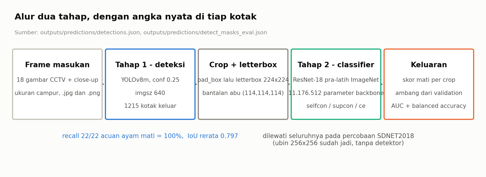

*Gambar 1 - Alur dua tahap dengan angka nyata di tiap kotak. Sumber:
`outputs/predictions/detections.json`, `outputs/predictions/detect_masks_eval.json`.*

### 4.1 Hasil

| | |
|---|---|
| Bobot | YOLOv8m, `cmp_yolov8m/weights/best.pt` |
| Ambang keyakinan | 0.25 |
| `imgsz` inferensi | **640** |
| Keluaran | 1.215 kotak dari 18 gambar |
| **Recall terhadap 22 acuan ayam mati** | **22/22 = 100%** |
| IoU rerata terhadap acuan | 0.797 |

### 4.2 Satu pelajaran yang tidak jelas di awal: `imgsz`

`imgsz` saat inferensi mengikuti **ukuran objek pada gambar masukan**, bukan
disalin begitu saja dari nilai yang dipakai saat melatih. Pada frame uji ini,
`imgsz 960` hanya mencapai recall **36%**, sedangkan `imgsz 640` mencapai
**100%** pada bobot yang sama persis. Ayam pada frame uji berukuran kecil, dan
menaikkan resolusi masukan justru menggeser skala objek keluar dari rentang
yang dikenali detektor.

### 4.3 Tahap deteksi bukan penghambatnya

Dengan recall 100%, seluruh 22 ayam mati **pasti sampai** ke tahap klasifikasi.
Apa pun yang gagal setelah titik ini bukan karena detektornya melewatkan
sesuatu. Itu sebabnya seluruh sisa laporan ini membahas tahap 2.

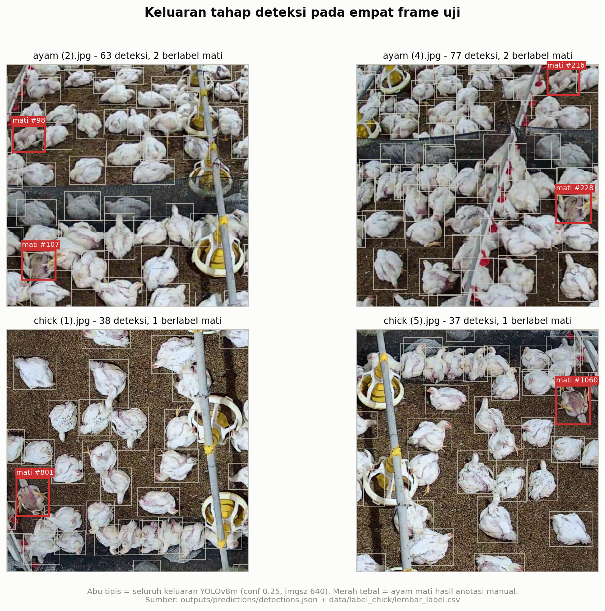

*Gambar 2 - Keluaran detektor pada empat frame uji. Kotak abu tipis = seluruh
1.215 deteksi; kotak merah tebal + nomor = ayam mati hasil anotasi manual.
Catatan: overlay seperti ini hanya bermakna untuk sumber yang bbox-nya memang
sub-bagian dari gambar (`pio_gt`, `coco_gt`, dan deteksi chick). Untuk
`archive4_rgb` dan `sdnet_tile`, bbox = seluruh gambar, jadi menggambar
kotaknya tidak menyampaikan apa pun - dan justru **fakta itulah** yang menjadi
penyebab jalan pintas `ukuran_bbox` di §10. Sumber:
`outputs/predictions/detections.json` + `data/label_chick/lembar_label.csv`.*

---

## 5. Tahap 2 - classifier kontrastif

### 5.1 Arsitektur

| | |
|---|---|
| Backbone | ResNet-18, pra-latih ImageNet, **11.176.512** parameter |
| Masukan | 224x224, `resize_mode: letterbox` (bantalan abu 114,114,114) |
| Dimensi fitur | 512 |
| Kepala proyeksi | 512 -> 512 -> 128 |
| Batch | 32 |
| Suhu kontrastif | 0.07 |
| Epoch | 60 kontrastif, 40 linear probe, 60 CE |
| Learning rate | 5e-4 kontrastif, 1e-3 probe, 1e-4 CE |
| Weight decay | 1e-4 |
| Pembobotan kelas | aktif |
| Seed | 42, 43, 44 - **selalu tiga**, tidak pernah satu |

### 5.2 Tiga metode, dan dua faktor yang sengaja terikat

Ini keputusan rancangan yang harus dibaca sebelum tabel hasil mana pun:

| metode | loss | augmentasi | paper |
|---|---|---|---|
| `selfcon` | NT-Xent self-supervised | `simclr` | Chen dkk., ICML 2020 |
| `supcon` | Supervised Contrastive | `stacked_randaug` | Khosla dkk., NeurIPS 2020 |
| `ce` | Cross-entropy biasa | `hier_addone` | Zhang & Ma, CVPR 2022 |

Tiap metode dijalankan dengan **augmentasi dari paper-nya sendiri**. Ini
disengaja - tujuannya membandingkan *metode sebagaimana diusulkan penulisnya*,
bukan membandingkan fungsi loss dalam isolasi.

**Akibatnya harus dinyatakan terus terang:** diagonal ini mengubah loss **dan**
augmentasi bersamaan, jadi ketika `supcon` unggul, tidak ada cara memastikan
apakah yang menang adalah loss-nya atau `stacked_randaug`-nya. Tidak satu pun
angka di laporan ini boleh dibaca sebagai bukti bahwa satu fungsi loss lebih
baik dari yang lain.

Kolam RandAugment **tidak memuat rotasi** untuk seluruh metode. Alasannya
spesifik pada tugas ayam: ayam mati punya orientasi baku (tergeletak), jadi
merotasi crop menghancurkan ciri yang justru ingin dipelajari. Pada SDNET
pembatasan ini dipertahankan walau retak beton tidak punya orientasi baku -
karena yang diuji adalah pipeline apa adanya.

Karena "per metode" dan "per augmentasi" menamai hal yang sama di laporan ini,
kebijakan augmentasi ketiga metode ditampilkan berdampingan pada crop yang
identik - sekali untuk tiap percobaan:

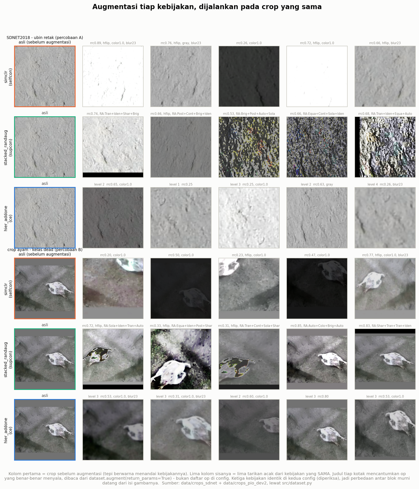

*Gambar 12 - Tiga baris atas: satu ubin SDNET2018. Tiga baris bawah: satu crop
ayam mati `crops_pio_dev2`. Kolom pertama = crop sebelum augmentasi (warna tepi
menandai kebijakannya); lima kolom sisanya = lima tarikan acak dari kebijakan
yang **sama**. Judul tiap kotak mencantumkan op yang benar-benar menyala,
dibaca dari `dataset.augment(return_params=True)` - bukan daftar op di config,
karena yang penting adalah apa yang terjadi, bukan apa yang tersedia. Untuk
`hier_addone` level yang terundi ikut dicetak: op dengan `level > i` dilewati,
jadi `level 1` jauh lebih ringan daripada `level 4`. Ketiga kebijakan
**identik** antara `config_sdnet.yaml` dan `config_pio_dev2.yaml` (diperiksa
kunci per kunci), jadi seluruh perbedaan antara blok atas dan bawah murni
datang dari isi gambarnya. Sumber: `data/crops_sdnet`, `data/crops_pio_dev2`,
lewat `src/dataset.py`.*

Dua hal terlihat langsung di gambar itu, dan keduanya sudah terukur di tempat
lain di laporan ini:

1. **Crop ayam punya bantalan letterbox abu; ubin SDNET tidak.** Pita abu di
   atas dan bawah tiap crop ayam adalah bantalan `letterbox()` - ubin SDNET
   sudah persegi, jadi bantalannya nol. Lebar pita itu berkorelasi dengan
   bentuk bbox, yakni dengan kelasnya (§6.2, `ukuran_bbox` 0.9976). Jadi
   sebagian jalan pintas percobaan B sudah terlihat dengan mata di tahap
   pra-pemrosesan, sebelum model apa pun dijalankan.
2. **`simclr` dan `stacked_randaug` jauh lebih merusak daripada
   `hier_addone`.** Beberapa tarikan `simclr` memutihkan atau menghitamkan
   ubin hampir seluruhnya, dan `stacked_randaug` menumpuk empat op sekaligus
   (mis. `RA:Brig+Post+Auto+Sola`) sampai teksturnya tak lagi terbaca mata.
   `hier_addone` dengan level rendah nyaris tidak mengubah apa pun. Ini
   memperkuat §5.2: intensitas augmentasi ikut berubah bersama fungsi loss,
   jadi perbandingan antar metode tidak bisa mengisolasi salah satunya.

### 5.3 Protokol yang mengikat

- Ambang klasifikasi **selalu** dikalibrasi dari validation (`tau_val`), tidak
  pernah dari test.
- Pemilihan epoch dan metode **tidak boleh** memakai data uji.
- `lock_probe_policy: true` - kebijakan probe dikunci supaya tidak bergeser
  antar-run.
- Split dikunci per **gambar dasar**, dengan hash manifest yang dicatat.
- Registry dibekukan setelah sweep; tambalan setelah pembekuan dicatat di blok
  terpisah (`tambalan_pasca_beku`) dan **tidak pernah** menimpa hash yang
  sudah beku - menimpanya sama dengan memalsukan catatan percobaan.

---

## 6. Gerbang wajib: lantai jalan pintas

### 6.1 Aturannya

Sebelum satu pun angka classifier boleh dibaca sebagai "kemampuan mengenali
ayam mati", susunan data itu harus lebih dulu diperiksa dengan
`src/eval_shortcut_baseline.py`. Yang diukur: berapa AUC yang bisa dicapai oleh
**satu ciri mentah** dengan **satu ambang**, tanpa model sama sekali.

Kalau ciri polos mencapai 0.88, maka checkpoint yang mencetak 0.79 belum
membuktikan apa pun - ia bahkan kalah dari menghitung rata-rata saturasi.

Tiga hal yang **tidak pernah** boleh dipertukarkan:

| | |
|---|---|
| **bacc ≠ AUC** | satu susunan bisa punya lantai bacc 0.9231 dan lantai AUC yang berbeda; selalu sebut metriknya |
| **lantai validation ≠ lantai test** | angka pipeline diuji di test, jadi lantainya juga harus lantai test |
| **AUC berarah** | dilaporkan sebagai `max(AUC, 1-AUC)`; ciri yang konsisten terbalik tetap merupakan jalan pintas |

Ambang ciri lantai dipilih dari skor **train**, tidak pernah dari test.

### 6.2 Lantai kedua dataset, berdampingan

| ciri | ayam `crops_pio_dev2` (val) | SDNET (test) |
|---|---:|---:|
| `ukuran_bbox` | **0.9976** | **0.5000** |
| `ketajaman` | 0.8396 | 0.5713 |
| `std_terang` | 0.7843 | **0.6430** |
| `saturasi` | 0.7195 | 0.5530 |
| `terang` | 0.6295 | 0.5629 |
| `rasio_bbox` | 0.5868 | **0.5000** |
| `hue` | 0.5093 | 0.5983 |

Dua kolom ini adalah inti seluruh laporan. Di SDNET, ciri terkuat hanya
mencapai **0.6430** dan dua ciri geometri bernilai **tepat 0.5000** karena
setiap ubin berukuran sama. Di data ayam, satu ciri mencapai **0.9976** - nyaris
sempurna, tanpa model.

Pada benchmark test chick (943 crop clean, yang dipakai untuk menilai semua
pipeline ayam), lantai tertinggi adalah `saturation` dengan AUC **0.8831**.
Itulah angka yang harus dilewati agar sebuah checkpoint boleh disebut berhasil.

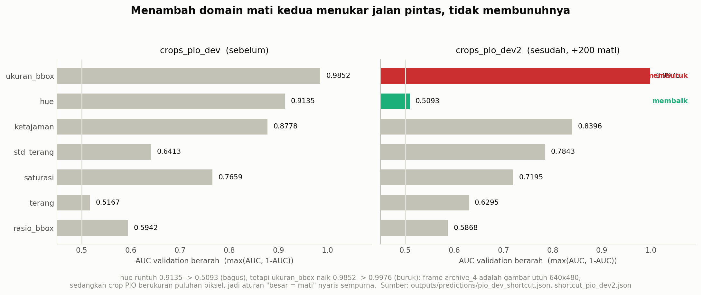

*Gambar 4 - Tujuh ciri lantai sebelum dan sesudah penambahan domain mati kedua.
Sumber: `outputs/predictions/pio_dev_shortcut.json`,
`outputs/reports/shortcut_pio_dev2.json`. Dibahas di §10.*

### 6.3 Korelasi tidak cukup: gerbang intervensi

Lantai jalan pintas menunjukkan apa yang **bisa** dibocorkan, bukan apa yang
**sedang** dibaca model. Untuk itu dipakai intervensi - rusak satu ciri, lalu
ukur akibatnya pada checkpoint yang sudah terlatih:

| perusakan | yang dihancurkan | yang dipertahankan |
|---|---|---|
| `abu` | seluruh warna | bentuk, tekstur, tepi |
| `hue+26` | rona warna | segalanya yang lain |
| `kabur` σ=4 | tepi halus dan tekstur mikro | bentuk kasar, warna |
| **`acak16`** | **bentuk dan pose global** (ubin 4x4 dipermutasi) | **tekstur lokal** |

`acak16` adalah gerbang terpenting. Kalau sebuah model benar-benar mengenali
*pose* ayam yang tergeletak, mengacak susunan ubinnya harus merusaknya. Kalau
skornya tidak berubah, yang dibaca adalah tekstur atau statistik global - dan
itu bukan pengenalan ayam mati.

---

## 7. Percobaan A - hasil SDNET2018

Seluruh angka: rerata ± simpangan baku atas **tiga seed** (42, 43, 44).

### 7.1 Hasil in-domain (test deck, n=402)

| metode | akurasi | balanced accuracy | **AUC** |
|---|---:|---:|---:|
| `ce` + `hier_addone` | **0.8482 ± 0.0073** | **0.7994 ± 0.0120** | 0.8403 ± 0.0079 |
| `selfcon` + `simclr` | 0.7944 ± 0.0197 | 0.7603 ± 0.0224 | 0.8035 ± 0.0051 |
| `supcon` + `stacked_randaug` | 0.8225 ± 0.0147 | 0.7882 ± 0.0071 | **0.8573 ± 0.0020** |

**Lantai test SDNET = 0.6430 AUC** (`std_terang`). Angka AUC terbaik
(supcon, **0.8573 ± 0.0020**) melewatinya dengan selisih **+0.214**, dan
melewatinya di **3 dari 3 seed** - seed terendah pun 0.8550.

Perhatikan bahwa `ce` unggul pada akurasi dan bacc sementara `supcon` unggul
pada AUC. Keduanya benar; metriknya memang mengukur hal yang berbeda, dan
itulah sebabnya metrik harus selalu disebut namanya.

### 7.2 Lintas sub-domain (wall dan pavement, masing-masing n=3.200)

Kedua permukaan ini **tidak pernah dilihat saat latih**. Ambang yang dipakai
adalah `tau_val` - dikalibrasi dari validation deck, bukan dari data uji ini.

| metode | wall: akurasi | wall: AUC | pave: akurasi | pave: AUC |
|---|---:|---:|---:|---:|
| `ce` | 0.8347 ± 0.0135 | 0.8506 ± 0.0169 | 0.7574 ± 0.0791 | 0.7397 ± 0.0376 |
| `selfcon` | 0.8193 ± 0.0092 | 0.8080 ± 0.0161 | 0.6324 ± 0.0450 | 0.8107 ± 0.0080 |
| `supcon` | **0.8462 ± 0.0316** | **0.8815 ± 0.0051** | **0.8220 ± 0.0099** | **0.8623 ± 0.0130** |

Angka wall dan pavement untuk `supcon` **lebih tinggi** daripada angka
in-domain deck-nya sendiri (0.8573). Itu tidak aneh: dinding dan perkerasan
punya latar yang lebih seragam daripada lantai jembatan, jadi retaknya lebih
kontras. Yang penting bukan tingginya, melainkan bahwa performanya **tidak
runtuh** saat berpindah domain - tepat kebalikan dari apa yang terjadi pada
classifier ayam, yang jatuh ke AUC 0.65 begitu diuji lintas domain.

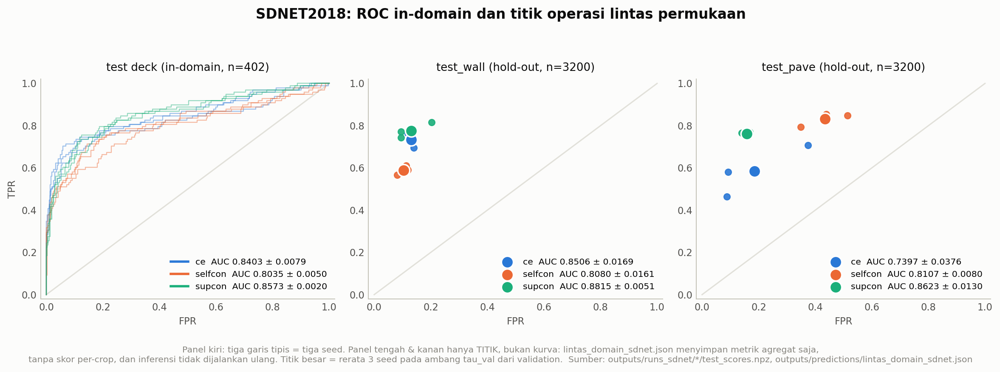

*Gambar 6 - Kiri: kurva ROC sungguhan untuk test deck, tiga garis tipis = tiga
seed. Tengah dan kanan **hanya titik, bukan kurva** - keterbatasan yang harus
dinyatakan: `lintas_domain_sdnet.json` menyimpan metrik agregat saja tanpa skor
per-crop, dan inferensi tidak dijalankan ulang untuk laporan ini. Titik besar =
rerata 3 seed pada ambang `tau_val`. Sumber:
`outputs/runs_sdnet/*/test_scores.npz`,
`outputs/predictions/lintas_domain_sdnet.json`.*

### 7.3 Gerbang intervensi

| perusakan | `ce` | `selfcon` | `supcon` | arah |
|---|---:|---:|---:|---|
| asli | 0.8403 | 0.8035 | 0.8573 | - |
| `abu` | 0.8393 (−0.001) | 0.8034 (−0.000) | 0.8538 (−0.003) | ~ tak berubah |
| `hue+26` | 0.8456 (+0.005) | 0.8037 (+0.000) | 0.8626 (+0.005) | ~ tak berubah |
| **`acak16`** | 0.8008 (**−0.040**) | 0.7686 (**−0.035**) | 0.7767 (**−0.081**) | **turun 3/3** |
| **`kabur` σ=4** | 0.7819 (**−0.058**) | 0.7502 (**−0.053**) | 0.7676 (**−0.090**) | **turun 3/3, paling parah** |

Urutannya: `kabur` > `acak16` >> warna. Model paling rusak ketika tepi
retaknya dihapus, cukup rusak ketika susunan globalnya diacak, dan **tidak
peduli sama sekali** pada warna.

Untuk retak beton, itu persis urutan yang benar. Retak adalah fenomena tepi dan
tekstur; warnanya tidak relevan. Model bereaksi keras terhadap perusakan yang
secara fisik menghapus objeknya, dan mengabaikan perusakan yang tidak. Inilah
yang dimaksud dengan "model membaca hal yang benar", dan ini terukur, bukan
ditafsirkan.

### 7.4 Bagaimana jalannya latihan: loss, validation, dan ROC akhir

Tiga tabel di atas hanya menunjukkan titik akhir. Dua gambar berikut
menunjukkan jalan menuju titik itu, per augmentasi dan per seed.

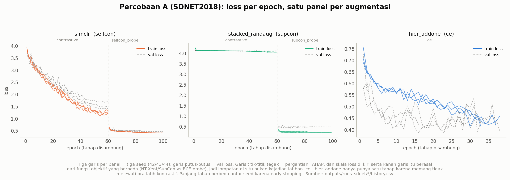

*Gambar 10 - Pertumbuhan loss di SDNET2018, satu panel per augmentasi/metode
(keduanya sama - lihat §5.2), tiga garis = tiga seed. Garis putus-putus = loss
validation, garis tegak bertitik = batas tahap. Tahap dipisah karena skalanya
memang beda: NT-Xent dan SupCon dihitung atas pasangan, BCE probe atas satu
crop, jadi menyambungkan keduanya jadi satu garis akan tampak seperti
peristiwa latihan yang tidak pernah terjadi. Sumber:
`outputs/runs_sdnet/*/history.csv`.*

Satu hal di gambar itu wajib dibaca dengan hati-hati: **loss `supcon`
praktis datar** (4.263 ke 4.058 sepanjang 60 epoch, seed 42), sementara `selfcon`
turun tajam dari 3.929 ke 1.268. Kalau besaran penurunan loss dipakai sebagai
ukuran mutu, `supcon` akan disebut gagal belajar - padahal `supcon` justru
mencetak **AUC test tertinggi** (0.8573, §7.1). Loss kontrastif dihitung
relatif terhadap negatif di dalam batch; nilainya tidak sebanding antar loss
dan **bukan** alat ukur kualitas. Yang mengukur adalah AUC pada data yang
belum dilihat.

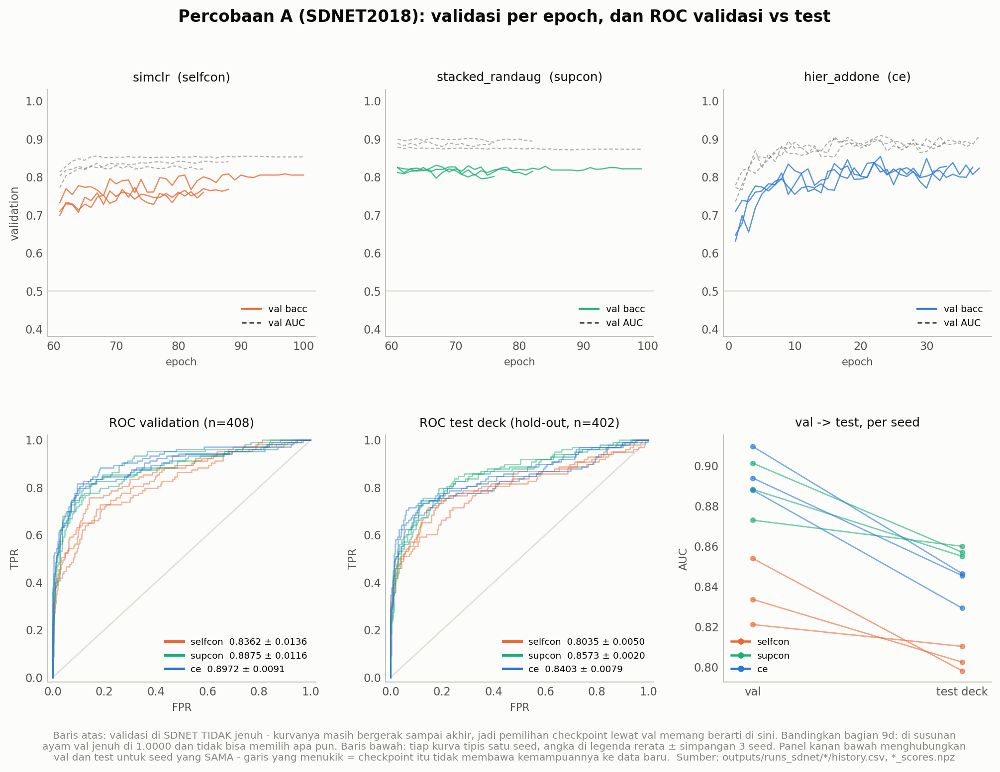

*Gambar 11 - Baris atas: `val_bacc` (garis penuh) dan `val_auc` (putus-putus)
per epoch, hanya pada epoch yang benar-benar diukur - epoch tanpa validation
dilewati, tidak digambar sebagai nol. Baris bawah: ROC pada validation deck
(n=408) dan pada test deck (n=402), tiga garis tipis = tiga seed. Sumber:
`outputs/runs_sdnet/*/history.csv`, `val_scores.npz`, `test_scores.npz`.*

Dua hal terukur dari Gambar 11:

| | AUC validation (n=408) | AUC test (n=402) | selisih |
|---|---:|---:|---:|
| `selfcon` + `simclr` | 0.8362 ± 0.0136 | 0.8035 ± 0.0050 | −0.033 |
| `supcon` + `stacked_randaug` | 0.8875 ± 0.0116 | 0.8573 ± 0.0020 | −0.030 |
| `ce` + `hier_addone` | 0.8972 ± 0.0091 | 0.8403 ± 0.0079 | −0.057 |

1. **Validation SDNET tidak jenuh, dan kurvanya bergerak.** Pada tahap probe,
   `val_bacc` `ce` naik dari 0.631-0.710 ke 0.823-0.828 (rentang tiga seed) dan
   `selfcon` dari 0.698-0.732 ke 0.759-0.805; hanya `supcon` yang praktis datar,
   berangkat 0.812-0.825 dan berakhir 0.801-0.821. Bandingkan dengan percobaan
   ayam, yang mencetak 1.0000 pada **epoch 1** (§9(d)). Kurva yang bergerak
   inilah yang membuat pemilihan epoch dan kalibrasi ambang punya arti.
2. **Setiap seed turun dari validation ke test, di 3/3 metode.** Selisih
   −0.030 sampai −0.057 adalah harga generalisasi yang normal, bukan kegagalan;
   yang penting adalah arahnya konsisten dan besarnya kecil. `ce` memimpin di
   validation (0.8972) tetapi `supcon` yang memimpin di test (0.8573) - urutan
   **berubah** saat pindah ke data yang tidak dipakai memilih apa pun. Itu
   alasan konkret mengapa metode tidak boleh dipilih dari validation.

---

## 8. Perbandingan dengan paper sitasi

**Paper:** Dorafshan, S., Thomas, R. J., & Maguire, M. (2018). *SDNET2018: An
annotated image dataset for non-contact concrete crack detection using deep
convolutional neural networks.* **Data in Brief, 21**, 1664-1668.
DOI 10.1016/j.dib.2018.11.015. Dataset: DOI 10.15142/T3TD19, lisensi CC BY.

### 8.1 Yang dilaporkan paper

| permukaan | retak | utuh | rasio | AlexNet *transfer learning* | AlexNet *full training* |
|---|---:|---:|---|---:|---:|
| deck | 2.025 | 11.595 | 1 : 5,7 | **91,92%** | 90,45% |
| wall | 3.851 | 14.287 | 1 : 3,7 | **89,31%** | 87,54% |
| pavement | 2.608 | 21.726 | 1 : 8,3 | **95,52%** | 94,86% |

Total 56.092 ubin 256x256.

### 8.2 Kenapa akurasi mentah TIDAK bisa dibandingkan

Empat alasan, dan keempatnya harus dibaca sebelum tabel selanjutnya:

1. **Paper hanya melaporkan akurasi.** Tidak ada AUC, tidak ada balanced
   accuracy, tidak ada precision/recall per kelas. Metrik utama proyek ini
   (AUC dan bacc) **tidak punya pembanding sama sekali** di paper itu.
2. **Protokol split paper tidak didokumentasikan.** Rasio train/test, acak
   per-ubin atau per-foto, ada penyeimbangan kelas atau tidak - tidak satu pun
   disebutkan. Proyek ini memakai split **per foto sumber**, yang lebih ketat;
   kalau paper membagi per ubin, angkanya naik karena kebocoran, bukan karena
   modelnya lebih baik.
3. **Rasio kelas berbeda.** Paper memakai seluruh data yang timpang; proyek ini
   menyeimbangkan ke 1:3. Akurasi pada rasio kelas yang berbeda **bukan
   besaran yang sama** - pada data 1:8,3 menebak "utuh" terus sudah memberi
   89,28%.
4. **Skalanya berbeda jauh.** Proyek ini memakai 8.400 dari 56.092 ubin =
   **15,0%**, dan melatih hanya pada 1.190 ubin deck = **8,7%** dari ubin deck
   yang tersedia.

### 8.3 Perbandingan yang boleh dilakukan: selisih terhadap tebak-mayoritas

Satu-satunya besaran yang sebanding adalah **berapa poin akurasi di atas
menebak kelas mayoritas**, karena itu menetralkan perbedaan rasio kelas.

| | akurasi | tebak mayoritas | **selisih** |
|---|---:|---:|---:|
| paper, deck (AlexNet TL) | 91,92% | 85,13% | +6,79 |
| paper, wall (AlexNet TL) | 89,31% | 78,77% | **+10,54** |
| paper, pavement (AlexNet TL) | 95,52% | 89,28% | +6,24 |
| **kami, deck** (`ce`, 3 seed) | 84,82% | 75,62% | **+9,20** |
| **kami, wall** (`supcon`, 3 seed) | 84,62% | 75,00% | **+9,62** |
| **kami, pavement** (`supcon`, 3 seed) | 82,20% | 75,00% | **+7,20** |

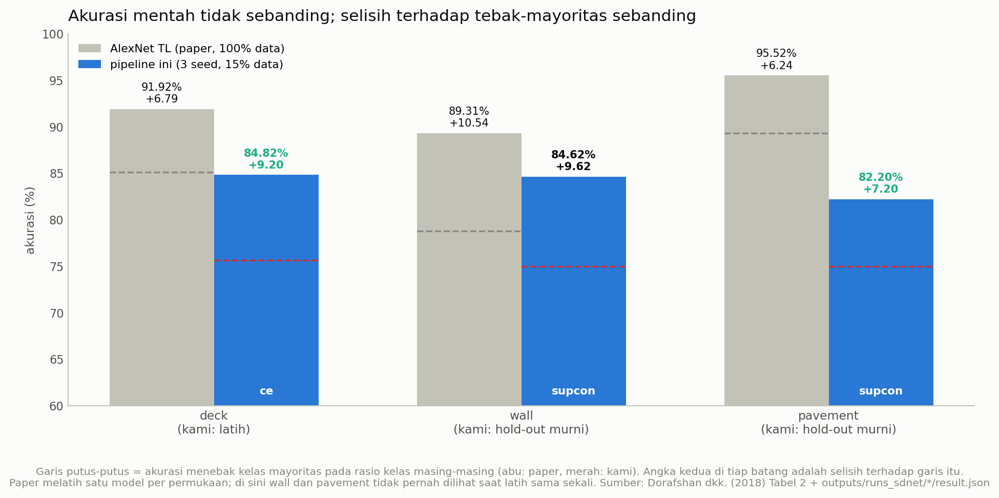

*Gambar 8 - Batang = akurasi mentah (tidak sebanding). Garis putus-putus =
tebak-mayoritas pada rasio kelas masing-masing. Angka kedua di tiap batang =
selisih terhadap garis itu, yang **sebanding**. Sumber: Dorafshan dkk. (2018)
+ `outputs/runs_sdnet/*/result.json`.*

### 8.4 Kesimpulan yang jujur

Pada **dua dari tiga** permukaan (deck dan wall) selisih terhadap
tebak-mayoritas lebih besar daripada AlexNet paper; pada satu permukaan
(pavement) lebih kecil. Itu dicapai dengan 15% data, tanpa menyetel augmentasi
sama sekali (rotasi tetap dimatikan padahal aman untuk beton), dan - ini yang
paling penting - **wall dan pavement di sini murni hold-out**: model tidak
pernah melihat satu ubin pun dari keduanya, sedangkan paper melatih **model
terpisah untuk tiap permukaan**.

Perbandingannya tidak setara **ke dua arah**. Paper punya 6,7x lebih banyak
data dan model khusus per permukaan; proyek ini punya protokol split yang lebih
ketat dan pengujian lintas-domain yang sesungguhnya. Menyebut salah satunya
"menang" akan menyesatkan.

> **Kalimat yang berlaku:** metode ini **sebanding, bukan terbukti lebih
> baik**. Yang bisa dinyatakan: pipeline ini menghasilkan angka yang berada di
> kisaran yang sama dengan baseline paper sitasinya, pada tugas yang sama,
> dengan data jauh lebih sedikit dan protokol yang lebih ketat.

---

## 9. Kenapa hasil non-ayam seperti itu

Bagian ini menjawab permintaan terpisah: **kenapa** hasil di dataset non-ayam
keluar seperti itu, dan apa yang bisa disimpulkan dari situ tentang pipeline
ini. Empat bukti, semuanya dari angka yang sudah ada di §6 dan §7.

### (a) Lantainya rendah, jadi ada ruang untuk belajar

Ciri terkuat tanpa model di SDNET hanya **0.6430** AUC, dan dua ciri geometri
bernilai **tepat 0.5000** karena setiap ubin 256x256 - nol informasi bentuk
untuk dibocorkan. Di data ayam, saturasi saja **0.8831** dan ukuran bbox
**0.9976**.

Konsekuensinya langsung: **di SDNET model harus benar-benar melihat gambarnya
untuk mencetak angka; di data ayam tidak perlu.** Sebuah pipeline yang sama
persis akan terlihat "berhasil" pada data ayam dengan membaca ciri global, dan
harus benar-benar bekerja pada SDNET. Perbedaan hasil antara keduanya karena
itu **informatif**, bukan kebetulan.

### (b) Perusakan yang relevan secara fisik menurunkan skor; yang tidak relevan, tidak

Ini bukti terkuat, dan arahnya tepat:

| perusakan | apa yang dihancurkan | SDNET (`supcon`) | tafsir |
|---|---|---:|---|
| `abu` | warna | 0.8573 -> 0.8538 (−0.004) | retak bukan soal warna - **benar** |
| `hue+26` | warna | 0.8573 -> 0.8626 (+0.005) | sama - **benar** |
| `acak16` | bentuk & susunan global | 0.8573 -> 0.7767 (**−0.081**) | sebagian susunan memang dipakai |
| `kabur` σ=4 | tepi retak | 0.8573 -> 0.7676 (**−0.090**) | **paling parah** - tepat |

Bandingkan dengan data ayam. Di sana `acak16` - yang menghancurkan pose,
satu-satunya ciri yang secara fisik membedakan ayam mati dari ayam hidup -
justru **menaikkan** AUC:

| lengan | asli | `acak16` | selisih |
|---|---:|---:|---:|
| `asli`/`selfcon` | 0.5279 | 0.5534 | **+0.026** |
| `asli`/`ce` | 0.5956 | 0.6016 | **+0.006** |
| `asli`/`supcon` | 0.7042 | 0.7027 | −0.001 |
| `eq48`/`selfcon` | 0.4971 | 0.5671 | **+0.070** |
| `eq48`/`ce` | 0.6897 | 0.7154 | **+0.026** |
| `eq48`/`supcon` | 0.7287 | 0.7692 | **+0.041** |

**Naik di 5 dari 6 kombinasi** pada susunan dev2. (Pada susunan dev sebelumnya
angkanya 3 dari 6; penambahan domain mati kedua justru memperburuk hal ini.)
Sebuah model yang skornya *membaik* ketika pose dihancurkan tidak sedang
membaca pose.

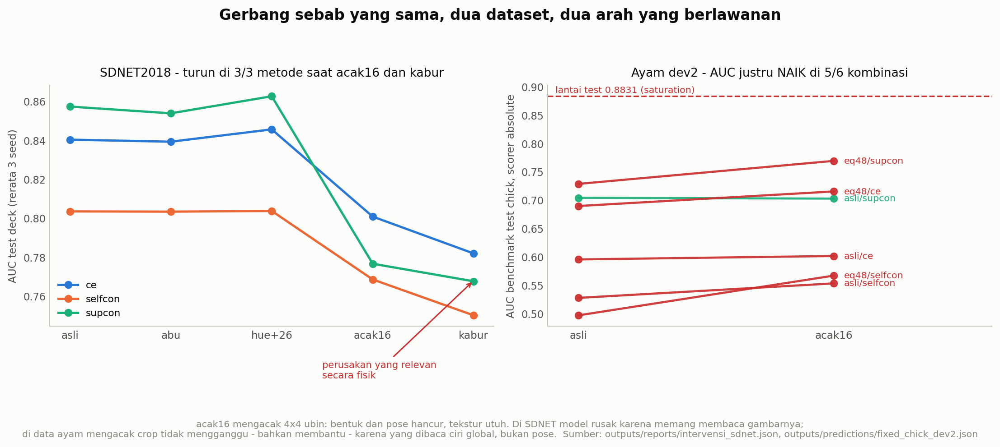

*Gambar 7 - Gerbang sebab yang sama persis, dua dataset, dua arah berlawanan.
Kiri: SDNET turun di 3/3 metode pada `acak16` dan `kabur`. Kanan: ayam dev2
naik di 5/6 kombinasi pada `acak16`, dan seluruhnya tetap di bawah lantai test
0.8831. Sumber: `outputs/reports/intervensi_sdnet.json`,
`outputs/predictions/fixed_chick_dev2.json`.*

### (c) Sebaran antar-seed 20-30x lebih rapat

| | simpangan baku AUC antar-seed |
|---|---|
| SDNET | **±0.0020 - 0.0079** |
| ayam dev2 | **±0.0210 - 0.1338** |

Pada data ayam, simpangan antar-seed **lebih besar daripada jarak antar-metode**
(bandingkan `asli`/`ce` 0.5956 ± 0.1338 dengan `asli`/`supcon` 0.7042 ± 0.0567
- selang keduanya bertumpang tindih). Artinya peringkat "supcon > ce >
selfcon" di sana sebagian besar derau. Pada SDNET urutan yang sama terbaca
sungguhan, karena selisihnya belasan kali lebih besar daripada simpangannya.

Sinyal yang nyata menghasilkan hasil yang stabil; jalan pintas yang bergantung
pada segelintir crop menghasilkan hasil yang berayun.

### (d) Validation tidak jenuh, jadi validation kembali berguna

| | AUC validation |
|---|---|
| SDNET | 0.82 - 0.91, tercapai sekitar epoch 22 |
| ayam | **1.0000 pada epoch 1** |

Validation yang jenuh tidak bisa memilih apa pun: kalau setiap epoch mencetak
nilai sempurna, "epoch terbaik" adalah undian, dan ambang yang dikalibrasi
darinya tidak punya dasar. Pada percobaan ayam, pemilihan epoch dan ambang
praktis buta. Pada SDNET keduanya kembali bermakna - dan memang terbukti
bermakna, karena ambang `tau_val` yang dikalibrasi dari validation deck tetap
bekerja pada wall dan pavement yang belum pernah dilihat (§7.2).

### 9.1 Kesimpulan tentang pipeline, yang boleh ditarik

> Kode, arsitektur, ketiga fungsi loss, protokol split per gambar dasar,
> kalibrasi ambang dari validation, dan evaluatornya **berfungsi**. Diberi data
> yang lantainya rendah, pipeline yang **sama persis** - tanpa satu baris pun
> diubah - melewati lantainya sendiri di 3 dari 3 seed, menggeneralisasi ke dua
> sub-domain yang tidak pernah dilihat, dan rusak ketika gambarnya dirusak
> dengan cara yang secara fisik relevan.
>
> Hipotesis "ada cacat mendasar di implementasi classifier" **tidak didukung
> bukti**.

### 9.2 Yang TIDAK boleh ditarik

Empat batasan, dan semuanya penting:

1. **Ini tidak berarti pipeline ini akan berhasil pada ayam kalau datanya
   diperbaiki.** Retak beton adalah tugas **tekstur**; ayam mati adalah tugas
   **pose**. Keduanya tidak setara. Justru gerbang `acak16` menunjukkan bahwa
   pipeline ini kuat pada tekstur - tepat pada kemampuan yang **tidak**
   dibutuhkan untuk membedakan ayam mati dari ayam hidup. Uji kewarasan ini
   membersihkan nama pipeline-nya, bukan menjanjikan hasilnya.
2. **Tidak boleh dikreditkan ke satu fungsi loss.** Tiap diagonal mengubah
   loss **dan** augmentasi bersamaan (§5.2). "supcon terbaik" berarti
   "supcon + stacked_randaug terbaik", tidak lebih.
3. **Tidak boleh dianggap sudah menguji tahap deteksi.** Tahap YOLO dilewati
   seluruhnya pada SDNET - labelnya melekat pada ubin, bukan pada bounding
   box. Yang diuji hanya tahap 2.
4. **Tidak boleh dianggap angka optimal.** Augmentasi sengaja tidak
   disesuaikan untuk beton; rotasi tetap dimatikan padahal aman di sini. Angka
   di §7 adalah angka pipeline apa adanya, bukan angka terbaik yang bisa
   dicapai pada SDNET.

---

## 10. Percobaan B - domain ayam mati kedua

### 10.1 Apa yang ditambahkan

200 crop ayam mati dari `archive_4` (sumber Kaggle), sehingga crop mati naik
dari **98 menjadi 298** dan gambar dasar dari 62 menjadi 262 (§3.1, §3.2).
Hipotesisnya: kalau ayam mati datang dari dua domain yang berbeda, model tidak
bisa lagi menyamakan "mati" dengan "close-up".

Dua lengan dijalankan, masing-masing 3 metode x 3 seed = 18 run:
- **`asli`** - piksel apa adanya
- **`eq48`** - sisi pendek tiap crop disamakan ke 48 px sebelum letterbox,
  untuk melawan jalan pintas ketajaman

### 10.2 Hasil 1: validation tetap jenuh

| lengan/metode | AUC validation |
|---|---|
| `ce`, kedua lengan | **1.0000** di 6/6 run |
| `supcon`, kedua lengan | **1.0000** di 6/6 run |
| `selfcon` | 0.9961 - 1.0000 |

Penambahan 200 crop mati **tidak** memecah kejenuhan validation. Hanya
`selfcon` yang sedikit longgar - menarik, tetapi tidak cukup untuk membuat
validation berguna kembali.

### 10.3 Hasil 2: lantai bergeser, tidak hilang

| ciri | `crops_pio_dev` | `crops_pio_dev2` | arah |
|---|---:|---:|---|
| `hue` | 0.9135 | **0.5093** | **membaik banyak** |
| `ketajaman` | 0.8778 | 0.8396 | sedikit membaik |
| `saturasi` | 0.7659 | 0.7195 | sedikit membaik |
| `rasio_bbox` | 0.5942 | 0.5868 | ~ tetap |
| `terang` | 0.5167 | 0.6295 | memburuk |
| `std_terang` | 0.6413 | 0.7843 | memburuk |
| **`ukuran_bbox`** | 0.9852 | **0.9976** | **memburuk, nyaris sempurna** |

Sebabnya struktural, dan terlihat di Gambar 3: frame `archive_4` adalah
**gambar utuh 640x480** dengan bbox `[0, 0, 640, 480]`, sedangkan crop PIO
berukuran puluhan piksel. Jadi aturan "besar = mati" menjadi hampir sempurna -
AUC 0.9976 tanpa model sama sekali.

> **Satu jalan pintas ditukar dengan jalan pintas lain.** `hue` runtuh dari
> 0.9135 ke 0.5093, yang bagus; tetapi `ukuran_bbox` naik ke 0.9976, yang lebih
> buruk daripada apa pun yang ada sebelumnya.

### 10.4 Hasil 3: benchmark uji justru turun

Scorer **`absolute`**, rerata ± simpangan atas 3 seed, pada benchmark test
chick (943 crop clean):

| lengan / metode | dev (sebelum) | **dev2 (sesudah)** | arah |
|---|---:|---:|---|
| `eq48` / `supcon` | **0.7917 ± 0.0593** | **0.7287 ± 0.0548** | **turun 0.063** |
| `eq48` / `ce` | 0.7443 ± 0.0549 | 0.6897 ± 0.0210 | turun 0.055 |
| `eq48` / `selfcon` | 0.5806 ± 0.0980 | 0.4971 ± 0.0519 | turun 0.084 |
| `asli` / `supcon` | 0.6756 ± 0.0290 | 0.7042 ± 0.0567 | naik 0.029 |
| `asli` / `ce` | 0.5911 ± 0.0299 | 0.5956 ± 0.1338 | ~ tetap |
| `asli` / `selfcon` | 0.4929 ± 0.0822 | 0.5279 ± 0.0762 | naik 0.035 |

**Lantai test = 0.8831** (`saturation`, scorer `absolute`).
**Tidak satu pun** dari enam angka dev2 melewatinya; yang tertinggi
(`eq48`/`supcon`, 0.7287) masih tertinggal **0.154 poin** di belakang satu
ciri mentah tanpa model.

Angka terbaik yang pernah dicapai proyek ini tetap **0.7917 ± 0.0593**
(`eq48`/`supcon` pada susunan dev **lama**) - dan itu pun di bawah lantai.
Penambahan domain mati kedua **menurunkannya**.

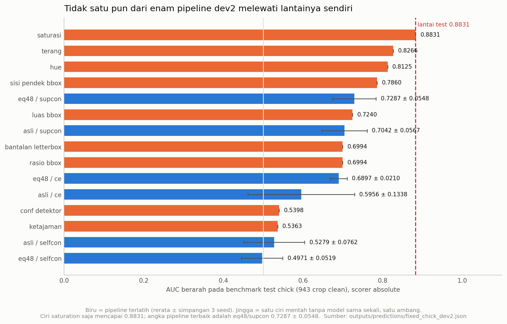

*Gambar 9 - Enam pipeline dev2 (biru, dengan simpangan 3 seed) berdampingan
dengan sembilan ciri nuisance tanpa model (jingga, satu ambang, tanpa
simpangan karena deterministik). Garis merah = lantai test 0.8831. Empat ciri
polos mengalahkan seluruh pipeline. Sumber:
`outputs/predictions/fixed_chick_dev2.json`.*

### 10.5 Kenapa hasil negatif ini tetap merupakan hasil

Kesimpulannya bukan "archive_4 datanya jelek", melainkan sesuatu yang lebih
umum:

> **Setiap sumber ayam mati yang baru membawa domainnya sendiri.** Menambah
> sumber tidak memecah `label = domain`; ia hanya menambah satu domain lagi ke
> sisi "mati", dan jalan pintas yang tersedia bergeser ke ciri global mana pun
> yang kebetulan paling membedakan sumber-sumber itu.

Selama crop hidup dan crop mati datang dari rekaman yang berbeda, akan selalu
ada ciri global yang memisahkannya lebih murah daripada mengenali pose ayam.

Ini memperkuat arah yang sudah dicatat sebelumnya: solusinya bukan menambah
sumber, melainkan **peringkat di dalam satu frame** - membandingkan crop-crop
dari frame CCTV yang sama, di mana seluruh crop berbagi kamera, pencahayaan,
skala, dan latar, sehingga tidak ada ciri global yang tersisa untuk dijadikan
jalan pintas. Pada rancangan itu, satu-satunya hal yang membedakan crop adalah
ayamnya sendiri.

### 10.6 Bagaimana jalannya latihan percobaan B, dan mengapa tidak ada ROC test

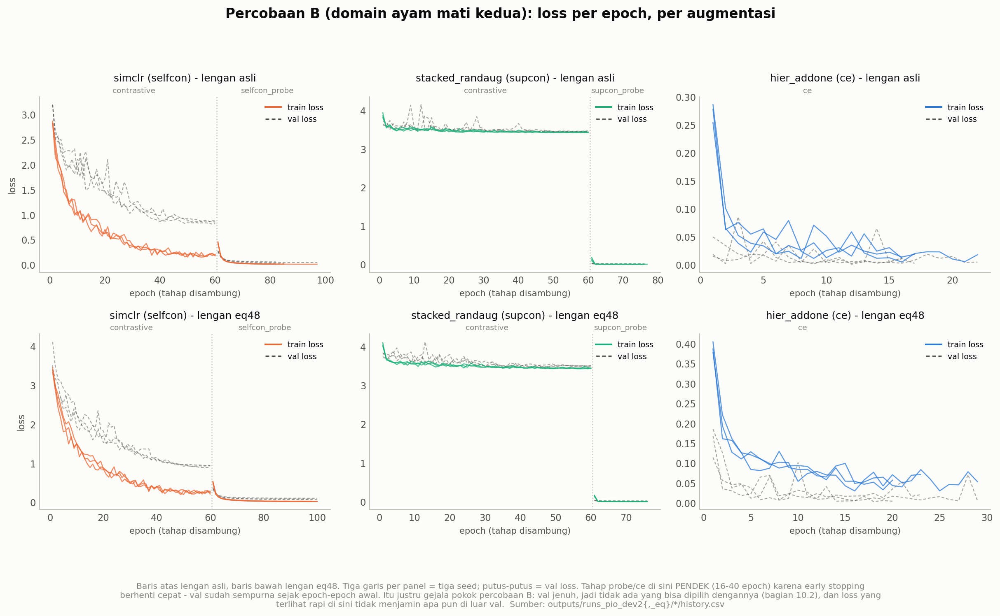

*Gambar 13 - Pertumbuhan loss pada crop ayam dev2, lengan `asli`, satu panel
per augmentasi/metode, tiga garis = tiga seed. Susunan panelnya sengaja sama
dengan Gambar 10 supaya kedua percobaan bisa dibandingkan mata langsung.
Perhatikan panjang tahap probe: `ce` berhenti di epoch 16-22 dan `supcon` di
16-17 karena early stopping - validation-nya sudah sempurna, jadi tidak ada
lagi yang bisa diperbaiki. Sumber: `outputs/runs_pio_dev2/*/history.csv`.*

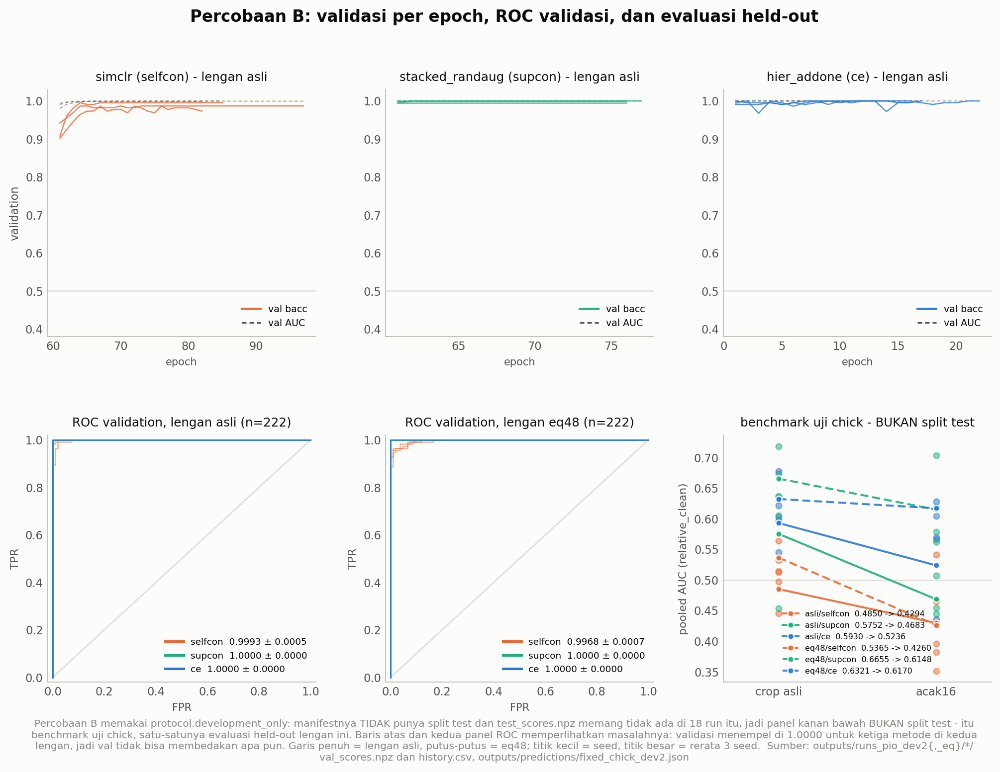

*Gambar 14 - Kiri: ROC validation (n=222) untuk kedua lengan. Kanan: benchmark
uji chick per metode, `asli` ke `acak16`, scorer `relative_clean`. Panel kanan
**bukan split test** - lihat penjelasan di bawah. Lengan dibaca dari
`config_snapshot.crops.equalize_resolution`, bukan dari nama berkas registry.
Sumber: `outputs/runs_pio_dev2{,_eq}/*/val_scores.npz`,
`outputs/predictions/fixed_chick_dev2.json`.*

**Percobaan B tidak punya split test, jadi tidak ada ROC test yang bisa
digambar.** Keempat config dev2 menyetel `protocol.development_only: true`,
yang berarti manifest-nya hanya memuat `train` + `val`; diperiksa pada seluruh
18 run: `val_scores.npz` ada di 18/18, `test_scores.npz` **tidak ada di satu
pun**. Ini konsekuensi protokol, bukan berkas yang hilang - split test ditahan
justru supaya tidak terpakai selama pengembangan. Panel kanan Gambar 14
karenanya diisi **benchmark uji chick** (943 crop clean dari tahap deteksi,
§3.4), yang memang satu-satunya himpunan tertahan yang tersedia di percobaan
ini. Menyebutnya "test" akan mengulang persis kesalahan pelabelan yang sudah
ditemukan dua kali di `report.py` (§11).

ROC validation kiri menegaskan §10.2 dengan angka:

| | AUC val lengan `asli` | AUC val lengan `eq48` |
|---|---:|---:|
| `selfcon` + `simclr` | 0.9993 ± 0.0005 | 0.9968 ± 0.0007 |
| `supcon` + `stacked_randaug` | 1.0000 ± 0.0000 | 1.0000 ± 0.0000 |
| `ce` + `hier_addone` | 1.0000 ± 0.0000 | 1.0000 ± 0.0000 |

Empat dari enam sel **persis 1.0000 dengan simpangan nol** - tiga seed, tidak
satu crop pun salah dari 222. Kurva ROC-nya menempel ke sudut kiri-atas.
Bandingkan langsung dengan panel bawah Gambar 11, di mana ROC SDNET adalah
lengkungan sungguhan. Dua gambar itu berdampingan adalah bentuk visual dari
seluruh masalah proyek ini: validation ayam **tidak mengandung informasi**
untuk memilih apa pun, sementara validation SDNET mengandung.

Panel kanan menambahkan dua hal yang tidak terlihat di tabel §10.4, yang
memakai scorer `absolute`:

| lengan / metode | `asli` | `acak16` | arah |
|---|---:|---:|---|
| `eq48` / `supcon` | **0.6655** | 0.6148 | turun 0.051 |
| `eq48` / `ce` | 0.6321 | 0.6170 | turun 0.015 |
| `asli` / `ce` | 0.5930 | 0.5236 | turun 0.069 |
| `asli` / `supcon` | 0.5752 | 0.4683 | turun 0.107 |
| `eq48` / `selfcon` | 0.5365 | 0.4260 | turun 0.111 |
| `asli` / `selfcon` | **0.4850** | 0.4294 | turun 0.056 |

1. **`asli`/`selfcon` berangkat dari bawah 0.5** (0.4850 pada data yang tidak
   dirusak sama sekali). Di bawah 0.5 berarti lebih buruk daripada melempar
   koin: urutan skornya sedikit **terbalik** terhadap label. Angka itu tidak
   perlu ditafsirkan sebagai "hampir acak" - ia memang praktis acak, dan
   perusakan `acak16` menurunkannya lagi ke 0.4294 tanpa mengubah kesimpulan
   apa pun.
2. **Kedua lengan harus dibaca terpisah, bukan dirata-ratakan.** `eq48`/`supcon`
   (0.6655) dan `asli`/`supcon` (0.5752) berbeda **0.090 AUC** dengan loss,
   augmentasi, seed, dan crop yang identik - satu-satunya yang beda adalah
   penyamaan sisi pendek ke 48 px. Merata-ratakan keduanya menjadi satu angka
   "supcon" akan menyembunyikan efek terbesar yang ada di percobaan ini.

3. **Kedua scorer tidak sepakat soal arahnya, dan itu wajib dinyatakan.**
   Tabel di atas memakai `relative_clean` (peringkat di dalam frame, dihitung
   dari jarak fitur ke median frame), dan di sana `acak16` menurunkan skor di
   **6/6** rerata dan **16/18** checkpoint. Tetapi pada scorer `absolute`
   (kepala sigmoid dengan ambang `tau_val`) - scorer yang dipakai tabel §10.4 -
   `acak16` justru **menaikkan** skor di **5/6** rerata dan **12/18**
   checkpoint, sampai +0.070 pada `eq48`/`selfcon`.

Ketidaksepakatan itu bukan galat; keduanya mengukur hal yang berbeda atas
checkpoint yang sama. `absolute` membaca keluaran kepala klasifikasi, sedangkan
`relative_clean` membuang seluruh nilai mutlak dan hanya menyisakan urutan di
dalam satu frame. Kesimpulan yang boleh ditarik dari keduanya bersama:

> **Turun di `relative_clean` tidak boleh dibaca sebagai "model membaca bentuk
> ayam".** Kalau model benar-benar bergantung pada pose, mengacak susunan crop
> seharusnya merusaknya pada **kedua** scorer. Yang terjadi: satu scorer turun,
> satu naik. Selain itu seluruh titik awalnya - 0.4850 sampai 0.6655 - berada
> di bawah lantai 0.8831 (§10.4), jadi yang dirusak `acak16` adalah ciri yang
> belum terbukti ayamnya.

Ini konsisten dengan pemeriksaan terpisah yang sudah dicatat sebelumnya: pada
crop yang diacak, performa checkpoint ayam **tidak runtuh** seperti yang terjadi
pada SDNET (§7.3, turun 3/3 pada kedua arah perusakan fisik). Model ayam membaca
tekstur dan statistik global, bukan pose - dan `acak16` mempertahankan keduanya.

---

## 11. Cacat evaluasi yang ditemukan

Selama percobaan B, jalur evaluasi diperiksa ulang baris demi baris. Yang
ditemukan bukan kesalahan hitung, melainkan pola yang sama berulang: **nilai
yang benar untuk susunan data lama dipaku di kode**, lalu tetap dicetak apa
adanya ketika susunan datanya berubah - tanpa error, tanpa peringatan. Satu
cacat sudah benar-benar terjadi dan menimpa berkas hasil; satu lagi justru
diciptakan oleh tambalan untuk cacat sebelumnya.

Penanda di `domain_mati_kedua.md` §4 berjalan **(a) sampai (j)**, jadi
jumlahnya **sepuluh**, bukan delapan seperti tertulis di judul bagian itu
(ditambah satu butir "Satu hal yang justru benar" yang bukan cacat). Angka
sepuluh yang berlaku.

| # | cacat | sudah terjadi? |
|---|---|---|
| a | `report_fixed_chick.py` menebak varian crop dari **substring nama berkas** (`"eq_dev" in nama`); gagal senyap saat lengan baru ditambahkan | ya, saat dev2 ditambahkan |
| b | `eval_fixed_chick.py` dan `report_fixed_chick.py` menulis ke nama berkas yang sama untuk susunan berbeda - benchmark beku bisa tertimpa tanpa disadari | risiko |
| c | Tambalan (a) mengubah berkas yang ikut di-hash, sehingga catatan provenance harus diperbarui juga | turunan dari (a) |
| d | `data_contract` di registry dipaku di kode (`train.py:370`) dan masih menyebut **satu** sumber mati | ya |
| e | Label varian bertabrakan antar susunan data - label hanya menyatakan "apakah crop ini di-equalize", bukan susunan mana | ya |
| f | Teks kontrak di laporan otomatis juga dipaku dan masih menyebut satu sumber mati | ya |
| g | `purpose` di split lock (`build_crops.py:551`) dipaku ke susunan lama | ya |
| h | **`development_comparison.json` ditimpa diam-diam** - versi ter-commit sudah tertimpa; dibedakan lewat `validation.n` (155 = lama, 222 = dev2) | **ya, sudah terjadi** |
| i | Tambalan untuk (e) memunculkan cacat baru: `plot()` memaku nama keluarga registry | **ya, dibuat oleh tambalannya sendiri** |
| j | Hash beku tidak boleh ditimpa oleh tambalan pasca-sweep; hash sebelum dan sesudah dicatat di blok terpisah | dicegah |

Rincian tiap cacat, kode yang bersangkutan, dan tambalannya: lihat
[`domain_mati_kedua.md` §4](domain_mati_kedua.md).

**Pelajaran yang berlaku umum:** heuristik substring pada nama berkas dan
nilai kontrak yang dipaku di kode keduanya **gagal tanpa bunyi**. Keduanya
tetap mencetak angka yang terlihat masuk akal setelah datanya berubah, dan
itulah yang membuatnya berbahaya - sebuah crash akan jauh lebih aman.

### 11.1 Dua angka yang bertentangan di laporan lama

Keduanya disebutkan di sini, bukan dipilih diam-diam:

1. **Runtuhnya jalan pintas ketajaman akibat eq48.** Tercatat
   **0.8778 -> 0.5646** di `domain_mati_kedua.md`, tetapi
   **0.8596 -> 0.4194** di `detection_chick.md` dan `pio_saja.md`. Yang
   berlaku adalah **pasangan pertama**; pasangan kedua adalah nilai draf dari
   susunan sebelumnya yang sudah digantikan.
2. **`eq48`/`supcon` pooled AUC dev2.** Tercatat **0.729 ± 0.067** di tabel
   `fixed_chick_dev2.md` dan **0.7287 ± 0.0548** di JSON sumbernya. Ini
   perbedaan pembulatan saja, bukan perselisihan angka. Yang dipakai di
   laporan ini adalah **0.7287 ± 0.0548**, langsung dari
   `outputs/predictions/fixed_chick_dev2.json`.

### 11.2 Satu hal yang justru benar

Kedua lengan (`asli` dan `eq48`) berbagi `manifest_sha256` yang **identik**.
Itu bukan kebetulan melainkan bukti: equalisasi mengubah piksel saja, dan
pembagian train/val sama persis di kedua lengan. Perbandingan antar-lengan
karena itu sah.

---

## 12. Yang boleh dan tidak boleh disimpulkan

### 12.1 Boleh

1. **Pipeline-nya sehat.** Kode, arsitektur, ketiga loss, protokol split,
   kalibrasi ambang, dan evaluator terbukti bekerja pada data yang lantainya
   rendah - 3/3 seed, dua sub-domain hold-out, gerbang sebab yang arahnya
   benar.
2. **Cacat proyek ini ada di datanya.** Lantai 0.8831 pada benchmark test,
   `label = domain` 598/598, dan validation jenuh sejak epoch 1 semuanya sifat
   data, bukan sifat kode.
3. **Menambah sumber ayam mati tidak memecah `label = domain`.** Terukur:
   jalan pintas bergeser (hue 0.9135 -> 0.5093, ukuran_bbox 0.9852 -> 0.9976)
   dan benchmark turun (0.7917 -> 0.7287).
4. **Angka SDNET sebanding dengan baseline paper sitasinya** pada besaran yang
   memang sebanding (selisih terhadap tebak-mayoritas), dengan 15% data dan
   protokol lebih ketat.

### 12.2 Tidak boleh

1. **Bukan berarti pipeline ini akan berhasil pada ayam setelah data
   diperbaiki.** Beton = tugas tekstur; ayam mati = tugas pose. `acak16`
   menunjukkan pipeline ini kuat pada tekstur, yaitu kemampuan yang justru
   tidak dibutuhkan.
2. **Bukan bukti satu fungsi loss lebih baik.** Loss dan augmentasi berubah
   bersamaan di tiap diagonal.
3. **Bukan pengujian tahap deteksi.** YOLO dilewati seluruhnya pada SDNET.
4. **Bukan angka optimal pada SDNET.** Augmentasi sengaja tidak disesuaikan.
5. **Tidak ada angka ayam yang boleh disebut keberhasilan.** Tertinggi 0.7287
   ± 0.0548 melawan lantai 0.8831 - kalah dari satu ciri mentah.
6. **Tidak ada klaim dari satu seed.** Dengan 22 crop mati, satu crop yang
   berpindah sisi ambang menggeser bacc 7,14 poin.

---

## 13. Reproduksi

Seluruh perintah, berurutan. Tidak satu pun dijalankan ulang untuk laporan ini
- angkanya dibaca dari keluaran yang sudah tersimpan.

### 13.1 Percobaan A - SDNET2018

```bash
python src/build_manifest_sdnet.py --config configs/config_sdnet.yaml
python src/eval_shortcut_baseline.py --crops data/crops_sdnet \
    --json outputs/reports/shortcut_sdnet.json                    # GERBANG WAJIB
python src/train.py --config configs/config_sdnet.yaml --method all \
    --seeds 42,43,44 --save-model all
python src/report.py --config configs/config_sdnet.yaml
python src/eval_lintas_domain.py --config configs/config_sdnet.yaml \
    --runs outputs/runs_sdnet --splits test_wall,test_pave \
    --json outputs/predictions/lintas_domain_sdnet.json
python src/eval_intervensi.py --config configs/config_sdnet.yaml \
    --runs outputs/runs_sdnet --seeds 42,43,44 \
    --json outputs/reports/intervensi_sdnet.json
```

Waktu: 9 run = 12.005 detik GPU (~3,3 jam). Per run: `ce` 429 detik,
`selfcon` 1.674 detik, `supcon` 1.898 detik.

### 13.2 Percobaan B - domain ayam mati kedua

```bash
# --- lengan asli ---
python src/build_crops.py --config configs/config_pio_dev2.yaml
python src/eval_shortcut_baseline.py --crops data/crops_pio_dev2 \
    --json outputs/predictions/pio_dev2_shortcut.json             # GERBANG WAJIB
python src/train.py --config configs/config_pio_dev2.yaml --method all \
    --seeds 42,43,44 --save-model all

# --- lengan eq48 ---
python src/build_crops.py --config configs/config_pio_dev2_eq.yaml
python src/eval_shortcut_baseline.py --crops data/crops_pio_dev2_eq \
    --json outputs/predictions/pio_dev2_eq_shortcut.json          # GERBANG WAJIB
python src/train.py --config configs/config_pio_dev2_eq.yaml --method all \
    --seeds 42,43,44 --save-model all

# --- tambalan, SESUDAH sweep beku dan SEBELUM benchmark ---
python outputs/tambalan/perbaiki_data_contract.py --tulis
python outputs/tambalan/perbaiki_keterangan_sumber.py --tulis
python outputs/tambalan/catat_tambalan_pasca_beku.py --tulis

# --- benchmark: WAJIB pakai prefix sendiri (cacat b dan h) ---
python src/eval_fixed_chick.py --output-prefix fixed_chick_dev2 \
    --registries outputs/predictions/pio_dev2_registry.json,outputs/predictions/pio_dev2_eq_registry.json
python src/report_fixed_chick.py \
    --json outputs/predictions/fixed_chick_dev2.json \
    --report outputs/reports/fixed_chick_dev2.md \
    --plot outputs/reports/fixed_chick_dev2.png

# --- verifikasi ---
python outputs/tambalan/periksa_registry.py outputs/predictions/pio_dev2_registry.json
python outputs/tambalan/periksa_registry.py outputs/predictions/pio_dev2_eq_registry.json
python tests/test_protocol.py -v
```

Tiga hal yang urutannya **tidak boleh** ditukar:

1. `catat_tambalan_pasca_beku.py` merekam hash berkas **sesudah** ditambal,
   jadi harus berjalan setelah kedua tambalan dan sebelum registry diperiksa.
2. Nilai `--json` pada gerbang harus sama dengan `protocol.shortcut_json` di
   config. `train.py` membekukan hash berkas itu ke registry dan melempar
   `FileNotFoundError` kalau tidak ada - tetapi baru **pada langkah terakhir**,
   setelah kesembilan run selesai. Salah menaruhnya berarti kehilangan seluruh
   waktu GPU sweep.
3. Registry lama dan dev2 **tidak boleh digabung** dalam satu perintah
   `--registries`. Perintahnya akan berjalan tanpa error tetapi merata-ratakan
   dua susunan data yang berbeda menjadi satu baris (cacat e).

### 13.3 Gambar di laporan ini

```bash
python src/figur_laporan_akhir.py --figur all
# atau sebagian: --figur 2,3,7
```

Menghasilkan **empat belas** PNG ke `outputs/reports/laporan_akhir/`.
Seluruhnya membaca berkas yang sudah ada; `ultralytics` **tidak terpasang** di
lingkungan ini, jadi deteksi memang tidak bisa dijalankan ulang dan overlay
kotak pada Gambar 2 dibaca dari `detections.json` yang tersimpan.

Gambar 10-14 (kurva loss, kurva validation, ROC, galeri augmentasi) dibaca dari
`history.csv`, `val_scores.npz`, dan `test_scores.npz` tiap run, ditambah
`fixed_chick_dev2.json`. Sel kosong di `history.csv` berarti "tidak diukur pada
epoch itu" dan diterjemahkan menjadi `None`, **bukan** `0.0` - kalau tidak,
kurva validation akan tampak jatuh ke nol di epoch yang sebenarnya hanya
dilewati. Untuk Gambar 12 crop dipilih deterministik (urut `path`, ambil
elemen tengah) supaya gambarnya tidak berubah tiap kali skrip dijalankan.

Lengan `asli` vs `eq48` pada Gambar 7, 9, dan 14 dibaca dari
`config_snapshot.crops.equalize_resolution.enabled`, **bukan** dari substring
nama berkas registry. Heuristik nama berkas kebetulan benar untuk dev2
(diperiksa: 18/18 entri sepakat, dan PNG-nya byte-identik sebelum/sesudah
perubahan ini), tetapi bentuknya persis kegagalan senyap yang sudah tercatat:
lengan baru yang tidak memakai pola nama itu akan jatuh ke `asli` tanpa error
dan dua lengan tercampur dalam satu rerata. `eval_fixed_chick.py:266` memang
menulis blok `crops` ke JSON untuk keperluan itu.

### 13.4 Uji regresi

`python tests/test_protocol.py -v` -> **15/15 lolos**.

| kelompok | jumlah | yang dijaga |
|---|---:|---|
| protokol lama | 7 | split lock, kontrak provenance, config beku pada 237/155 |
| SDNET | 3 | manifest SDNET, split per foto sumber |
| dev2 | 5 | `allowed_provenance` tidak melumpuhkan penjaga lama; manifest dev2 terkunci pada 376/222; kelas mati = 98 `coco_gt` + 200 `archive4_rgb` |

Dua uji dev2 yang terakhir diperiksa dengan **mutasi**: angka harapannya
sengaja dirusak, keduanya memang gagal (`FAILED (failures=2)`), lalu lolos lagi
setelah dipulihkan. Uji yang belum pernah dilihat gagal belum tentu menguji apa
pun.

---

## 14. Berkas terkait dan daftar pustaka

### 14.1 Laporan lain

| berkas | isi | kapan dibuka |
|---|---|---|
| `outputs/reports/uji_kewarasan_sdnet.md` | Percobaan A secara penuh, 401 baris | ingin tabel per-seed SDNET, per-epoch, log sweep |
| `outputs/reports/domain_mati_kedua.md` | Percobaan B secara penuh, 1046 baris; **§4 = sepuluh cacat evaluasi** | ingin rincian tiap cacat beserta bukti dan tambalannya |
| `outputs/reports/kesimpulan_kronologi_2.md` | kesimpulan sebelum dua percobaan ini; sumber gagasan "ranking dalam satu frame" | ingin tahu kenapa dua percobaan ini dijalankan |
| `outputs/reports/kronologi lengkap 2.md` | Babak 14, laci dibuka | ingin urutan kejadian |
| `outputs/reports/fixed_chick_dev2.md` | papan skor benchmark dev2 | ingin angka benchmark mentah |
| `outputs/reports/reports_sdnet/comparison.md` | tabel perbandingan tiga metode SDNET | ingin val/test per metode per seed |

### 14.2 Berkas angka (JSON / NPZ)

| berkas | dipakai oleh |
|---|---|
| `outputs/reports/shortcut_sdnet.json` | gerbang lantai SDNET (train/val/test) - §6, §9 |
| `outputs/reports/shortcut_sdnet_lintas.json` | lantai SDNET pada `test_wall` dan `test_pave` - §7 |
| `outputs/reports/intervensi_sdnet.json` | `abu`/`hue+26`/`kabur`/`acak16` SDNET - §9, Gambar 7 |
| `outputs/predictions/lintas_domain_sdnet.json` | hasil lintas sub-domain (agregat saja) - §7, Gambar 6 |
| `outputs/predictions/pio_dev_shortcut.json` | lantai susunan **sebelum** - §6, Gambar 4 |
| `outputs/reports/shortcut_pio_dev2.json` | lantai susunan **sesudah** - §6, Gambar 4 |
| `outputs/predictions/fixed_chick_dev2.json` | benchmark uji chick dev2 - §10, Gambar 7, 9 |
| `outputs/predictions/detections.json` | 1215 kotak pada 18 frame - §4, Gambar 1, 2 |
| `outputs/predictions/detect_masks_eval.json` | recall 22/22, IoU 0.797 - §4, Gambar 1 |
| `data/label_chick/lembar_label.csv` | label manual 22 mati (bbox dipisah **spasi**) - Gambar 2 |
| `outputs/runs_sdnet/*/test_scores.npz` | skor per-crop deck - Gambar 6 |
| `outputs/predictions/pio_dev2_registry.json`, `pio_dev2_eq_registry.json` | registry beku + `tambalan_pasca_beku` - §11 |

### 14.3 Gambar laporan ini

Seluruhnya di `outputs/reports/laporan_akhir/`, dibuat oleh
`src/figur_laporan_akhir.py`:

| berkas | bagian |
|---|---|
| `01_alur_pipeline.png` | §4 |
| `02_bbox_uji.png` | §4 |
| `03_galeri_kelas_ayam.png` | §3 |
| `04_pergeseran_jalan_pintas.png` | §6 |
| `05_galeri_sdnet.png` | §3 |
| `06_roc_sdnet.png` | §7 |
| `07_intervensi_sdnet_vs_ayam.png` | §9 |
| `08_sdnet_vs_paper.png` | §8 |
| `09_papan_skor_dev2.png` | §10.4 |
| `10_loss_per_augmentasi_sdnet.png` | §7.4 |
| `11_validasi_dan_roc_sdnet.png` | §7.4 |
| `12_galeri_augmentasi.png` | §5.2 |
| `13_loss_per_augmentasi_dev2.png` | §10.6 |
| `14_validasi_dan_benchmark_dev2.png` | §10.6 |

### 14.4 Daftar pustaka

1. **Dorafshan, S., Thomas, R. J., & Maguire, M. (2018).** SDNET2018: An
   annotated image dataset for non-contact concrete crack detection using deep
   convolutional neural networks. *Data in Brief*, 21, 1664-1668.
   DOI: 10.1016/j.dib.2018.11.015.
   Dataset: DOI 10.15142/T3TD19, Utah State University, lisensi CC BY 4.0.
   *Dipakai sebagai susunan data non-ayam pada Percobaan A dan sebagai
   pembanding di §8.*

2. **Chen, T., Kornblith, S., Norouzi, M., & Hinton, G. (2020).** A simple
   framework for contrastive learning of visual representations. *ICML 2020*,
   PMLR 119:1597-1607.
   *Sumber metode `selfcon` dan augmentasi `simclr`.*

3. **Khosla, P., Teterwak, P., Wang, C., Sarna, A., Tian, Y., Isola, P.,
   Maschinot, A., Liu, C., & Krishnan, D. (2020).** Supervised contrastive
   learning. *NeurIPS 2020*, 33:18661-18673.
   *Sumber metode `supcon` dan augmentasi bertumpuk berbasis RandAugment.*

4. **Zhang, C., & Ma, Y. (2022).** Rethinking the augmentation module in
   contrastive learning. *CVPR 2022*.
   *Sumber augmentasi `hier_addone` (modul "add-one") yang dipasangkan dengan
   `ce`. Yang diambil hanya modul augmentasinya, bukan metode Zhang secara
   utuh - lihat peringatan di bawah.*

5. **Jocher, G., Chaurasia, A., & Qiu, J. (2023).** Ultralytics YOLOv8.
   *Tahap 1 deteksi. Catatan: paket `ultralytics` tidak terpasang di
   lingkungan saat laporan ini ditulis; deteksi dibaca dari keluaran
   tersimpan.*

6. **He, K., Zhang, X., Ren, S., & Sun, J. (2016).** Deep residual learning for
   image recognition. *CVPR 2016*, 770-778.
   *Backbone ResNet-18, bobot awal ImageNet.*

> **Peringatan butir 4.** Yang diimplementasikan di sini hanyalah **modul
> augmentasi add-one** dari Zhang & Ma, bukan metode Zhang secara utuh -
> menyebutnya "metode Zhang" tidak benar. Batasan ini juga tercatat di
> `configs/config_pio_dev2.yaml:307-317` dan `src/aug_report.py:115-140`.
> Selain itu varian "hierarchical strength" pada Tabel 6 paper **tidak**
> direplikasi, dan rotasi dimatikan di seluruh augmentasi proyek ini padahal
> ketiga paper sumber memakainya (`src/dataset.py:47`).

---

*Laporan ini tidak menjalankan ulang satu pun sweep, tidak menyentuh satu pun
checkpoint, dan tidak mengubah satu pun berkas label. Seluruh angka dibaca dari
keluaran yang sudah tersimpan dan diverifikasi silang ke berkas sumbernya.*
