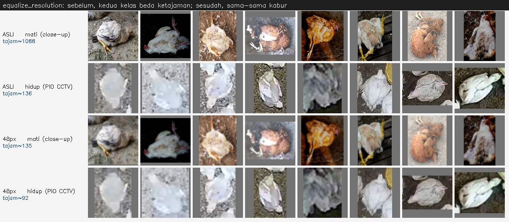
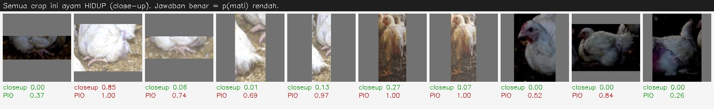
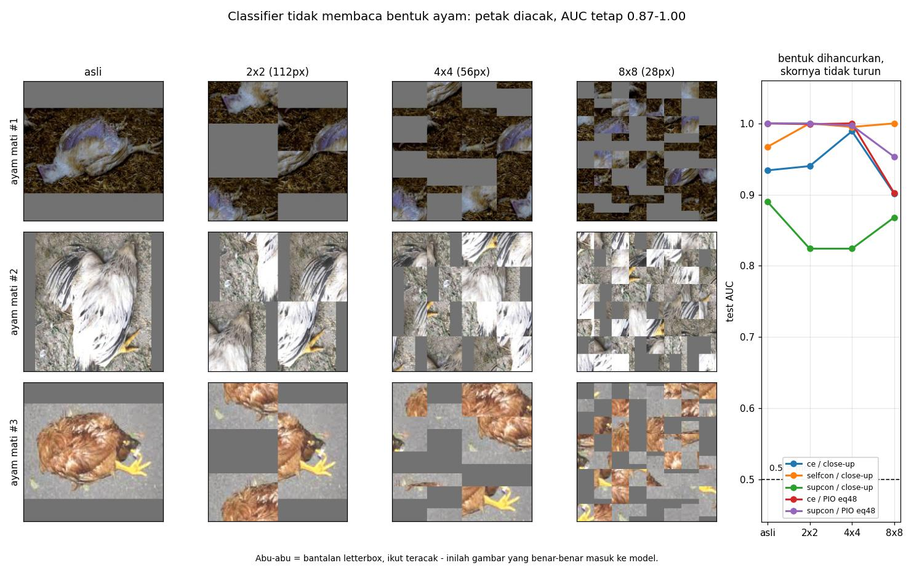

# Melatih dengan dataset PIO saja - sudah dicoba, dan hasilnya menipu

Permintaannya: **jangan pakai 1215 crop dari domain CCTV** (hasil deteksi di
18 gambar `chick`), dan **coba latih dengan dataset PIO saja**.

Bagian pertama dipatuhi - 1215 crop itu tidak dipakai melatih apa pun, dan
saran lama yang mengusulkannya sudah dicabut dari `detection_chick.md`.

Bagian kedua sudah dikerjakan sungguhan: crop dibangun, 9 model dilatih,
lalu diuji. **Angkanya bagus sekali - test balanced accuracy sampai 1.0000 -
dan justru itu masalahnya.** Bagian 2 menjelaskan kenapa.

Di data yang sesungguhnya (`chick`), setelah model close-up juga dilatih ulang
dengan 3 seed supaya bisa dibandingkan berpasangan: **PIO saja 0.600 +/- 0.087,
close-up 0.651 +/- 0.062, PIO dengan resolusi disamakan 0.674 +/- 0.080.**
Ketiganya tidak terbedakan secara statistik (p = 0.301 dan p = 0.570) - jarak
antar kelompok lebih kecil daripada sebaran antar seed di dalamnya. Jadi
jawaban atas pertanyaan PIO: **bisa dilatih, tapi tidak memperbaiki apa pun.**

Satu temuan di bagian 5 ternyata lebih besar daripada pertanyaan PIO itu
sendiri: **tidak satu pun dari 18 checkpoint - termasuk model close-up yang
lama - terganggu ketika bentuk ayamnya dihancurkan** (crop diacak 4x4, AUC
tetap 0.92-1.00; selisih rata-rata -0.0100). Artinya yang dibaca classifier
bukan pose ayam, melainkan statistik tekstur dan warna. Ini berlaku untuk
seluruh pipeline, bukan cuma untuk PIO.

Semua angka bisa dihitung ulang; perintahnya ada di bagian 7.

---

## 1. Yang dibangun

`data/crops_pio/` - ayam hidup diambil dari bbox asli (ground truth) dataset
PIO, bukan dari deteksi:

| | |
|---|---|
| ayam hidup | 294 crop, dari 26 gambar PIO (`origin: pio_gt`) |
| ayam mati | 98 crop, dari 36 foto close-up (`origin: coco_gt`) |
| split | train 179/58, val 58/19, test 57/21 |
| kebocoran antar split | 0 gambar |

Hasil latih 3 metode x 3 seed ke `outputs/runs_pio_alive`:

| metode | aug | seed | test bacc | test AUC |
|---|---|---|---|---|
| supcon | stacked_randaug | 42 | **1.0000** | 1.0000 |
| supcon | stacked_randaug | 43 | **1.0000** | 1.0000 |
| supcon | stacked_randaug | 44 | 0.9912 | 1.0000 |
| ce | hier_addone | 42 | **1.0000** | 1.0000 |
| ce | hier_addone | 43 | **1.0000** | 1.0000 |
| ce | hier_addone | 44 | **1.0000** | 1.0000 |
| selfcon | simclr | 43 | 0.9825 | 1.0000 |
| selfcon | simclr | 44 | 0.9348 | 0.9933 |
| selfcon | simclr | 42 | 0.9261 | 0.9916 |

Dibandingkan lantai lama bacc 0.9231, ini lompatan besar. Sayangnya lompatan
itu bukan karena modelnya jadi bisa mengenali ayam mati.

---

## 2. Kenapa angka itu tidak boleh dipercaya

### PIO tidak punya kelas ayam mati

```
_pio_yolo/labels/train/*.txt  ->  kelas unik: 0
data.yaml                     ->  nc: 1, names: ['Pollo']
```

PIO hanya bisa menyumbang ayam **hidup**. Ayam **mati** tetap harus datang
dari foto close-up. Akibatnya:

| label | asal | domain |
|---|---|---|
| hidup (294) | PIO | **cctv**, 100% |
| mati (98) | close-up | **closeup**, 100% |

Label dan domain jadi identik. Menebak "ini foto dari dataset mana" sudah
cukup untuk mendapat nilai sempurna - tidak perlu tahu apa pun tentang ayam.

### Jalan pintasnya bisa diukur, dan besarnya nyaris seluruh skor

Crop PIO median sisi pendek **39 px**, crop mati **224 px**. Setelah keduanya
diperbesar ke 224, yang satu tetap tajam dan yang lain kabur:

| ciri | mati (close-up) | hidup (PIO) |
|---|---|---|
| varians Laplacian (train) | 728 | 132 |

Dengan **ketajaman saja** - piksel tidak dilihat isinya sama sekali, cuma
diukur seberapa kabur - ambang dipilih di train lalu dipakai apa adanya:

| | train | val | test |
|---|---|---|---|
| bacc | 0.9579 | 0.7913 | **0.8434** |
| AUC | - | 0.9074 | **0.8596** |

Jadi **test bacc 0.8434 sudah didapat tanpa model apa pun**. Angka 1.0000 milik
supcon dan ce berdiri di atas lantai itu, bukan dari nol.



### Ujinya yang paling jelas: beri model ayam HIDUP close-up

Kalau model belajar "mati", ia harus bilang hidup. Kalau ia belajar
"close-up = mati", ia akan bilang mati. Dua hipotesis, jawaban berlawanan,
gambar yang sama. Rata-rata p(mati) yang diberikan:

| model | mati close-up (n=196) | **hidup close-up (n=32)** | hidup CCTV (n=294) |
|---|---|---|---|
| supcon dilatih closeup | 0.585 | **0.249** (9% mati) | 0.464 |
| **supcon dilatih PIO** | 0.990 | **0.780 (91% disebut mati)** | 0.018 |
| ce dilatih closeup | 0.861 | **0.047** (3% mati) | 0.152 |
| **ce dilatih PIO** | 0.999 | **0.813 (84% disebut mati)** | 0.014 |
| selfcon dilatih closeup | 0.774 | **0.238** (3% mati) | 0.584 |
| **selfcon dilatih PIO** | 0.869 | **0.619 (66% disebut mati)** | 0.087 |

Model yang dilatih PIO menyebut **ayam hidup yang sehat dan berdiri** sebagai
ayam mati, hanya karena fotonya close-up. Ini bukan kesalahan kecil di
pinggiran - ini isi dari apa yang dipelajarinya.



Hijau = jawaban benar (p rendah), merah = salah. Baris `closeup` = model lama,
baris `PIO` = model baru.

### Uji silang memperlihatkan hal yang sama

Model diuji pada test set yang bukan miliknya:

| model | test close-up (bacc/AUC) | test PIO (bacc/AUC) |
|---|---|---|
| dilatih closeup supcon | 0.7857 / 0.8901 | 0.6216 / 0.6550 |
| **dilatih PIO supcon** | **0.5000** / 0.9286 | 1.0000 / 1.0000 |
| dilatih closeup selfcon | 0.9286 / 0.9670 | 0.6692 / 0.8120 |
| **dilatih PIO selfcon** | **0.4423** / 0.5879 | 0.9261 / 0.9916 |
| dilatih closeup ce | 0.9093 / 0.9341 | 0.9561 / 0.9825 |
| **dilatih PIO ce** | **0.5714** / 0.8791 | 1.0000 / 1.0000 |

Di test close-up - tempat kedua kelas sama-sama close-up, sehingga jalan
pintas domain tidak tersedia - model PIO jatuh ke **0.44-0.57**, yaitu
menebak. Model lama bertahan di 0.79-0.93.

---

## 3. Pada data yang sesungguhnya (`chick` CCTV), tidak ada perbaikan berarti

Uji ujung-ke-ujung: gambar utuh -> detektor -> crop -> classifier, pada 22 ayam
mati vs 1193 crop lain.

| metode | **AUC dilatih close-up (3 seed)** | **AUC dilatih PIO (3 seed)** |
|---|---|---|
| ce | **0.616 +/- 0.067** (0.522-0.665) | 0.542 +/- 0.090 (0.422-0.639) |
| selfcon | **0.675 +/- 0.061** (0.611-0.757) | 0.580 +/- 0.036 (0.550-0.631) |
| supcon | **0.662 +/- 0.038** (0.625-0.715) | 0.676 +/- 0.060 (0.592-0.729) |

AUC 0.5 = menebak. **Kedua kolom sekarang 3 seed, dan itu mengubah
kesimpulannya.** Versi 1-seed yang sempat tercatat salah di kedua sisi: PIO
(0.566 / 0.442 / 0.642) maupun close-up (0.522 / 0.569 / 0.606) sama-sama
**tidak mewakili** - sebaran antar seed merentang 0.21 poin pada ce PIO dan
0.14 poin pada ce close-up. Pelajarannya: pada test sekecil ini (22 ayam
mati), **satu seed tidak boleh dipakai menyimpulkan apa pun** - termasuk angka
acuan yang dipakai untuk membandingkan.

Dibandingkan berpasangan (metode dan seed sama persis, n=9), PIO **bukan lebih
baik, melainkan sedikit lebih buruk**: -0.051 +/- 0.111, naik cuma pada 3/9
pasangan, Wilcoxon p = 0.301. Artinya selisihnya tidak bisa dipisahkan dari
derau seed. Latihan dengan PIO saja **tidak memperbaiki apa pun** di data yang
sesungguhnya; dengan 1 seed sempat kelihatan menang, dengan 3 seed selisih itu
hilang.

Bandingkan dengan test bacc 1.0000 di tabel bagian 1: **selisih antara 1.0000
dan 0.60 itulah harga dari jalan pintas** - sebagian besar skor di bagian
1 tidak ikut pindah ke data yang sesungguhnya.

Dicek juga apakah model memang menempel pada jalan pintas ketika melihat crop
chick (korelasi Spearman antara p(mati) dan ciri crop):

| model | rho(ketajaman) | rho(ukuran) | AUC chick (checkpoint ini saja) |
|---|---|---|---|
| closeup supcon | 0.309 | 0.198 | 0.606 |
| PIO supcon | -0.000 | 0.056 | 0.642 |
| closeup selfcon | 0.299 | 0.417 | 0.569 |
| PIO selfcon | 0.003 | -0.175 | 0.442 |

Menarik: pada chick, jalan pintas ketajaman **tidak tersedia** (semua crop
berasal dari kamera yang sama, AUC ketajaman-saja cuma 0.515). Model PIO
karena itu berhenti memakainya - rho jatuh ke ~0.000 - dan yang tersisa cuma
0.60 (rata-rata 9 checkpoint). Itulah kemampuan aslinya tanpa jalan pintas.

Dua peringatan untuk tabel rho ini. Pertama, kolom AUC-nya per checkpoint
tunggal, jadi jangan dibandingkan antar baris - pakai angka 3-seed di atas.
Kedua, dan lebih penting: **rho tinggi tidak membuktikan model memakai ciri
itu**. Pada data yang label-nya identik dengan domain, semua ciri berkorelasi
dengan label. Bagian 5 memperlihatkan satu contoh di mana penalaran itu
menyesatkan, lalu menggantinya dengan uji sebab.

---

## 4. Yang bisa diselamatkan: samakan resolusi dulu

`crops.equalize_resolution` selama ini hanya stub di config. Sekarang
benar-benar bekerja (`src/build_crops.py`, fungsi `equalize`): tiap crop
diturunkan ke sisi pendek yang sama **sebelum** di-letterbox ke 224, sehingga
kedua kelas sama-sama kabur.

Dengan `target_short_side: 48`, jalan pintas ketajaman runtuh:

| ketajaman-saja | ambang | train bacc | val bacc/AUC | test bacc/AUC |
|---|---|---|---|---|
| PIO asli | 392.0 | 0.9579 | 0.7913 / 0.9074 | **0.8434 / 0.8596** |
| PIO disamakan 48px | 131.4 | 0.6394 | 0.6234 / 0.4328 | **0.4787 / 0.4194** |

AUC 0.4194 berarti ketajaman sudah **tidak lagi** memberi informasi. Angka
yang keluar dari data ini jujur - tapi jujur bukan berarti tinggi: hasil latih
ulangnya ada di bagian 5.

Baseline-nya dijadikan skrip tetap, `src/eval_shortcut_baseline.py`, dan
diperluas ke tiga ciri supaya tidak ada yang terlewat:

| ciri (test AUC) | `data/crops` | `data/crops_pio` | `data/crops_pio_eq` |
|---|---|---|---|
| ketajaman (terlihat di piksel) | 0.9670 | 0.8596 | **0.4194** |
| rasio bbox (lebar bantalan letterbox) | 0.1154 | 0.3484 | 0.3484 |
| ukuran bbox (**metadata**, bukan piksel) | 0.9176 | 0.9858 | 0.9858 |

Tiga hal yang perlu dibaca hati-hati di tabel itu:

- **Rasio di bawah 0.5** berarti arahnya justru terbalik - ayam mati cenderung
  lebih persegi. Jadi bantalan letterbox bukan jalan pintas di sini.
- **Ukuran tetap 0.9858 setelah disamakan**, tapi itu dihitung dari bbox di
  manifest, bukan dari piksel crop (semua crop tersimpan 224x224 dan sudah
  sama-sama kabur). Angka itu mengukur **seberapa kuat label masih menempel
  pada asal data**, bukan jalan pintas yang pasti dipakai model.
- Pada `data/crops` (model lama) ketajaman-saja juga sudah 0.9670. Jadi masalah
  ini **bukan bawaan PIO** - PIO hanya memperbesarnya.
- **Baseline ini mengukur jalan pintas yang TERSEDIA, bukan yang DIPAKAI.**
  Keduanya sering berbeda: hue di sini 0.9181, tapi bagian 5 membuktikan lewat
  intervensi bahwa model sama sekali tidak memakainya. Untuk pertanyaan "apa
  yang sebenarnya dibaca model", pakai `src/eval_intervensi.py`.

Ini perbaikan pengukuran, bukan perbaikan model.

---

## 5. Hasil latih ulang pada data yang sudah disamakan

Sembilan run pada `data/crops_pio_eq` (3 metode x 3 seed), crop sudah
disamakan ke sisi pendek 48 px:

| metode | test bacc (3 seed) | sebelum disamakan |
|---|---|---|
| supcon + stacked_randaug | 0.9833 +/- 0.0061 | 0.9971 +/- 0.0041 |
| ce + hier_addone | 0.9595 +/- 0.0388 | 1.0000 +/- 0.0000 |
| selfcon + simclr | 0.8609 +/- 0.0526 | 0.9478 +/- 0.0248 |

Jalan pintas ketajaman sudah runtuh (AUC-terarah 0.8596 -> 0.5806), tapi
skornya **nyaris tidak turun**. Jadi ada jalan pintas lain yang masih dipakai.
Bagian ini mencari tahu yang mana - dan jawabannya ternyata bukan yang
pertama saya tuduh.

### Tuduhan pertama: warna. Ternyata salah.

Baseline tanpa model pada `data/crops_pio_eq` menunjuk **hue** sebagai ciri
terkuat yang masih selamat:

| ciri (test AUC-terarah) | `data/crops_pio` | `data/crops_pio_eq` |
|---|---|---|
| ketajaman | 0.8596 | **0.5806** |
| **hue** | 0.9056 | **0.9181** |
| saturasi | 0.8276 | 0.6750 |

Sebarannya memang terpisah jelas: hue rata-rata **28.6 +/- 9.8** untuk crop
mati (close-up) lawan **55.0 +/- 18.2** untuk crop hidup (CCTV) - studio
berwarna lain daripada kandang. Korelasi Spearman antara p(mati) dan hue pun
besar: **-0.599** (eq ce), -0.559 (eq selfcon), -0.246 (eq supcon).

Dari dua angka itu saya sempat menyimpulkan "model menempel pada hue".
**Kesimpulan itu salah, dan ini cara membuktikannya.**

Korelasi tidak bisa membedakan dua hal: model yang *membaca* hue, dan model
yang membaca hal lain yang *kebetulan berbarengan* dengan hue. Di data ini hue
berbarengan dengan label, jadi rho akan besar pada kedua kasus. Yang
memisahkannya cuma satu: **rusak hue-nya saja, lalu lihat jawabannya berubah
atau tidak.**

Hue diputar +26 (tepat menggeser crop mati ke wilayah warna crop hidup).
Bentuk, pose, tekstur, dan ketajaman tidak disentuh sama sekali:

| model | AUC asli | AUC setelah hue diputar +26 | AUC tanpa warna (abu) |
|---|---|---|---|
| ce / eq48 | 1.000 | **0.998** | 0.974 |
| selfcon / eq48 | 0.975 | **0.933** | 0.855 |
| supcon / eq48 | 1.000 | **0.938** | 0.737 |
| ce / PIO asli | 1.000 | **1.000** | 1.000 |
| selfcon / PIO asli | 1.000 | **1.000** | 1.000 |
| supcon / PIO asli | 1.000 | **1.000** | 1.000 |

Hue-nya dibalik, AUC-nya tidak bergerak. Bahkan ketika **seluruh warna
dibuang** (grayscale), model PIO asli masih 1.000. Jadi hue bukan penyebabnya -
ia cuma penumpang. rho -0.599 itu menyesatkan saya.

### Yang sesungguhnya terjadi: model tidak melihat bentuk ayam sama sekali

Kalau bukan ketajaman dan bukan warna, apa? Perlakuan yang paling menjelaskan
adalah **mengacak petak**: crop dipecah 4x4 lalu petaknya ditukar-tukar. Bentuk
ayam, pose, dan susunan badannya hancur total; tekstur dan warna lokal utuh.
Kalau model benar-benar mengenali ayam mati - yang secara definisi adalah soal
**pose** - AUC-nya harus jatuh.

| model | asli | abu | hue+26 | kabur | **acak16** |
|---|---|---|---|---|---|
| ce / eq48 | 1.000 | 0.974 | 0.998 | 0.985 | **1.000** |
| selfcon / eq48 | 0.975 | 0.855 | 0.933 | 0.860 | **0.979** |
| supcon / eq48 | 1.000 | 0.737 | 0.938 | 0.995 | **1.000** |
| ce / PIO asli | 1.000 | 1.000 | 1.000 | 0.917 | **1.000** |
| selfcon / PIO asli | 1.000 | 1.000 | 1.000 | 0.893 | **1.000** |
| supcon / PIO asli | 1.000 | 1.000 | 1.000 | 0.967 | **0.999** |
| ce / close-up | 0.934 | 0.984 | 0.923 | 0.396 | **0.940** |
| selfcon / close-up | 0.967 | 0.945 | 0.940 | 0.769 | **0.995** |
| supcon / close-up | 0.890 | 0.912 | 0.885 | 0.269 | **0.918** |

**Tidak satu pun dari sembilan model di tabel itu yang terganggu oleh
hancurnya bentuk ayam.** Beberapa malah naik. Ini temuan terpenting di
seluruh laporan, dan ia berlaku juga untuk model close-up - jadi **bukan
akibat memakai PIO.**

Diulang pada **seluruh 18 checkpoint** yang ada (3 metode x 3 seed x 2
susunan data), bukan cuma satu seed per metode:

| | |
|---|---|
| selisih AUC rata-rata (asli -> diacak) | **-0.0100** |
| checkpoint yang turun lebih dari 0.05 | **1 dari 18** |
| rentang selisih | -0.077 sampai +0.000 |

Satu-satunya yang turun agak berarti adalah selfcon/eq48/s44 (-0.077), dan itu
pun model dengan AUC asli terendah. Temuannya tidak bergantung pada pilihan
seed.

Dikontrol terhadap kemungkinan "4x4 belum cukup merusak" dengan memperbanyak
petak sampai tiap petak lebih kecil daripada ayamnya:

| model | asli | 2x2 (112px) | 4x4 (56px) | 8x8 (28px) | 16x16 (14px) |
|---|---|---|---|---|---|
| ce / close-up | 0.934 | 0.940 | 0.989 | 0.901 | 0.808 |
| selfcon / close-up | 0.967 | 1.000 | 0.995 | 1.000 | 0.984 |
| supcon / close-up | 0.890 | 0.824 | 0.824 | 0.868 | 0.687 |
| ce / eq48 | 1.000 | 0.999 | 1.000 | 0.902 | 0.317 |
| selfcon / eq48 | 0.975 | 0.987 | 0.962 | 0.906 | 0.819 |
| supcon / eq48 | 1.000 | 1.000 | 0.997 | 0.953 | 0.779 |



Kolom `8x8` itulah yang menentukan: mata manusia tidak bisa lagi menyebutnya
ayam, tapi classifier masih memberi AUC 0.87-0.95.

Pada petak 28 px - lebih kecil daripada badan ayam di crop - AUC masih
**0.90-0.95**. Yang dibaca model jelas bukan ayam, melainkan statistik tekstur
dan warna yang bertahan walau susunannya diacak.

Satu-satunya perlakuan yang benar-benar melukai sebagian model adalah
**kabur**, dan hanya pada model close-up (ce 0.934 -> 0.396, supcon 0.890 ->
0.269). Artinya model close-up bergantung pada ketajaman - persis jalan pintas
yang sudah diukur di bagian 4 dengan test AUC 0.9670.

### Akibatnya bagi tafsiran seluruh laporan

`equalize_resolution` menutup satu jalan pintas (ketajaman) dan itu nyata.
Tapi ia tidak membuat model mulai melihat ayam, karena **yang menghalangi bukan
satu ciri yang bisa ditutup satu per satu**: dengan 392 crop latih dari 62
gambar, tekstur dan warna global sudah cukup memisahkan kedua kelas, jadi model
tidak pernah punya alasan untuk belajar pose. Menutup ketajaman hanya memaksa
ia pindah ke ciri global lain, bukan ke bentuk.

### Pada data chick yang sesungguhnya

Kedua kelompok dilatih dengan seed yang sama (42, 43, 44), jadi selisihnya
bisa **dipasangkan per seed** - jauh lebih peka daripada membandingkan
rata-rata yang rentangnya tumpang tindih:

| metode | seed | PIO asli | PIO eq48 | selisih |
|---|---|---|---|---|
| ce | 42 | 0.566 | 0.574 | +0.009 |
| ce | 43 | 0.639 | 0.757 | +0.118 |
| ce | 44 | 0.422 | 0.742 | +0.319 |
| selfcon | 42 | 0.631 | 0.670 | +0.040 |
| selfcon | 43 | 0.550 | 0.636 | +0.086 |
| selfcon | 44 | 0.560 | 0.527 | **-0.033** |
| supcon | 42 | 0.729 | 0.684 | **-0.045** |
| supcon | 43 | 0.592 | 0.684 | +0.093 |
| supcon | 44 | 0.708 | 0.790 | +0.082 |

Gabungannya **+0.074 +/- 0.108**, naik pada **7 dari 9** pasangan, Wilcoxon
signed-rank **p = 0.055**. Rata-rata per metode: ce +0.149, supcon +0.043,
selfcon +0.031.

Cara membacanya harus hati-hati, dan lebih lemah daripada yang terlihat:

- **p = 0.055 bukan bukti.** Dengan 9 pasangan dan hanya 22 ayam mati di test
  chick, ini petunjuk yang lemah - arahnya positif, tapi tidak bisa disebut
  terbukti.
- **Dua pasangan bergerak turun.** Kalau menyamakan resolusi benar-benar
  memperbaiki, seharusnya tidak ada yang turun.
- **Sebagian besar keuntungan datang dari satu angka.** ce seed 44 melompat
  0.422 -> 0.742 (+0.319). Tanpa satu pasangan itu, rata-ratanya tinggal
  +0.043 - sekadar riak.
- **Sebaran antar seed lebih besar daripada selisih antar kelompok.** ce PIO
  asli sendiri merentang 0.422-0.639 hanya karena seed. Selisih rata-rata
  +0.074 lebih kecil daripada rentang itu.
- **Sembilan pasangan itu tidak saling bebas** - 3 seed x 3 metode berbagi
  data latih yang sama, jadi p berapa pun di sini terlalu optimis.

Diperiksa dari beberapa arah supaya tidak bergantung pada satu uji:

| cara mengukur | hasil |
|---|---|
| Wilcoxon signed-rank (n=9) | p = 0.055 |
| uji permutasi tanda (eksak, 2^9) | p = 0.039 |
| **tanpa pencilan ce s44** | mean +0.044, **p = 0.109** |
| selang bootstrap 95% | [+0.015, +0.147] |
| rata-rata per metode (n=3) | +0.149 / +0.031 / +0.043, semua positif |

Arahnya positif di semua cara, tapi begitu satu pencilan dibuang p naik ke
0.109. Itu ukuran yang tepat untuk seberapa jauh temuan ini boleh dipercaya:
**cukup untuk dilanjutkan, belum cukup untuk diklaim.**

Dan ada satu soal yang lebih besar daripada kekuatan uji: **+0.074 ini diukur
terhadap acuan yang salah**. Dua subbagian lagi ke bawah angka itu dibandingkan
terhadap acuan yang benar, dan hasilnya berubah.

Praproses yang tidak cocok memang merusak, dan ini terlihat jelas: model eq48
yang diuji lewat praproses asli turun (supcon 0.719 -> 0.639 rata-rata).

### Tetapi +0.074 itu diukur dari acuan yang salah

Perbandingan di atas adalah **eq48 melawan PIO asli**. Acuan yang seharusnya
dipakai bukan itu, melainkan model close-up - sebab pertanyaan aslinya adalah
"apakah latihan dengan PIO saja lebih baik daripada yang sudah ada". Setelah
model close-up dilatih ulang dengan 3 seed yang sama (42/43/44), ketiga
kelompok bisa dibandingkan berpasangan per metode-dan-seed:

| kelompok (9 checkpoint) | AUC chick | selisih vs close-up | naik | Wilcoxon |
|---|---|---|---|---|
| close-up | 0.651 +/- 0.062 | - (acuan) | - | - |
| PIO asli | 0.600 +/- 0.087 | **-0.051 +/- 0.111** | 3/9 | p = 0.301 |
| PIO eq48 | 0.674 +/- 0.080 | **+0.023 +/- 0.086** | 7/9 | p = 0.570 |

Jadi yang sebenarnya terjadi: **PIO saja menurunkan skor, dan menyamakan
resolusi mengembalikannya ke titik awal.** +0.074 yang tadi nyata, tapi itu
perbaikan atas kerusakan yang dibuat sendiri oleh PIO - bukan kemajuan atas
model yang sudah ada. Terhadap acuan yang benar, selisihnya +0.023 dengan
p = 0.570, yaitu tidak terbedakan dari derau seed.

Angka dasarnya: close-up ce 0.616 +/- 0.067, selfcon 0.675 +/- 0.061, supcon
0.662 +/- 0.038; PIO asli ce 0.542 +/- 0.090, selfcon 0.580 +/- 0.036, supcon
0.676 +/- 0.060; PIO eq48 ce 0.691 +/- 0.083, selfcon 0.611 +/- 0.061, supcon
0.719 +/- 0.050 - semuanya 3 seed.

Kesimpulan yang jujur: **tidak ada satu pun dari ketiga susunan data ini yang
terbukti lebih baik daripada yang lain di `chick`.** Semuanya duduk di
0.60-0.67, dengan sebaran antar seed (+/-0.06 sampai +/-0.11) yang lebih besar
daripada jarak antar kelompoknya. Ini persis yang diperkirakan dari temuan
acak-petak di atas: selama model tidak membaca bentuk ayam, menata ulang
sumber data dan menutup jalan pintas satu per satu tidak menggerakkan apa pun.

Diulang dengan:

```bash
python src/eval_intervensi.py --config configs/config_pio_eq.yaml     --runs outputs/runs_pio_eq
```

---

## 6. Batas yang sesungguhnya: tidak ada ayam mati di domain CCTV

Seluruh dataset deteksi yang ada di disk hanya punya satu kelas:

| dataset | nc | isi |
|---|---|---|
| `_pio_yolo` (PIO) | 1 | `Pollo` - ayam, tanpa status |
| `broiler_instance_seg` | 1 | ayam |
| `chicken_detection_fum` | 1 | ayam |
| `rilis_rectified_pio` | 1 | ayam |

Ayam mati **hanya** ada dalam bentuk foto close-up (dataset `dead-chikens`)
dan dalam 22 mask di `chick` - dan 22 itu jatah uji.

Selama itu belum berubah, susunan datanya akan selalu seperti ini:

```
hidup  -> CCTV
mati   -> close-up
```

dan classifier akan selalu punya pilihan untuk membedakan **kamera**, bukan
**kondisi ayam**. Menyamakan resolusi menutup satu celah; sumber datanya yang
belum berubah.

Jadi jawaban atas "bagaimana latihnya dengan dataset PIO saja": **bisa
dijalankan, sudah dijalankan, tapi ia tidak bisa mengajari model membedakan
mati dan hidup** - karena PIO tidak mengandung satu pun contoh ayam mati.
Yang ia ajarkan adalah membedakan PIO dari close-up.

---

## 7. Menghitung ulang

Dua config disediakan supaya `configs/config.yaml` (pipeline utama) tidak
perlu diubah sama sekali:

| config | crop | equalize | runs |
|---|---|---|---|
| `configs/config_pio.yaml` | `data/crops_pio` | mati | `outputs/runs_pio_alive` |
| `configs/config_pio_eq.yaml` | `data/crops_pio_eq` | 48 px | `outputs/runs_pio_eq` |
| `configs/config_closeup_ckpt.yaml` | `data/crops` | mati | `outputs/runs_closeup_ckpt` |

Config ketiga itu **acuan pembandingnya**: isinya identik dengan
`configs/config.yaml`, cuma `runs_dir`-nya beda. Gunanya melatih ulang model
close-up dengan seed 42/43/44 sambil menyimpan checkpoint, supaya bisa
dibandingkan berpasangan 3 seed lawan 3 seed - tanpa menimpa `outputs/runs`.

```bash
# --- PIO asli -------------------------------------------------------------
python src/build_crops.py --config configs/config_pio.yaml --alive-source pio
python src/train.py --config configs/config_pio.yaml --method all     --seeds 42,43,44 --save-model all

# --- PIO resolusi disamakan 48 px ----------------------------------------
python src/build_crops.py --config configs/config_pio_eq.yaml --alive-source pio
python src/train.py --config configs/config_pio_eq.yaml --method all     --seeds 42,43,44 --save-model all

# --- uji pada data chick yang sesungguhnya -------------------------------
# config ikut menentukan praproses crop uji; model yang dilatih pada crop
# 48 px HARUS diuji dengan config_pio_eq, kalau tidak angkanya tidak berarti
python src/eval_on_chick.py --config configs/config_pio.yaml     --runs outputs/runs_pio_alive
python src/eval_on_chick.py --config configs/config_pio_eq.yaml     --runs outputs/runs_pio_eq

# --- acuan: model close-up, 3 seed (bukan 1) -----------------------------
python src/train.py --config configs/config_closeup_ckpt.yaml --method all     --seeds 42,43,44 --save-model all
python src/eval_on_chick.py --config configs/config_closeup_ckpt.yaml     --runs outputs/runs_closeup_ckpt

# --- jalan pintas yang TERSEDIA (tanpa model sama sekali) ----------------
python src/eval_shortcut_baseline.py --crops data/crops_pio
python src/eval_shortcut_baseline.py --crops data/crops_pio_eq

# --- jalan pintas yang DIPAKAI (uji sebab: rusak satu ciri) --------------
# 'acak16' adalah kolom terpenting: bentuk ayam dihancurkan. AUC yang tetap
# tinggi di kolom itu berarti model tidak pernah melihat ayamnya.
python src/eval_intervensi.py --config configs/config.yaml --runs outputs/runs
python src/eval_intervensi.py --config configs/config_pio.yaml     --runs outputs/runs_pio_alive
python src/eval_intervensi.py --config configs/config_pio_eq.yaml     --runs outputs/runs_pio_eq
```

---

## Berkas

| berkas | isi |
|---|---|
| `src/build_crops.py` | `equalize()` - `equalize_resolution` sekarang berfungsi |
| `src/eval_shortcut_baseline.py` | jalan pintas yang TERSEDIA, tanpa model (baru) |
| `src/eval_intervensi.py` | jalan pintas yang DIPAKAI - uji sebab (baru) |
| `src/eval_on_chick.py` | ikut `equalize_resolution` dari config (baru) |
| `configs/config_pio.yaml` | varian ablasi PIO asli (baru) |
| `configs/config_pio_eq.yaml` | varian ablasi PIO + eq 48 px (baru) |
| `configs/config_closeup_ckpt.yaml` | acuan close-up 3 seed, runs_dir terpisah (baru) |
| `configs/config.yaml` | `crops.pio_max_per_image: 12` (baru) |
| `data/crops_pio/` | 392 crop, ayam hidup dari PIO |
| `data/crops_pio_eq/` | sama, resolusi disamakan ke 48 px |
| `outputs/runs_pio_alive/` | 9 run pada crop PIO asli |
| `outputs/runs_pio_eq/` | 9 run pada crop yang disamakan |
| `outputs/runs_closeup_ckpt/` | 9 run acuan close-up (3 seed, checkpoint disimpan) |
| `outputs/reports/pio_salah_hidup.jpg` | ayam hidup disebut mati |
| `outputs/reports/pio_equalize.jpg` | crop sebelum vs sesudah disamakan |
| `outputs/reports/acak_bentuk.jpg` | crop diacak; AUC tidak bergeming |
| `outputs/predictions/eval_on_chick_closeup.json` | uji chick, model lama |
| `outputs/predictions/eval_on_chick_pio.json` | uji chick, model PIO |
| `outputs/predictions/eval_on_chick_closeup_ckpt.json` | uji chick, acuan close-up 3 seed |
| `outputs/predictions/intervensi_*.json` | AUC di bawah tiap intervensi |

---

Cerita utuh seluruh eksperimen - berurutan, dengan gambar tiap
percobaan dan alasan di balik setiap perubahan - ada di
[`kronologi_lengkap.md`](kronologi_lengkap.md).
